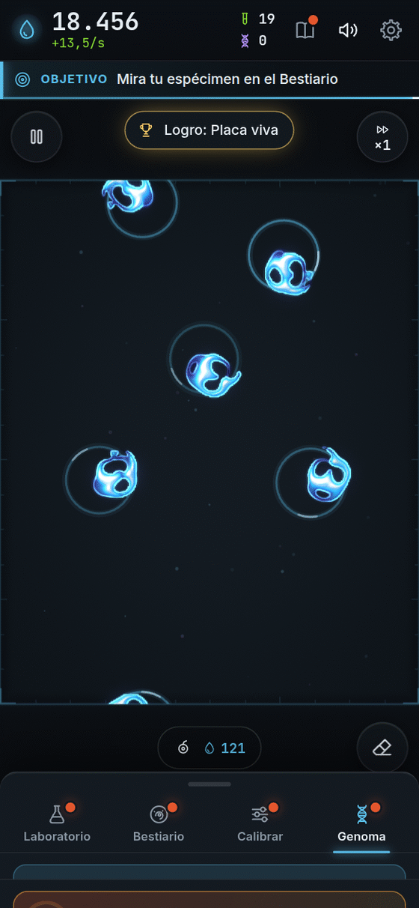
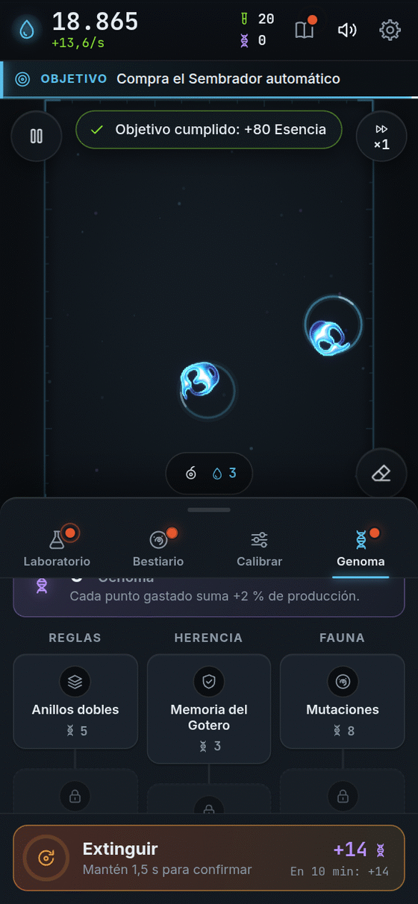
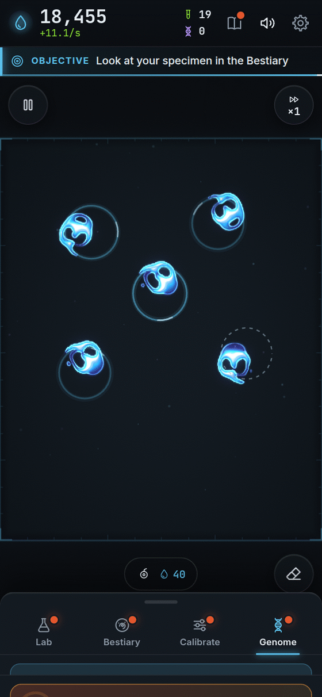
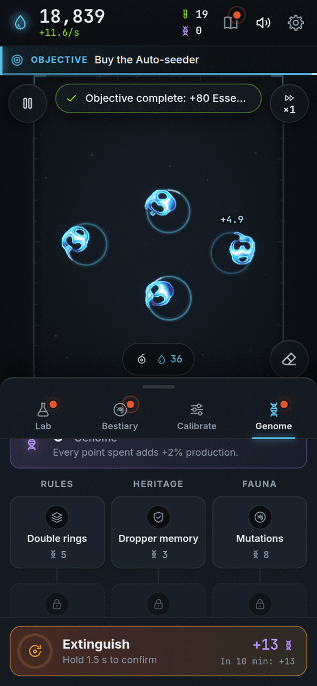

<p align="center">
  <a href="https://bioluma-xi.vercel.app"></a>
</p>

<p align="center">
  <a href="https://github.com/ronalc90/Lenia/actions/workflows/ci.yml"></a>
  <a href="LICENSE"></a>
  
  
  
  
</p>

<h1 align="center">Bioluma</h1>

<p align="center"><b>Español</b> · <a href="#english">English</a></p>

<h3 align="center"><a href="https://bioluma-xi.vercel.app">▶ Jugar ahora / Play now</a> · <a href="https://github.com/ronalc90/Lenia/wiki">Wiki</a></h3>

## Español

**Bioluma** (nombre de trabajo, antes "Petri") es un juego incremental donde **tú siembras luz y nace vida de verdad**. Las criaturas son [Lenia](https://github.com/Chakazul/Lenia) de Bert Chan, un autómata celular continuo que corre en vivo en tu navegador (WebGL2): nada está animado a mano, cada criatura emerge de la simulación. Siembra materia, descubre especies, provoca una extinción y vuelve con mejores genes.

Es gratis, **sin anuncios**, sin cuenta, y se juega con un solo dedo.

### Qué lo hace divertido

- 🧬 **Vida real.** Las criaturas nadan, giran, laten y se dividen porque la regla matemática lo permite, no porque alguien las animó.
- 🌱 **Un toque y pasa algo.** Cada siembra es un dado: la mayoría se disuelve y algunas cobran vida. Ondas de luz, números que suben y música que se inventa en el momento.
- 🔬 **Bestiario y Calibrador.** Cada especie nueva te da un multiplicador permanente. Mueve μ y σ para cambiar las reglas del universo y encontrar fauna que nadie ha visto.
- ✨ **El Destello dorado.** Cruza la placa de vez en cuando: tócalo y gana un premio sorpresa.
- ♻️ **Extinción y Genoma.** Empieza de nuevo, pero más fuerte: te quedas con todo lo descubierto y compras reglas nuevas.
- 🏅 **34 logros**, objetivos que te guían la primera hora y [secretos](https://github.com/ronalc90/Lenia/wiki/Secretos) (sin spoilers).
- 📱 **Móvil primero.** PWA instalable, vertical y con un pulgar; también en escritorio. Español e inglés, tema oscuro y claro, "reducir movimiento" y modo de un toque.
- 🎵 **Audio sintetizado en vivo.** No hay archivos de sonido ni arte hecho con IA.

<table>
  <tr>
    <td align="center"></td>
    <td align="center"></td>
    <td align="center"></td>
    <td align="center"></td>
  </tr>
</table>

<p align="center"></p>

*Capturas del juego real, generadas con [`tests/e2e/wiki-shots.mjs`](tests/e2e/wiki-shots.mjs).*

### Cómo jugar en 30 segundos

1. **Toca la placa** para sembrar. Cuesta un poco de Esencia.
2. **Mira qué nace.** Casi todo se disuelve; lo que se queda brilla con un anillo y te da Esencia sin parar.
3. **Compra mejoras** en el Laboratorio y **descubre especies** en el Bestiario.
4. **Atrapa el Destello** dorado y, cuando la placa se estanque, **extingue** para volver más fuerte.

### Wiki

La guía completa, con fotos y para todas las edades, está en la **[wiki](https://github.com/ronalc90/Lenia/wiki)**:
[Cómo jugar](https://github.com/ronalc90/Lenia/wiki/C%C3%B3mo-jugar) ·
[Mejoras](https://github.com/ronalc90/Lenia/wiki/Mejoras) ·
[Especies](https://github.com/ronalc90/Lenia/wiki/Especies) ·
[Prestigio y Genoma](https://github.com/ronalc90/Lenia/wiki/Prestigio-y-Genoma) ·
[Logros](https://github.com/ronalc90/Lenia/wiki/Logros) ·
[Secretos](https://github.com/ronalc90/Lenia/wiki/Secretos) ·
[Preguntas frecuentes](https://github.com/ronalc90/Lenia/wiki/Preguntas-frecuentes) ·
[Plataformas](https://github.com/ronalc90/Lenia/wiki/Plataformas) ·
[Ciencia detrás](https://github.com/ronalc90/Lenia/wiki/Ciencia-detr%C3%A1s) ·
[Desarrollo](https://github.com/ronalc90/Lenia/wiki/Desarrollo) ·
[Créditos](https://github.com/ronalc90/Lenia/wiki/Cr%C3%A9ditos)

### Ejecutar en local

```bash
npm ci
npm run dev          # servidor de desarrollo (Vite)
npm run build        # typecheck + build de producción en dist/
SINGLE=1 npx vite build   # build de un solo archivo en dist-single/ (para compartir)
```

Requiere Node 22 y un navegador con WebGL2.

### Pruebas

```bash
npm run typecheck    # tsc --noEmit
npm test             # vitest (simulación, detector, economía, ...)
npm run e2e          # prueba de humo con Playwright (compila con VITE_E2E=1)
```

### Documentación

[`docs/GDD.md`](docs/GDD.md) (diseño, en español) · [`DECISIONS.md`](DECISIONS.md) (ADR) ·
[`docs/ROADMAP.md`](docs/ROADMAP.md) · [`docs/PLATAFORMAS.md`](docs/PLATAFORMAS.md) · [`docs/RANKING.md`](docs/RANKING.md) ·
[`docs/ABOUT.md`](docs/ABOUT.md) (texto del cuadro "About" del repositorio) · [`CLAUDE.md`](CLAUDE.md) (reglas para agentes de IA)

### Créditos y licencia

Las especies, sus nombres y parámetros son del catálogo de Bert Chan (MIT); ver [`CREDITS.md`](CREDITS.md) para el detalle, los papers y las fuentes. Todo el audio se sintetiza en tiempo de ejecución y no hay arte generado por IA. Código bajo licencia [MIT](LICENSE), Copyright (c) 2026 ronalc90.

---

## English

**Bioluma** (working title, formerly "Petri") is an incremental game where **you sow light and real life is born**. The creatures are [Lenia](https://github.com/Chakazul/Lenia) by Bert Chan, a continuous cellular automaton running live in your browser (WebGL2): nothing is hand-animated, every creature emerges from the simulation. Seed matter, discover species, trigger an extinction and come back with better genes.

It is free, has **no ads**, needs no account, and is played with one finger.

### Why it is fun

- 🧬 **Real life.** Creatures swim, spin, pulse and divide because the math rule allows it, not because someone animated them.
- 🌱 **One tap and something happens.** Every seed is a dice roll: most dissolve and some come alive. Ripples of light, rising numbers and music made on the spot.
- 🔬 **Bestiary and Calibrator.** Every new species gives you a permanent multiplier. Move μ and σ to bend the rules of the universe and find fauna nobody has seen.
- ✨ **The golden Spark.** It drifts across the dish now and then: tap it for a surprise prize.
- ♻️ **Extinction and Genome.** Start over, but stronger: you keep everything you discovered and buy new rules.
- 🏅 **34 achievements**, objectives that guide your first hour, and [secrets](https://github.com/ronalc90/Lenia/wiki/Secrets-en) (spoiler-free).
- 📱 **Mobile first.** Installable PWA, portrait and one thumb; desktop too. English and Spanish, dark and light themes, "reduce motion" and one-touch mode.
- 🎵 **Audio synthesised live.** No sound files and no AI-generated art.

<table>
  <tr>
    <td align="center"></td>
    <td align="center"></td>
    <td align="center"></td>
    <td align="center"></td>
  </tr>
</table>

*Screenshots of the real game, generated with [`tests/e2e/wiki-shots.mjs`](tests/e2e/wiki-shots.mjs).*

### How to play in 30 seconds

1. **Tap the dish** to seed it. It costs a little Essence.
2. **Watch what is born.** Almost everything dissolves; what stays glows with a ring and gives you Essence non-stop.
3. **Buy upgrades** in the Lab and **discover species** in the Bestiary.
4. **Catch the golden Spark** and, when the dish stalls, **extinguish** to come back stronger.

### Wiki

The full guide, with pictures and for all ages, is in the **[wiki](https://github.com/ronalc90/Lenia/wiki/Home-en)**:
[How to play](https://github.com/ronalc90/Lenia/wiki/How-to-play-en) ·
[Upgrades](https://github.com/ronalc90/Lenia/wiki/Upgrades-en) ·
[Species](https://github.com/ronalc90/Lenia/wiki/Species-en) ·
[Prestige and Genome](https://github.com/ronalc90/Lenia/wiki/Prestige-and-Genome-en) ·
[Achievements](https://github.com/ronalc90/Lenia/wiki/Achievements-en) ·
[Secrets](https://github.com/ronalc90/Lenia/wiki/Secrets-en) ·
[FAQ](https://github.com/ronalc90/Lenia/wiki/FAQ-en) ·
[Platforms](https://github.com/ronalc90/Lenia/wiki/Platforms-en) ·
[Science behind](https://github.com/ronalc90/Lenia/wiki/Science-behind-en) ·
[Development](https://github.com/ronalc90/Lenia/wiki/Development-en) ·
[Credits](https://github.com/ronalc90/Lenia/wiki/Credits-en)

### Run locally

```bash
npm ci
npm run dev          # development server (Vite)
npm run build        # typecheck + production build into dist/
SINGLE=1 npx vite build   # single-file build into dist-single/ (shareable)
```

Needs Node 22 and a browser with WebGL2.

### Tests

```bash
npm run typecheck    # tsc --noEmit
npm test             # vitest (simulation, detector, economy, ...)
npm run e2e          # Playwright smoke test (builds with VITE_E2E=1)
```

### Documentation

[`docs/GDD.md`](docs/GDD.md) (design, Spanish) · [`DECISIONS.md`](DECISIONS.md) (ADRs) ·
[`docs/ROADMAP.md`](docs/ROADMAP.md) · [`docs/PLATAFORMAS.md`](docs/PLATAFORMAS.md) · [`docs/RANKING.md`](docs/RANKING.md) ·
[`docs/ABOUT.md`](docs/ABOUT.md) (text for the repository "About" box) · [`CLAUDE.md`](CLAUDE.md) (rules for AI agents)

### Credits and license

Species, names and parameters come from Bert Chan's catalog (MIT); see [`CREDITS.md`](CREDITS.md) for details, papers and fonts. All audio is synthesized at runtime and no AI-generated art is used. Code is [MIT](LICENSE) licensed, Copyright (c) 2026 ronalc90.
