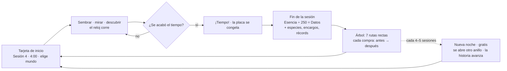

# Ciclo de juego: sesiones de laboratorio y Árbol de investigación

> **Decisión del dueño (tras jugarlo):** *«El menú de mejoras y el prestigio tienen que ser más claros — algo como un
> ÁRBOL CON RAMAS. La idea es que eres como un ESTUDIANTE CON TIEMPO DE LABORATORIO: puedes experimentar X tiempo antes
> de que empiece otra tanda.»*
>
> **Segunda decisión del dueño:** *«Como cambia el menú de evoluciones eso de calibrar ya no iría, ¿no? Deben ser más
> claras las rutas de mejora y prestigio: deben ser lineales siempre para conseguir más recursos u obtener más… al final
> es un juego aunque sea cosas de química.»*
>
> **Plan vinculante:** la página «Rutas de mejora de Bioluma» (7 rutas rectas, 53 mejoras, 7 mundos, la Noche como
> prestigio gratis). Este documento la aplica y dice dónde la medida obligó a desviarse (§4.3 mundos, §4.5 Gotero,
> §11 ritmo).

Todos los números viven en [`src/game/cycleBalance.ts`](../src/game/cycleBalance.ts) (Fase 2: reexportado desde
`balance.ts`). Sustituye al ciclo continuo de la GDD (§5 Muestras/Genoma, §8 Laboratorio, §10 Extinción, Calibrar) — ver
el ADR propuesto en §16.

## Índice

1. [El ciclo en una imagen](#1-el-ciclo-en-una-imagen)
2. [La sesión](#2-la-sesión)
3. [Dos monedas: Esencia y Datos](#3-dos-monedas-esencia-y-datos)
4. [El Árbol: 7 rutas rectas](#4-el-árbol-7-rutas-rectas)
5. [Noches: el prestigio, gratis](#5-noches-el-prestigio-gratis)
6. [Encargos dentro de las sesiones](#6-encargos-dentro-de-las-sesiones)
7. [Progreso offline](#7-progreso-offline)
8. [Qué se conserva y qué se reinicia](#8-qué-se-conserva-y-qué-se-reinicia)
9. [Precios claros](#9-precios-claros)
10. [La pantalla del árbol](#10-la-pantalla-del-árbol)
11. [Ritmo: bot de sesiones](#11-ritmo-bot-de-sesiones)
12. [Anti-frustración](#12-anti-frustración)
13. [Partidas antiguas](#13-partidas-antiguas)
14. [Archivos y API](#14-archivos-y-api)
15. [Cambios para la Fase 2](#15-cambios-para-la-fase-2)
16. [ADR propuesto y preguntas abiertas](#16-adr-propuesto-y-preguntas-abiertas)

---

## 1. El ciclo en una imagen



**El prestigio en una sola línea** (la que ve el jugador): *Termina la sesión → ganas N Datos («por cada 250 de
Esencia, 1 Dato») → gástalos en el árbol → la próxima sesión rindes más.* Antes de que acabe la sesión, el HUD ya dice
cuánto vas a ganar y para qué te alcanza: **«📊 +22 Datos al terminar · Más tiempo: faltan 4»** (al tocarlo, la cuenta
entera en la hoja «¿Por qué?» de Momentos).

*Un estudiante con tiempo de laboratorio.* Cada **sesión** es una placa nueva y un reloj (3:00 al principio). Las
criaturas estables dan **Esencia**, que se gasta en semillas durante la sesión. Al llegar a cero, la Esencia **ganada** se
convierte en **Datos** con una cuenta que se ve entera. Con los Datos se compran mejoras del **Árbol** en **7 rutas
rectas**: en cada ruta, el paso siguiente siempre da más. El **Bestiario** y el **Árbol** nunca se pierden; la placa se
vacía en cada sesión. Cada 4–5 sesiones la **noche avanza** (gratis): se abre un anillo más del árbol y VELA cuenta el
siguiente capítulo. **No hay mandos de química**: las reglas del mundo se eligen como **mundos** con sus especies (§4.3).

## 2. La sesión

### 2.1 Tarjeta de inicio

`src/ui/session/start.ts`. **«Sesión 8 · Tienes 5:30 de laboratorio»**; **«Elige un mundo»**: los mundos abiertos como
tarjetas (nombre, una línea en palabras, retratos de sus especies — las que aún no tienes como siluetas con «?» —, y
«+3 especies» / «Encontradas 1/3» / «¡Todas encontradas!»; el mundo recién abierto lleva **«¡Nuevo!»** y viene elegido);
lo que el árbol regala al empezar (💧 Esencia · 🎁 siembras gratis · ❄ criaturas de la Nevera con sus retratos);
**«Nuevo desde la última vez»**; el **encargo**; «El reloj empieza con tu primera gota» y **«¡Empezar!»**. Elegir mundo es
la **única** elección de reglas del juego y nunca enseña números. En la sesión 1 la tarjeta se omite (VELA presenta).

### 2.2 El reloj (HUD)

`src/ui/session/hud.ts`. Una píldora grande sobre la placa (dial + **«2:41»**, «Sesión 4») y debajo la píldora del
prestigio **«📊 +22 Datos al terminar · Más tiempo: faltan 4»** (o **«¡Alcanza para Más tiempo!»** en verde).

| Momento | Qué se ve | Sonido (gancho) |
|---|---|---|
| Antes de la primera gota | «3:30 · Siembra para empezar», en gris | — |
| Corriendo | cifras claras, dial azul | — |
| Queda 1 minuto | cartel **«¡Último minuto!»** sobre la placa (una vez) | `lastMinute` |
| Últimos 30 s | la píldora se vuelve **ámbar** y late | `warn` |
| Últimos 10 s | cada segundo la cifra **rebota** | `tick` |
| Sprint final (nodo) | chip dorado **«¡Sprint! ×2»** | — |
| Se alarga | chip verde **«+5 s especie»** bajo el reloj | `extend` |
| 0:00 | sello **«¡TIEMPO!»** sobre la placa congelada (1,6 s), luego el resumen | `timesUp` |

**Cuándo corre:** solo mientras la placa corre; **se detiene** con la pausa, las tarjetas de Momentos, los diálogos y
cualquier pantalla encima (`tickSession(…, {paused})`). **Empieza con la primera gota.**

**Qué lo alarga** (todo visible con «+N s», nada lo resta):

| Fuente | Segundos | De dónde |
|---|---|---|
| Duración base | 3:00 | `SESSION_BASE_SECONDS` |
| ⏱ Más tiempo · Reloj grande · Reloj de arena · Reloj eterno | +30·3, +30·2, +60·2, +30·3 → **9:00** | ruta Reloj |
| Cada especie **nueva** para el Bestiario (regla base) | +5 s | `SESSION_TIME_PER_SPECIES` |
| Encargo cumplido | +5 s → +10 → +15 («Encargos con prisa») | `SESSION_TIME_PER_ENCARGO` + nodo |
| Destello atrapado | +5 s → +10 («Destello del tiempo») | nodo |

### 2.3 La Esencia durante la sesión

Solo se gasta dentro de la sesión: semillas (precio explicado con la hoja «¿Por qué cuesta esto?» de
`src/ui/moments/seedprice.ts`, con flecha ↑/↓ y su motivo cada vez que cambia) y copias (Copiadora). Los Datos se calculan
con la Esencia **ganada**, no la guardada: gastar nunca castiga.

### 2.4 Terminar antes

Menú de pausa → **«Terminar ahora»** (con confirmación). Cobra lo ganado; el resumen dice cuánto tiempo quedaba.

### 2.5 El resumen: «Fin de la sesión N»

`src/ui/session/summary.ts`: título y tiempo usado; **VELA** dice una línea (`velaKey`); **«Cómo se calcularon tus
Datos»** con la fórmula a la vista (**«💧 Por cada 250 de Esencia, 1 Dato»**) y la ecuación fila a fila que suma de
verdad (§3.3), con un total que cuenta hacia arriba; especies de hoy con retratos (**«¡Nueva!»**), la mejor criatura,
récords; dos botones fijos: **«Ir al Árbol · 3 mejoras listas»** y **«Nueva sesión»** (si no alcanza para nada, «Nueva
sesión» va primero y el árbol dice «Te faltan 12 para Más tiempo»). En escritorio, dos columnas.

## 3. Dos monedas: Esencia y Datos

### 3.1 Esencia 💧 (de la sesión)

La producen las criaturas estables (GDD §5, sin cambios), se gasta en semillas y copias y **se convierte al acabar**.
Cada sesión empieza con 20 + «Esencia de bolsillo».

### 3.2 Datos 📊 (permanentes)

La moneda del árbol (*Data*): de cada experimento sacas datos y con datos aprendes técnicas nuevas. Se renombra en un
solo sitio (`DATOS_NAME`).

### 3.3 La conversión, a la vista

```
Datos = ⌊ Esencia ganada ÷ 250 ⌋ × noche            (+10 % por noche después de la primera)
      + especies nuevas × 5 (7, 9, 11 con Cuaderno de campo)
      + maneras de moverse nuevas × 3 (5, 7 con Premio al descubridor)
      + encargos × 2  + destellos × (Destello sabio)  + récords × 1
      + Gran enciclopedia: +25 / 50 / 75 % de todo lo anterior
      (nunca menos de 3)
```

En pantalla, cada número es entero y se puede comprobar:

```
💧 Por cada 250 de Esencia, 1 Dato
💧 310.000 Esencia ganada  ÷  250 (= 1 Dato)        = 1.240
1.240 Datos   🌙 ×1,2 Noche 3                        = 1.488
+ 🧬 2 × 9 especies nuevas                            =  +18
+ ↗ 1 × 3 maneras de moverse nuevas                   =   +3
+ 📋 1 × 2 encargos                                   =   +2
+ 1.511 Datos × 25 % 📚 Enciclopedia                  = +377
──────────────────────────────────────────────────────────────
📊 Datos                                               1.888
```

- **División lineal (÷250)**: «cada 250 de Esencia es 1 Dato». La página decía ÷100; con la economía de hoy (≈3× la
  Esencia por sesión que la tabla de la página) ÷100 compraba el árbol entero en 13 sesiones y luego las sesiones se
  estancaban (§11). Es una sola constante (`DATOS_ESSENCE_DIV`). Nada oculto: la noche y la enciclopedia salen como filas.
- **«Especie nueva» = primera vez en la partida**: repetir sesiones no cultiva bonus.
- **Récords** desde la sesión 2; **mínimo 3 Datos**.
- El HUD enseña la misma cuenta **antes** de que acabe la sesión (`sessionPreview` + `datosExplain`).

### 3.4 Lo que se retira

- **Calibrar** (mandos μ/σ/R/dt, Recetas, anillos a mano, «Mapa de especies»): sustituido por la ruta 🌍 **Mundos**
  (§4.3). Nadie mueve μ ni σ.
- **Muestras**: su papel lo cumplen los Datos por especie/comportamiento; sus mejoras son nodos de 🔬 Descubrir.
- **Genoma y Extinción**: el prestigio es la **noche** (§5), gratis y sin reinicio doloroso.
- **Turno de laboratorio, Reserva, Pipeta rápida**: la sesión *es* el turno; sin offline.
- **Pincel y Formas de semilla** (ring/noise): retirados — eran elecciones con contra (más sorpresa, menos éxito). La
  Gota grande se queda (pura ganancia).

## 4. El Árbol: 7 rutas rectas

### 4.1 Forma

`src/game/tree.ts` (datos y lógica, puros) · `src/ui/tree/` (pantalla). **54 nodos**: el **centro** (la noche) y **7
rutas rectas** de 6 a 9 pasos. Reglas fijas (con test):

- **Cadena estricta:** el paso *k* solo necesita el paso *k − 1* de su ruta (nivel ≥ 1); el primero, el centro. Sin
  cruces, sin dos requisitos, sin caminos sin salida.
- **Siempre más:** cada nivel de cada nodo mejora estrictamente **un número** que se enseña como **«antes → después»**
  (`beforeAfter`, test sobre todos los niveles, solo y con el árbol lleno). Si un nodo posterior ya hace todo su trabajo
  (Gotero maestro → «toda semilla prende»; Placa gigante → la placa máxima), el anterior pasa a «¡Completo!»
  (`supersededBy`): nunca se compra un nivel que no da nada.
- **Anillos = bandas:** los nodos de un anillo quedan entre dos círculos de noche; el anillo marca el primer precio y la
  noche que lo abre (anillos 1–2: Noche 1 · anillo 3: Noche 2 · anillo 4: Noche 3 · anillo 5: Noche 4).

| Dirección | Ruta | Color | Para qué |
|---|---|---|---|
| ↑ | ⏱ **Reloj** | celeste | más tiempo por sesión y un arranque más rápido |
| ↗ | 💧 **Gotero** | turquesa | semillas que prenden más y más para sembrar |
| → | 🧫 **Placa** | lavanda | una placa más grande, con sitio para todas |
| ↘ | 🌱 **Vida** | rosa | cada criatura da más Esencia por segundo |
| ↙ | 🔬 **Descubrir** | naranja | más Datos por cada cosa nueva |
| ← | 🌍 **Mundos** | violeta | reglas nuevas donde nacen otras especies (sustituye a Calibrar) |
| ↖ | ✨ **Destello** | dorado | la chispa dorada viene más y regala más |

### 4.2 Todas las mejoras

Precios con la regla de §9 (anillo × factor^nivel). «Antes → después» como lo enseña la hoja (con los pasos anteriores
de la ruta comprados).

**Reloj** — Más tiempo en cada sesión y un arranque más rápido.

| # | Nodo | Anillo · 🌙 | Niveles | Precios (×factor) | Antes → después (de 0 al máximo) |
|---|---|---|---|---|---|
| 1 | Más tiempo | 1 · 1 | 3 | 3 · 6 · 12 (×2) | Sesión 3:00 → Sesión 3:30 → Sesión 4:00 → Sesión 4:30 |
| 2 | Reloj grande | 2 · 1 | 2 | 10 · 20 (×2) | Sesión 4:30 → Sesión 5:00 → Sesión 5:30 |
| 3 | Nevera | 2 · 1 | 3 | 10 · 20 · 40 (×2) | Ninguna al empezar → 1 criatura viva al empezar → 2 criaturas vivas al empezar → 3 criaturas vivas al empezar |
| 4 | Sprint final | 3 · 2 | 3 | 100 · 200 · 400 (×2) | Últimos 30 s ×1 → Últimos 30 s ×1,5 → Últimos 30 s ×2 → Últimos 30 s ×2,5 |
| 5 | Encargos con prisa | 3 · 2 | 2 | 100 · 200 (×2) | +5 s por encargo → +10 s por encargo → +15 s por encargo |
| 6 | Reloj de arena | 4 · 3 | 2 | 2000 · 4000 (×2) | Sesión 5:30 → Sesión 6:30 → Sesión 7:30 |
| 7 | Reloj eterno | 5 · 4 | 3 | 20.000 · 40.000 · 80.000 (×2) | Sesión 7:30 → Sesión 8:00 → Sesión 8:30 → Sesión 9:00 |

**Gotero** — Semillas que prenden más y más para sembrar.

| # | Nodo | Anillo · 🌙 | Niveles | Precios (×factor) | Antes → después (de 0 al máximo) |
|---|---|---|---|---|---|
| 1 | Gotero | 1 · 1 | 3 | 3 · 6 · 12 (×2) | Prenden 24 % → Prenden 32 % → Prenden 45 % → Prenden 59 % |
| 2 | Esencia de bolsillo | 2 · 1 | 4 | 10 · 20 · 40 · 80 (×2) | Empiezas con 20 de Esencia → Empiezas con 50 de Esencia → Empiezas con 110 de Esencia → Empiezas con 290 de Esencia → Empiezas con 820 de Esencia |
| 3 | Esporas de regalo | 3 · 2 | 3 | 100 · 200 · 400 (×2) | 1 siembra gratis → 3 siembras gratis → 5 siembras gratis → 7 siembras gratis |
| 4 | Estabilizador | 3 · 2 | 5 | 100 · 150 · 230 · 340 · 510 (×1,5) | Prenden 59 % → Prenden 65 % → Prenden 71 % → Prenden 76 % → Prenden 80 % → Prenden 84 % |
| 5 | Gota grande | 3 · 2 | 1 | 100 (×2) | No → Semilla grande ×2,25 |
| 6 | Sembrador automático | 3 · 2 | 6 | 100 · 150 · 230 · 340 · 510 · 760 (×1,5) | Nunca → Cada 20 s → Cada 16 s → Cada 12 s → Cada 10 s → Cada 8,2 s → … |
| 7 | Gotas baratas | 4 · 3 | 3 | 2000 · 4000 · 8000 (×2) | Precio normal → Semillas −15 % → Semillas −28 % → Semillas −39 % |
| 8 | Gotero maestro | 5 · 4 | 1 | 20.000 (×2) | Prenden 76 % → Prenden 100 % |

**Placa** — Una placa más grande, con sitio para todas.

| # | Nodo | Anillo · 🌙 | Niveles | Precios (×factor) | Antes → después (de 0 al máximo) |
|---|---|---|---|---|---|
| 1 | Placa más grande | 1 · 1 | 3 | 3 · 9 · 27 (×3) | Placa Ø96 → Placa Ø128 → Placa Ø160 → Placa Ø192 |
| 2 | Más sitio | 2 · 1 | 3 | 10 · 20 · 40 (×2) | +0 sitios baratos → +1 sitio barato → +2 sitios baratos → +3 sitios baratos |
| 3 | Sin apretujones | 3 · 2 | 2 | 100 · 200 (×2) | Recargo normal → Recargo −40 % → Recargo −68 % |
| 4 | Guardería | 3 · 2 | 1 | 100 (×2) | No → Las 2 primeras no suben el precio |
| 5 | Incubadora | 3 · 2 | 2 | 100 · 300 (×3) | Maduran ×1 → Maduran ×2 → Maduran ×3 |
| 6 | Placa gigante | 4 · 3 | 1 | 2000 (×2) | Placa Ø192 → Placa Ø224 |
| 7 | Ecosistema | 4 · 3 | 2 | 2000 · 4000 (×2) | +0 % por especie viva → +3 % por especie viva → +6 % por especie viva |

**Vida** — Cada criatura da más Esencia por segundo.

| # | Nodo | Anillo · 🌙 | Niveles | Precios (×factor) | Antes → después (de 0 al máximo) |
|---|---|---|---|---|---|
| 1 | Cultivo | 1 · 1 | 5 | 3 · 5 · 7 · 10 · 15 (×1,5) | Esencia ×1 → Esencia ×1,15 → Esencia ×1,32 → Esencia ×1,52 → Esencia ×1,75 → Esencia ×2,01 |
| 2 | Nutriente | 2 · 1 | 3 | 10 · 20 · 40 (×2) | Esencia +0 % → Esencia +8 % → Esencia +16 % → Esencia +24 % |
| 3 | Superalimento | 3 · 2 | 3 | 100 · 200 · 400 (×2) | Esencia ×1 → Esencia ×1,25 → Esencia ×1,56 → Esencia ×1,95 |
| 4 | Nadadoras | 3 · 2 | 3 | 100 · 200 · 400 (×2) | Nadadoras +0 % → Nadadoras +15 % → Nadadoras +30 % → Nadadoras +45 % |
| 5 | Tranquilas | 3 · 2 | 3 | 100 · 200 · 400 (×2) | Quietas +0 % → Quietas +15 % → Quietas +30 % → Quietas +45 % |
| 6 | Familias | 4 · 3 | 3 | 2000 · 4000 · 8000 (×2) | Colonias +0 % → Colonias +15 % → Colonias +30 % → Colonias +45 % |
| 7 | Simbiosis | 4 · 3 | 1 | 2000 (×2) | No → Parejas ×1,5 |
| 8 | Vida abundante | 4 · 3 | 1 | 2000 (×2) | Toda la Esencia ×1 → Toda la Esencia ×1,5 |
| 9 | Vida eterna | 5 · 4 | ∞ | 20.000 · 22.000 · 24.000 · 27.000 · … (×1,1) | Esencia ×1 → Esencia ×1,1 → Esencia ×1,21 → Esencia ×1,33 → Esencia ×1,46 → Esencia ×1,61 |

**Descubrir** — Más Datos por cada cosa nueva que encuentras.

| # | Nodo | Anillo · 🌙 | Niveles | Precios (×factor) | Antes → después (de 0 al máximo) |
|---|---|---|---|---|---|
| 1 | Cuaderno de campo | 1 · 1 | 3 | 3 · 6 · 12 (×2) | 5 Datos por especie nueva → 7 Datos por especie nueva → 9 Datos por especie nueva → 11 Datos por especie nueva |
| 2 | Copiadora | 2 · 1 | 1 | 10 (×2) | No → Copias que siempre prenden |
| 3 | Catalogación | 3 · 2 | 5 | 100 · 150 · 230 · 340 · 510 (×1,5) | Bestiario: Esencia +0 % → Bestiario: Esencia +10 % → Bestiario: Esencia +20 % → Bestiario: Esencia +30 % → Bestiario: Esencia +40 % → Bestiario: Esencia +50 % |
| 4 | Archivo | 3 · 2 | 2 | 100 · 200 (×2) | Nunca → Copia gratis cada 45 s → Copia gratis cada 20 s |
| 5 | Microscopio | 3 · 2 | 2 | 100 · 200 (×2) | Ficha simple → Rangos y marcas → Todos los detalles |
| 6 | Premio al descubridor | 4 · 3 | 2 | 2000 · 4000 (×2) | 3 Datos por manera nueva → 5 Datos por manera nueva → 7 Datos por manera nueva |
| 7 | Esporas curiosas | 4 · 3 | 1 | 2000 (×2) | No → Buscan formas nuevas |
| 8 | Mutaciones | 4 · 3 | 1 | 2000 (×2) | No → Copias con variantes |
| 9 | Gran enciclopedia | 5 · 4 | 3 | 20.000 · 40.000 · 80.000 (×2) | Datos +0 % → Datos +25 % → Datos +50 % → Datos +75 % |

**Mundos** — Reglas nuevas en las que nacen otras especies.

| # | Nodo | Anillo · 🌙 | Niveles | Precios (×factor) | Antes → después (de 0 al máximo) |
|---|---|---|---|---|---|
| 1 | Mundo 2 · Frío | 1 · 1 | 1 | 3 (×2) | 2 especies posibles → 5 especies posibles |
| 2 | Mundo 3 · Remolinos | 2 · 1 | 1 | 10 (×2) | 5 especies posibles → 7 especies posibles |
| 3 | Mundo 4 · Escudos | 3 · 2 | 1 | 100 (×2) | 7 especies posibles → 11 especies posibles |
| 4 | Mundo 5 · Discos | 3 · 2 | 1 | 100 (×2) | 11 especies posibles → 14 especies posibles |
| 5 | Mundo 6 · Patas | 4 · 3 | 1 | 2000 (×2) | 14 especies posibles → 16 especies posibles |
| 6 | Mundo 7 · Gigantes | 5 · 4 | 1 | 20.000 (×2) | 16 especies posibles → 17 especies posibles |

**Destello** — La chispa dorada viene más y regala más.

| # | Nodo | Anillo · 🌙 | Niveles | Precios (×factor) | Antes → después (de 0 al máximo) |
|---|---|---|---|---|---|
| 1 | Destello frecuente | 1 · 1 | 3 | 3 · 6 · 12 (×2) | Llega cada 90–240 s → Llega cada 72–192 s → Llega cada 58–154 s → Llega cada 46–123 s |
| 2 | Destello lento | 2 · 1 | 2 | 10 · 20 (×2) | Se queda 12 s → Se queda 16 s → Se queda 20 s |
| 3 | Destello del tiempo | 2 · 1 | 2 | 10 · 20 (×2) | +0 s por chispa → +5 s por chispa → +10 s por chispa |
| 4 | Primer destello | 3 · 2 | 1 | 100 (×2) | La primera a los 40–80 s → La primera a los 10–20 s |
| 5 | Regalos mejores | 3 · 2 | 3 | 100 · 200 · 400 (×2) | Regalos ×1 → Regalos ×1,4 → Regalos ×1,8 → Regalos ×2,2 |
| 6 | Destello sabio | 3 · 2 | 2 | 100 · 200 (×2) | +0 Datos por chispa → +1 Datos por chispa → +2 Datos por chispa |
| 7 | Mutágeno potente | 4 · 3 | 1 | 2000 (×2) | 3 semillas seguras → 5 semillas seguras |

Diferencias con la página del plan: **Placa más grande tiene 3 niveles** (Ø96 es la placa base; 3 niveles llevan a Ø192 y
Placa gigante a Ø224 — la página decía «4 niveles» con los mismos 4 tamaños); **Pincel y Formas** se retiran (§3.4);
**«Descubrir da tiempo»** pasa a regla base (+5 s por especie nueva); los precios de los anillos 3–5 se ajustaron (§11).

### 4.3 Mundos: las reglas como tarjetas (sustituye a Calibrar)

`src/game/worlds.ts`. Un mundo es un **preajuste fijo** de `LeniaParams` (μ, σ, R, anillos del núcleo). La ruta 🌍 los
abre en orden; el mundo recién abierto queda elegido para la próxima sesión (`researchBuy`) y la tarjeta de inicio deja
cambiar a cualquiera abierto (`researchPickWorld`). Las semillas de un mundo salen de **sus** especies (las que aún no
tienes, 3× más probables; ×2 más con Esporas curiosas).

Comprobación con la simulación de referencia en CPU (`npx vite-node scripts/world-check.ts`): la plantilla exacta de
cada especie, en el preajuste del mundo, 700 pasos en un toro de 128²; «vive» si su masa queda entre 0,4× y 2,5× y no
inunda la placa (< 20 %). El preajuste parte del centro de sus especies (media de μ y σ) y, si en el centro alguna no
vive, se buscó el punto vecino donde viven más (rejilla fina; se prefieren puntos **robustos**, cuyos vecinos también
funcionan, porque la GPU calcula en float32).

| Mundo | Nodo (anillo) | Preajuste μ · σ · R · anillos | Especies que viven ahí (Bestiario) | Caídas (no viven en ese preajuste) | Paga por criatura* |
|---|---|---|---|---|---|
| 1 · Clásico | gratis | 0,15 · 0,015 · 13 · [1] | Orbium (unicaudatus/bicaudatus), Synorbium ignis — **2** | — | 2,65 |
| 2 · Frío | Mundo 2 (1) | 0,1207 · 0,0105 · 13 · [1] | Orbium ignis, Synorbium solidus, Orbium phantasma — **3** | — | 2,63 |
| 3 · Escudos | Mundo 3 (2) | 0,2865 · 0,0465 · 13 · [1] | Scutium valvatus y solidus, Gyropteron arcus, Paraptera — **4** | — | 4,32 |
| 4 · Remolinos | Mundo 4 (3) | 0,16 · 0,0222 · 13 · [1] | Gyrorbium gyrans (gira), Parorbium dividuus — **2** | — | 4,68 |
| 5 · Discos (plan: «Hélices») | Mundo 5 (3) | 0,356 · 0,063 · 13 · [1] | Discutium/Pyroscutium, Circium, Triscutium — **3** | Helicium solidus, Pentahelicium (inundan) | 4,85 |
| 6 · Patas | Mundo 6 (4) | 0,23 · 0,0355 · 13 · [1] | Helicium cavus pedes, Synptera — **2** | Parorbium adhaerens (inunda), Gyropteron cavus (muere) | 6,25 |
| 7 · Gigantes | Mundo 7 (5) | 0,25 · 0,033 · 18 · [½, 1, ⅔] | Hydrogeminium natans — **1** | Kronium dividuus (otro núcleo) | 9,60 · **×2** (caben la mitad) |

\* Media por especie de complejidad medida × comportamiento × rareza (`world-check.ts --yield`, constantes de
`balance.ts`). **El orden de los mundos sigue esta columna** (la página ponía Remolinos 2.º, Frío 3.º, Patas 4.º y
Escudos 5.º): el mundo recién abierto viene elegido en la tarjeta, así que nunca puede pagar menos que el anterior
(Remolinos 2.º hacía saltar la noche 1 a ×6 y luego Frío bajaba la Esencia a la mitad: un bajón en cada mundo nuevo).
Los anillos de la ruta son los de la página: 1 · 2 · 3 · 3 · 4 · 5.

**Lo que la medida cambió respecto a la página:**

- **Orden**: por lo que paga cada mundo (tabla), no por la lista de la página.
- **Remolinos**: en el centro (μ 0,165) Gyrorbium gyrans muere; ambas viven en una ventana pequeña alrededor de
  (0,16 · 0,0222). Se quedan las dos.
- **Patas**: Parorbium adhaerens inunda la placa en toda la zona; Gyropteron cavus solo comparte puntos al filo
  (0,232 · 0,0365, no robusto). Se quedan Helicium cavus pedes y Synptera (las de patas).
- **Hélices → «Discos»**: Helicium solidus y Pentahelicium inundan donde viven los discos (y los discos mueren donde vive
  Helicium). Se quedan Discutium/Pyroscutium (una sola especie para el Bestiario), Circium y Triscutium; el mundo se
  llama **«Discos»** porque ya no tiene hélices (una cadena en `treeText.ts` si se prefiere otro nombre).
- **Gigantes**: un mundo tiene un solo núcleo; Kronium necesita anillos [1, ⅓], donde Hydrogeminium inunda, y muere en
  los de Hydrogeminium. Se queda **Hydrogeminium natans** (anillos triples, R 18).
- Total: **17 especies** de Bestiario en los 7 mundos (la página contaba 24 nombres; O2u/O2b y S2s/PS3am son una sola
  especie para el detector, `CATALOG_GROUPS`). Las 6 caídas siguen en el catálogo para un mundo futuro.

### 4.4 Qué se ve: reglas de revelado

| Estado | Cuándo | Cómo se ve |
|---|---|---|
| **Tuyo** | nivel ≥ 1 | borde brillante del color de la ruta, halo, insignia «2/5» o ✓ |
| **Comprable ya** | el paso anterior es tuyo, anillo abierto y Datos suficientes | **late en verde**, precio en verde |
| **Disponible** | el paso anterior es tuyo, faltan Datos | icono legible, precio en su color |
| **«?»** | el paso siguiente a algo visible, o en un anillo que la noche aún no abrió | baldosa punteada con «?»; si es por la noche, insignia 🌙2 |
| **Oculto** | más lejos en la ruta | no se dibuja |

### 4.5 Gotero: lo que de verdad prende (medido)

La página marcaba ≈25/35/45/60 % como objetivos. El Gotero y el Estabilizador mueven el sesgo hacia la plantilla y quitan
ruido (`DROPPER_TREE_BIAS/NOISE`, `STABILIZER_TREE_BIAS/NOISE`, `seedConfig`); los porcentajes que enseña la UI son los
**medidos** (`SEED_SUCCESS`, `npx vite-node scripts/world-check.ts --seeds`: una semilla de radio R con la densidad del
juego y una plantilla del Mundo Clásico, 500 pasos en un toro de 64²; «prende» si queda un cuerpo de criatura).

| Gotero \ Estabilizador | 0 | 1 | 2 | 3 | 4 | 5 | (sesgo · ruido sin Estabilizador) |
|---|---|---|---|---|---|---|---|
| Sin Gotero | **24 %** | 29 % | 35 % | 41 % | 48 % | 54 % | 0,815 · 0,35 |
| Gotero I | **32 %** | 38 % | 44 % | 51 % | 57 % | 63 % | 0,83 · 0,33 |
| Gotero II | **45 %** | 51 % | 58 % | 64 % | 70 % | 75 % | 0,85 · 0,30 |
| Gotero III | **59 %** | 65 % | 71 % | 76 % | 80 % | 84 % | 0,87 · 0,25 |
| Gotero maestro | **100 %** (plantilla pura, ruido 0,08) | | | | | | 1 · 0,08 |

Cada nivel de Estabilizador suma +0,01 de sesgo y quita 0,012 de ruido (+5–7 puntos medidos). Objetivos de la página:
≈25/35/45/60 % → medidos 24/32/45/59 %; Estabilizador «+6 % → +30 %» → medido +25 puntos con Gotero III. Las 24
casillas se midieron con 100 semillas cada una (±5 %) más 13 barridos de sesgo/ruido (~3 000 semillas en CPU); la tabla es
un ajuste logístico de todas ellas para que cada nivel lea más que el anterior. **Fase 2:** volver a medir con la GPU y la
placa redonda (la detección real decide qué es «criatura»).

### 4.6 De las mejoras antiguas a los nodos

| Antes | Ahora |
|---|---|
| Gotero I–V | 💧 Gotero (3) · Gota grande · Gotero maestro (toda semilla prende) |
| Estabilizador (10) | 💧 Estabilizador (5) |
| Sembrador automático | 💧 Sembrador automático (6 niveles, 20 s → 6,6 s) |
| Cultivo · Nutriente | 🌱 Cultivo (5) · Nutriente (3) · Superalimento (3) · Vida abundante · Vida eterna (∞) |
| Afinidad nadadora / sésil / colonial | 🌱 Nadadoras · Tranquilas · Familias (+15 % por nivel) |
| Placa I–IV · Incubadora | 🧫 Placa más grande (3) · Más sitio · Sin apretujones · Guardería · Incubadora (las semillas maduran ×2/×3) · Placa gigante · Ecosistema |
| Calibrador I–IV, Recetas, Anillos dobles/triples, Microscopio III (mapa) | 🌍 **Mundos 2–7** (sin mandos) |
| Microscopio I–II, Marcador, Catalogación, Archivo, Imprimir | 🔬 Microscopio (2) · Catalogación (5) · Archivo (2) · Copiadora |
| Genoma: Mutaciones / Simbiosis / Arranque con Esencia / Turno doble / Sembrador fiel | 🔬 Mutaciones · 🌱 Simbiosis · 💧 Esencia de bolsillo · ⏱ Reloj grande · 💧 Sembrador |
| Reserva, Pipeta rápida, Termo, Paneles, Recetas guardadas | retirados (se reembolsan al migrar) |

## 5. Noches: el prestigio, gratis

La historia mide los actos con `view.era`: Acto I = noche 1, Acto II = noches 2–5, Acto III = noche 6+. La era avanza con
el **nodo central**, que **no cuesta Datos**:

| Pasar a | Sesiones terminadas | Especies en el Bestiario | o bien (nunca atascado) |
|---|---|---|---|
| Noche 2 (abre el anillo 3) | 4 | 2 | 8 sesiones |
| Noche 3 (anillo 4) | 8 | 4 | 12 |
| Noche 4 (anillo 5) | 13 | 7 | 17 |
| Noche 5 | 18 | 10 | 22 |
| Noche 6 (Acto III) | 23 | 12 | 27 |
| Noche 7 (la pregunta final) | 28 | 14 | 32 |

Cada noche da **+10 % de Datos** (fila visible en la ecuación) y el ritual de la lámpara (el de la Extinción, sin borrar
nada). El centro late en dorado y la hoja dice «Empezar la Noche 3» con las barras «Sesiones 8/8 · Especies 4/4».

## 6. Encargos dentro de las sesiones

La cadena **persiste** entre sesiones; el encargo actual sale en la tarjeta de inicio y en la barra de objetivo.
Recompensas: su Esencia se paga en la sesión (no cuenta como ganada), **+5 s** de reloj (§2.2) y **+2 Datos**. Cambios de
la cadena (Fase 2): «Compra el Gotero/Sembrador/Cultivo/Placa» → «…en el Árbol» (métrica `upgrade:<id>` = nivel del
nodo con el mismo id); **«Compra el Calibrador» → «Abre el Mundo 2 en el Árbol»** (`upgrade:worldCold`); **«Calibra hasta
que nazca algo nuevo» → «Juega en un mundo nuevo hasta que nazca algo nuevo»** (métrica `worldNew`: sesión en un mundo
con especies sin encontrar + especie nueva); `era100k` → «Gana 2 000 Esencia en una sesión»; `extinct` → «Empieza una
noche nueva».

## 7. Progreso offline

No hay: la sesión solo corre mientras se juega. `OFFLINE_DATOS = 0` queda preparado.

## 8. Qué se conserva y qué se reinicia

| Se conserva siempre | Se reinicia en cada sesión |
|---|---|
| Datos sin gastar, niveles del árbol, mundos abiertos y el elegido | La placa (vuelven las criaturas de la Nevera que viven en ese mundo) |
| Bestiario: especies, retratos, nombres | Esencia (20 + Esencia de bolsillo) |
| Comportamientos, logros, Bitácora, estadísticas, récords, historial | Reloj, buffs, destello, semillas gratis/seguras |
| Historia, Encargos, elecciones, finales, ajustes | Estado «desbordada» |

## 9. Precios claros

1. **Una regla, siempre la misma, sin azar:** `precio = inicio del anillo × factor^nivel`, redondeado amable (enteros
   por debajo de 100; dos cifras por encima). Inicio por anillo: **3 · 10 · 100 · 2 000 · 20 000** (los de la
   página). Factor **×2**; **×1,5** en los nodos de 5 o más niveles; **×3** en Placa más grande e Incubadora;
   **×1,1 en Vida eterna** (cuesta un 10 % más y da un 10 % más en cada nivel: así las últimas noches siguen creciendo;
   con ×1,5 se estancaban, §11).
2. **La hoja de cada nodo** enseña el precio como ecuación `[3 · Anillo 1] × [×4 · 2 niveles comprados: ×2 cada uno] =
   [12 Datos]` con la regla en palabras. **Un toque en el precio** abre la hoja compartida **«¿Por qué cuesta esto?»**
   (`createPriceSheet` de Momentos, `nodePriceExplain`): la misma ecuación, la regla, los 3 niveles siguientes con lo que
   dan («nivel 3 · 12 Datos → Sesión 4:30») y **«Te faltan 7 Datos — unas 2 sesiones»**.
3. **«Próximos niveles»**: mini gráfico de barras (altura = precio, encima lo que da).
4. **«Datos 38 / 50»** con barra y «Te faltan 12 Datos — unas 2 sesiones» (media de las 3 últimas, `sessionsToAfford`).
5. Al comprar, el **PriceTicker** de Momentos junto a los Datos dice **«−12 · Más tiempo»** con la flecha ↓.
6. Las semillas dentro de la sesión siguen con `seedprice` (Momentos).

## 10. La pantalla del árbol

`createTreeView(root, opts)`: pantalla completa, fondo de noche, círculos guía por anillo y círculos punteados con luna
para las noches cerradas (con niebla detrás). Arriba: Datos grandes, «Árbol · Noche 2 · 3 mejoras listas», **«▶ Nueva
sesión»**. Abajo: + / − / centrar (52 px). Arrastrar, pellizcar o rueda (0,16×–1,9×); al alejarse se ocultan los nombres
y salen los de las rutas en el borde. **Tocar un nodo** abre la hoja (abajo en móvil, a la derecha en escritorio): icono,
**NOMBRE**, «Reloj · Paso 1 de 7», **NIVEL 2/3**, el bloque **AHORA → CON UN NIVEL MÁS** («Sesión 4:00 → Sesión 4:30»,
gris → verde), una línea de descripción, el precio tocable (§9), los niveles siguientes, la barra de Datos y el botón
**«Comprar · 📊 12»**. Los nodos de mundo enseñan sus especies (siluetas «?» las que faltan). Comprar: salto, anillo de
partículas del color de la ruta, «2/3» flotando, el contador rebota, la línea crece hacia el «?» siguiente y gira.
Accesible: cada nodo es un botón con nombre y nivel; teclado (Tab/Enter, flechas, +/−, Esc); 48 px; claro/oscuro; es/en.

## 11. Ritmo: bot de sesiones

`npx vite-node scripts/session-bot.ts [sesiones=40] [corridas=3] [--verbose] [--policy=planner|greedy|kid] [--trace=N]`.
Juega el ciclo con la **economía real** del juego (`createGame`, con las mejoras del árbol traducidas en `applyTree`) y el
modelo estadístico de placa de `balance-bot.ts`, con tres cambios: una semilla prende con la probabilidad **medida**
(§4.5), su especie sale del **mundo** que se juega, y la población no pasa del sitio de la placa (también al dividirse).
Políticas: **planner** (prioridades sensatas; juega el mundo con más especies por encontrar), **greedy** (lo más barato;
el mundo más nuevo), **kid** (siembra cada 0,6 s, compra al azar, mundo al azar, atrapa menos destellos).

### 11.1 Planner: mediana de 4 corridas, sesión a sesión

| Ses. | Noche | Reloj | Esencia | Datos | Mejoras tuyas | Especies | Mundo | Compró después (corrida 1) |
|---|---|---|---|---|---|---|---|---|
| 1 | 1 | 3:25 | 3 474 | 32 | 2 | 2 | Clásico | Más tiempo ×3, Cultivo ×2 |
| 2 | 1 | 4:30 | 8 001 | 34 | 3 | 2 | Clásico | Cultivo ×3, Gotero |
| 3 | 1 | 4:30 | 6 407 | 27 | 5 | 2 | Clásico | Gotero ×2, Mundo 2, Placa |
| 4 | 2 | 4:45 | 20,7 K | 101 | 8 | 5 | Frío | 🌙2, Placa ×2, Reloj grande ×2, Cuaderno ×3… |
| 5 | 2 | 5:30 | 50,1 K | 223 | 10 | 5 | Frío | Nevera ×3, Esencia de bolsillo ×4 |
| 6 | 2 | 5:30 | 50,2 K | 222 | 16 | 5 | Frío | Mundo 3, Nutriente ×3, Más sitio ×3, Copiadora… |
| 7 | 2 | 5:55 | 108 K | 504 | 20 | 7 | Remolinos | Esporas, Sin apretujones, Superalimento, Catalogación, Mundo 4 |
| 8 | 3 | 6:20 | 208 K | 917 | 30 | 7 | Escudos | 🌙3, Sprint, Estabilizador, Guardería, Mundo 5… |
| 9 | 3 | 6:35 | 331 K | 1 634 | 36 | 11 | Discos | Microscopio, Regalos, Sembrador… |
| 10 | 3 | 6:35 | 389 K | 1 910 | 36 | 14 | Discos | niveles del anillo 3 |
| 11 | 3 | 6:20 | 544 K | 2 617 | 36 | 14 | Discos | niveles del anillo 3 |
| 12 | 3 | 6:20 | 786 K | 3 784 | 36 | 14 | Discos | niveles del anillo 3 |
| 13 | 4 | 6:20 | 1,31 M | 6 307 | 38 | 14 | Discos | 🌙4, Sembrador, Mundo 6, Reloj de arena |
| 14 | 4 | 7:40 | 1,78 M | 9 316 | 43 | 16 | Patas | Placa gigante, Familias, Premio, Gotas baratas, Ecosistema |
| 15 | 4 | 7:30 | 1,75 M | 9 090 | 47 | 16 | Patas | Simbiosis, Esporas curiosas, Mutágeno, Vida abundante |
| 16 | 4 | 7:30 | 2,74 M | 14 249 | 48 | 16 | Patas | Mutaciones, Reloj de arena… |
| 17 | 4 | 8:30 | 3,78 M | 19 666 | 48 | 16 | Patas | niveles del anillo 4 |
| 18 | 5 | 8:40 | 4,73 M | 24 601 | 48 | 16 | Patas | 🌙5, Gotas baratas |
| 19 | 5 | 8:30 | 3,62 M | 20 284 | 49 | 16 | Patas | Mundo 7 |
| 20 | 5 | 8:45 | 6,11 M | 34 204 | 51 | 17 | Gigantes | Reloj eterno, Gotero maestro |
| 22 | 5 | 9:10 | 6,72 M | 47 035 | 53 | 17 | Gigantes | Vida eterna ×2 |
| 24 | 6 | 9:10 | 10,6 M | 79 836 | 53 | 17 | Gigantes | Vida eterna ×2 |
| 26 | 6 | 9:30 | 13,0 M | 112 252 | 53 | 17 | Gigantes | Vida eterna ×2 |
| 28 | 7 (final) | 9:50 | 21,7 M | 195 186 | 53 | 17 | Gigantes | 🌙7, Vida eterna ×2, Reloj eterno |

`npx vite-node scripts/session-bot.ts 30 4 --policy=planner --runs` (con `--runs` imprime cada corrida y la curva sin la
suerte del Destello). «min» acumulados: 4 · 20 · 46 · 82 · 126 · 164 · 225 (sesión 28 ≈ 3,8 h con 45 s de resumen y
árbol por sesión).

### 11.2 Objetivos del plan

| Objetivo | Página | planner | greedy | kid |
|---|---|---|---|---|
| Sesión 1: 3:00 y ≥ 2 compras después | 3:00 · ~950 💧 | ✅ 3:25 (+5 s por especie nueva y encargo) · **3 474 💧** · 5 compras | ✅ · 9 | ✅ · 8 |
| Noche 1 (S1–4): reloj · Esencia · Datos | 3:00→4:30 · 950→4 500 · 28→48 | 3:25→4:45 · 3,5 K→21 K · 32→101 | | |
| Noche 2 (S5–8) | 4:30→5:30 · 11 K→35 K | 5:30→6:20 · 50 K→208 K | | |
| Noche 3 (S9–13) | 6:30→7:40 · 50 K→490 K | 6:35→6:20 · 331 K→1,3 M | | |
| Noche 4 (S14–18) | 8:10→9:00 · ~1 M→1,3 M | 7:40→8:40 · 1,8 M→4,7 M | | |
| Noches 2/3/4 en S5/S9/S14 | ✓ | ✅ | ✅ | ✅ (noche 4 en S15) |
| Final (noche 7 lista) en 3,5–5 h | S28 | ✅ S28 · 3,76 h | ✅ S28 · 3,96 h | ✅ S28 · 3,60 h |
| Sesiones tras las que se puede comprar ≥ 1 mejora | — | **100 %** | 100 % | 96 % |
| Mínimo de Datos en una sesión | ≥ 3 | 17 | 30 | 12 |
| Rutas tocadas en la sesión 12 | ≥ 6/7 | 7/7 | 7/7 | 7/7 |
| **REGLA DURA: ninguna sesión rinde menos que la anterior** | 0 bajones | mediana: **S3 −20 %, S19 −23 %** y tres planos (−1/−2 %) · **sin la suerte del Destello: S10 −5 %, S27 −3 %** | 5 | 5 |

**Lectura.**

- **La forma es la de la página** (3:00 → ~10:00; crecimiento suave; noches en S5/S9/S14; final en S28 a ~3,8 h; siempre
  hay algo que comprar), pero la Esencia de cada sesión es **~3–4×** la de su tabla. No es el árbol: la economía *dentro*
  de la sesión subió desde que se hizo esa tabla (complejidades medidas del catálogo — Synorbium ignis 2,0, no 1,2 —;
  semillas más baratas con `DISH_FREE_SLOTS` 3/5/7/9/12; el Destello «bloom» ×7). Por eso la conversión es **÷250** y
  no ÷100: con ÷100 el árbol entero se compraba en 13 sesiones y desde ahí las sesiones se estancaban (y bajaban).
- **La sesión 1** da 3 474 💧 porque el primer Destello llega siempre a los 40–80 s (`GOLDEN_FIRST_DELAY`) y un «bloom»
  ×7 aporta ~1 000; sin él, ~2 000. Ajuste posible en `balance.ts` (no en este trabajo).
- **Bajones**: al quitar los buffs del Destello (la curva «sin suerte»), la mediana sube en todas las sesiones salvo dos
  casi planas (−5 %, −3 %, ruido de muertes). Los dos bajones grandes son **suerte del Destello**: la sesión 18 cazó 7–8
  destellos y la 19, 5–6 (cada «bloom» vale ~⅓ de una sesión). Lo que sí era estructural y se corrigió: **mundos** (el
  nuevo pagaba menos que el anterior → reordenados por lo que paga una placa llena, y Gigantes ×2), **la Nevera** al
  cambiar de mundo (ahora siembra semillas puras del mundo nuevo), **Vida eterna** (×1,5 por nivel estancaba las últimas
  noches → ×1,1) y **la división** de criaturas por encima del sitio de la placa (modelo del bot).
- **Recomendación para la regla dura en el juego real**: regalos del Destello proporcionales a la sesión (p. ej. «30 s de
  tu producción») en lugar de ×7 aleatorio; así una sesión con menos destellos no cae un 20 %.

### 11.3 Límites del modelo

La placa estadística no tiene geometría (tope de población por tamaño de placa); las especies salen del mundo con la
supervivencia **medida** del Gotero; `applyTree` traduce el árbol a los mandos actuales del juego y deja fuera, a favor
del jugador real, Guardería, Sin apretujones, Gotas baratas y el tamaño de los regalos del Destello. En la Fase 2 el bot
usará el árbol integrado en `game.ts`.

## 12. Anti-frustración

- **Ninguna sesión vale cero**: mínimo 3 Datos, y la ecuación lo dice.
- **La sesión 1 garantiza una criatura** (primera gota segura + 3 siembras gratis) y cualquier sesión da una semilla
  segura si a los 45 s no hay nada estable (`pityDue`).
- **El reloj no corre** mientras explicas, lees o pausas; empieza con la primera gota.
- **Sin mandos que estropeen el mundo**: los mundos son preajustes comprobados; la Nevera solo replanta especies que viven
  en el mundo elegido.
- **Primeras compras baratas** (3 Datos) y siempre algo a la vista con «te faltan X — unas N sesiones».
- **Noches gratis** y con salida por sesiones si faltan especies. Nada se pierde salvo la placa.

## 13. Partidas antiguas

`migrateLegacy(oldState)` (`src/game/legacy.ts`, generosa): **era → noche** (con las sesiones que esa noche pedía);
mejoras y nodos de Genoma → los nodos que hacen lo mismo, **regalando los pasos anteriores de su ruta**; **Calibrador →
los mundos que sus mandos alcanzaban** (I → Frío y Remolinos; II → Escudos y Patas; III → Discos; Anillos
dobles/triples → Gigantes; los mundos anteriores de la ruta, gratis) y el más nuevo queda elegido; lo que cae en un anillo aún cerrado se **reembolsa** a precio de árbol; lo
retirado se reembolsa (10 Datos por nivel; Recetas guardadas, 20); **regalo de bienvenida** (20 + 10 por Genoma sin
gastar + 5 por gastado + 2 por Muestra + 5 por especie + ½·√(Esencia total)).

## 14. Archivos y API

| Archivo | Qué |
|---|---|
| `src/game/cycleBalance.ts` | Todos los números del ciclo |
| `src/game/tree.ts` (+ test) | 54 nodos en 7 rutas rectas (`routeNodes`), `beforeAfter`, `treeStates`, `canBuy`, `buyNode` (puro), `treeEffects`, `seedSuccess`/`seedConfig`, `possibleSpecies`, `nodeCost`, `priceRule`, `costRows`, `sessionsToAfford`, `nightInfo`, `nextGoal`, disposición en bandas (`TREE_LAYOUT`, `TREE_EDGES`, `TREE_BANDS`, `TREE_GATES`) |
| `src/game/worlds.ts` | `WORLDS` (preajuste, especies, caídas), `BASE_WORLD`, `worldSpeciesGroups`, `worldOfSpecies`, `TOTAL_WORLD_SPECIES` |
| `src/game/treeText.ts` | Textos es/en: rutas, nodos, valores de «antes → después», mundos, HUD, tarjetas, VELA |
| `src/game/session.ts` (+ test) | `ResearchState` (con `world`) y `SessionState` (con `world`), `beginSession`, `tickSession`, `note*`, `computeDatos`, `sessionPreview`, `summarize`, `applySummary`, `researchBuy`, `researchPickWorld`, `unlockedWorlds`, `nightReady`, `pityDue` |
| `src/game/legacy.ts` (+ test) | `migrateLegacy` |
| `src/ui/tree/` | `createTreeView` (hoja con antes → después, precio tocable, PriceTicker), `nodePriceExplain`, iconos propios (uno por nodo), `tree.css`, `dev.ts` |
| `src/ui/session/` | `createSessionHud` (+ `preview`), `createSessionStart` (selector de mundos), `createSessionSummary` (+ `equationRows`, `datosExplain`) |
| `tree-dev.html` | `?view=tree|summary|start|hud|flow&preset=new|s1|early|mid|late|all&sel=…&why=1&add=…&buy=…&lang=en&theme=light&rm=1` |
| `tests/e2e/tree-shots.mjs` | 41 capturas (390×844 y 1366×768) + interacción; falla con errores, desbordes o botones < 48 px |
| `scripts/session-bot.ts` · `scripts/world-check.ts` | Ritmo (§11) · mundos y semillas medidos (§4.3, §4.5) |

## 15. Cambios para la Fase 2

**`src/game/game.ts`**
1. Estado `research: ResearchState` y `session: SessionState`; `fx = treeEffects(research.levels)` (cacheado, se
   recalcula al comprar).
2. Efectos en lugar de `level('x')`: semilla aleatoria con `seedConfig(fx)` (sesgo/ruido; Gotero maestro = plantilla
   pura con ruido mínimo), Gota grande `fx.bigSeed`, `seedCost × fx.seedCostMult`, `SEED_CROWD → fx.crowdFactor`, las
   primeras `fx.nurseryBonus` criaturas no cuentan para la saturación, `freeSlots = DISH_FREE_SLOTS[min(fx.dishLevel,4)] +
   fx.extraSlots`, diámetro `dishDiameterFor(fx.dishLevel)`, maduración `× fx.matureSpeed` (ventana de detección de
   criaturas nuevas ÷ matureSpeed), Sembrador `fx.autoSeedInterval`, producción `× fx.prodMult × (1 + fx.ecosystem ·
   especiesVivas) × sessionProdMult`, `fx.affinity.{swim,still,colony}`, `fx.complexityMult`, `fx.cataloguing`,
   `fx.symbiosis`, Microscopio `fx.microscope`, Archivo `fx.archiveInterval`, Mutaciones, Esporas curiosas, Destello
   (`fx.goldenIntervalMult`, `fx.goldenFirstDelay`, `fx.goldenLifeBonus`, `× fx.goldenRewardMult`, `fx.mutagenSeeds`).
3. **Mundos:** al empezar la sesión, `calib = WORLD_BY_ID[session.world].params` (sin rangos ni límites de Calibrador) y
   las esporas salen de `sporeCandidates(params, worldSporeEntries)` — o sea, `pickSporeTemplate` con
   `entries = SPORE_CATALOG.filter(e ∈ world.species)` y pesos uniformes × novedad (×2 con `fx.rareSpores`). La Nevera
   replanta solo especies con `worldOfSpecies(code) === session.world`.
4. Ciclo de sesión: `startSession()` (limpia placa y detector, Esencia `fx.startEssence`, siembras `fx.freeSeeds`, mundo,
   Nevera), `noteSeed`, `noteEssence` en `addEssence`, `noteSpecies`/`noteBehavior` en el registro, `noteGolden`,
   `noteEncargo`, `noteProduction`/`noteBest` en `econTick`, `tickSession(dt, {paused})`, `pityDue →
   charges.guaranteed++`, en `timesUp`: congelar, `noteKeep`, `summarize` → evento `sessionEnd`; `endSessionNow()`;
   `applySummary` al cerrar el resumen; `sessionPreview` cada segundo para el HUD.
5. Acciones nuevas: `buyNode(id)`, `pickWorld(id)`, `startSession()`, `endSessionNow()`.
6. **Borrar (Calibrar):** `ranges()` y `CALIBRATOR_RANGES`, `ringOptions()`/`RING_PRESETS`, las acciones
   `setCalibration`, `setRings`, `saveRegime`, `loadRegime`, `deleteRegime`; `calibrationView()` (rangos, `regimes`,
   `maxRegimes`, `hints`/`HINT_RADIUS`) y `GameView.calibration` (o dejar solo `{mu, sigma, R, dt, rings}` de lectura para
   la Bitácora); `s.regimes`, `stats.regimesSaved`; la mejora `calibrator` (y su `unlockJournal('calibrator')`), los
   nodos `doubleRings`/`tripleRings`/`regimesPersist`; `tabs.calibrate` y `flags.tabCalibrate`; las métricas
   `calibrations`/`regimesSaved` de logros (o reescribirlas como «mundos visitados»).
7. Borrar también: Extinción/Genoma (`extinguish`, `genomeGain`…), Muestras (las copias cuestan Esencia), offline,
   objetivos antiguos; `globalParts()` sin `culture`/`dish`/`genome` (los da el árbol).

**`src/ui/ui.ts`**: quitar la pestaña **Calibrar** (`TABS`, `TAB_LABEL/ICON/LOCK_HINT.calibrate`, el
`CalibratePanel` de `panel-calibrate.ts` — borrar el archivo —, `calKey` y el punto «nuevo» de calibración en
`updateTabs`, `prefs.calKey`, el arte vacío `calibrate`) y las pestañas **Laboratorio** y **Genoma** (+ la lista de
mejoras de Muestras del Bestiario); botón **«Árbol»** (solo entre sesiones; de solo lectura durante la sesión); el
contador del HUD pasa a 📊 Datos; montar `createSessionHud` (+ `preview`, y `onPreview` → `createPriceSheet` con
`datosExplain`); «Terminar ahora» en el menú de pausa; `targetRect('tree.node.<id>')` para el tutorial. **`src/ui/ctx.ts`**:
`TABS = ['bestiary']` (o sin pestañas). **`src/ui/i18n.ts`**: quitar `tabCalibrate`, `lockCalibrate` y los textos de
Calibrar/Recetas.

**`src/game/state.ts`**: `SAVE_VERSION 2`; `GameState.research`, `GameState.session` (validación
`validateResearch`/`validateSession`); migración v1→v2 con `migrateLegacy`; quitar `regimes` y los campos retirados.
**`src/game/save.ts`**: acepta v1 y v2. **`src/game/balance.ts`**: `export * from './cycleBalance'`; borrar
`CALIBRATOR_COSTS`, `CALIBRATOR_RANGES`, `MAX_REGIMES`, `RING_PRESETS`, `HINT_RADIUS` y las constantes de Laboratorio,
Genoma, Turno y offline cuando nada las use. **`src/game/content.ts`**: Bitácora (primera sesión, primer nodo, cada noche,
**primer mundo nuevo** en lugar de `calibrator`); quitar textos de Genoma/Turno/Calibrador y el logro `tinkerer`
(«Cambia la calibración») → «Visita 3 mundos».

**`src/core/types.ts` / `bus.ts`**: `GameView.session?`, `GameView.research?` (`datos`, `night`, `nightReady`,
`affordable`, `world`, `worlds`, `preview`); eventos `sessionStart`, `sessionClock`, `sessionExtended`, `sessionEnd`,
`nodeBought`, `nightStart`, `worldPicked`; quitar `setCalibration`/`setRings`/`saveRegime`/`loadRegime`/`deleteRegime`
de `GameActions`.

**`src/main.ts`**: ciclo de vida (tarjeta de inicio → sesión → resumen → árbol → sesión); pausa del reloj con resumen,
árbol, Momentos y diálogos; `sim.setParams(world.params)` al empezar cada sesión (el evento `calibrationChanged` deja de
venir de Calibrar); guardar al cerrar cada sesión; sonidos.

**`src/story` (Encargos y escenas)**: `era` = noche; `extinction.available` → `nightReady`; `extinctionDone` →
`nightStart`; `tabs.calibrate` (en `encargoScript.ts`, `calibOpen`) → «hay más de un mundo abierto»; el encargo `calib`
→ «Abre el Mundo 2» y las peticiones «Calibra hasta que nazca algo nuevo» → «Juega en un mundo nuevo…» (§6); la métrica
`calib` y el contador `calib` de `encargos.ts` → `worldNew`; la línea de VELA del Calibrador (`content.ts`) → la del
primer mundo; `t_calibrate` del tutorial → «elige el mundo en la tarjeta de inicio».

**Bots**: `balance-bot.ts` se retira o queda para el modelo antiguo; `session-bot.ts` quita `applyTree` y usa el árbol
integrado.

## 16. ADR propuesto y preguntas abiertas

**ADR-023 — Sesiones de laboratorio con reloj, Árbol de 7 rutas rectas y Mundos (sustituye el ciclo continuo, la
Extinción y Calibrar).** *Contexto:* el dueño pidió un árbol con ramas y un prestigio más claro («estudiante con tiempo de
laboratorio») y, después, rutas lineales donde siempre se gana más y nada de mandos de química. *Decisión:* sesiones
cortas (3:00 → 9:00) en una placa nueva; la Esencia ganada se convierte en Datos con una división visible (÷250) más
bonus de descubrimiento, y el HUD la enseña antes de acabar; 53 mejoras en 7 rutas rectas (cada paso necesita solo el
anterior; cada nivel mejora un número que se enseña como «antes → después»); precios `inicio(anillo) × factor^nivel`; las
reglas del mundo son 7 **mundos** con preajustes comprobados en CPU que se abren en orden y se eligen como tarjetas; la
noche (era) avanza gratis por sesiones y especies. Se retiran Calibrar, Muestras, Genoma, Extinción, Turno y offline.
*Consecuencias:* GDD §4 (Calibrar), §5, §8, §10, §12 llevan «(Corrección v1.3)» apuntando a `docs/CICLO.md`; migración
generosa de partidas v1; el bot de sesiones verifica el ritmo; Encargos e historia cambian sus condiciones de
era/Extinción/Calibrar.

**Preguntas abiertas**
- **«Discos» en lugar de «Hélices»** para el Mundo 6 (la medida dejó fuera las hélices; ahora es el Mundo 5). ¿Nombre?
- **÷250 en lugar de ÷100** (§3.3, §11): ¿se acepta, o se prefiere rebajar la economía de la sesión en `balance.ts`
  (complejidades medidas altas, Destello «bloom» ×7, bonus de Placa/logros/colección) y volver a ÷100?
- **Varianza**: un Destello «bloom» (×7 durante 15–30 s) vale ~⅓ de una sesión; es la principal causa de que una sesión
  rinda menos que la anterior por mala suerte (§11). Propuesta para `balance.ts`: regalos proporcionales (p. ej. «30 s
  de producción») en lugar de multiplicadores grandes.
- **Incubadora** («las semillas maduran ×2/×3»): el integrador decide si acorta la ventana de detección o acelera la
  simulación solo mientras hay semillas formándose (los móviles deben sostener 30 fps).
- **«Terminar ahora»**: cobra todo (propuesta) o un 90 %.
