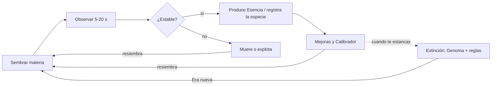

# Diseño del juego: Bioluma (Lenia incremental)

> **Nombre de trabajo: Bioluma** (antes "Petri"). Documento original v1 del 3 de oct. de 2026, autor Ronald Demian Cipagauta Penagos (PDF fuente en [`docs/source/GDD-Petri-v1.pdf`](source/GDD-Petri-v1.pdf)).
>
> **Versión v1.1.** Este documento es el original convertido a Markdown, con las correcciones aprobadas aplicadas *en el lugar* y marcadas con **(Corrección v1.1)**. Cada corrección tiene su ADR en [`DECISIONS.md`](../DECISIONS.md). Se añade la sección [Capa de diversión](#23-capa-de-diversión-añadida-en-v11). Las rutas de código se actualizaron a la estructura real del repo (`src/game/balance.ts`, etc.).
>
> **Cambios v1.1 de un vistazo:**
>
> | # | Corrección | Dónde |
> |---|---|---|
> | 1 | Semillas con ruido asimétrico suavizado y "esporas" (plantilla de especie + ruido) | §2, §4, §6, §8, §11 |
> | 2 | Placa toroidal también en pantalla *(superado por ADR-025 en la v1.2: placa redonda con cristal)*; sin penalización por borde; "Explotó" solo por masa/relleno | §4, §9, §22 |
> | 3 | Extinción disponible solo por el término de esencia; bonus de Genoma por especie/comportamiento solo la primera vez de por vida | §5, §10 |
> | 4 | La firma de especie no incluye μ ni σ | §9 |
> | 5 | Rendimientos decrecientes 0.85^k por especie repetida; colonia no se apila con divisora | §5, §9, §20 |
> | 6 | "Estable" a partir de ~400 pasos; el multiplicador de comportamiento aplica al clasificar en ventana de ~1000 pasos | §9 |
> | 7 | Cubeta de prueba (opcional): fuera de esta versión | §21 |
> | 8 | Grilla de aspecto fijo 192×240 (media), 128×160 (baja), 224×280 (alta) | §4, §8, §13, §16, §17 |
> | 9 | Tests del detector a 128×128 cuando intervienen especies de R = 18 | §9, §20, §22 |
> | — | Kernel y crecimiento exactos de Chan (kn = 1, gn = 1, polinomiales) en lugar de gaussianos | §4, §22 |
> | — | Corrección de la reducción de lecturas por simetría de 8 pliegues | §4, §17 |
>
> **Correcciones v1.2 y v1.3 (marcadas en el lugar):**
>
> | ADR | Corrección | Dónde |
> |---|---|---|
> | [ADR-025](../DECISIONS.md#adr-025-round-walled-petri-dish-that-grows-glass-deflection-instead-of-wrap) | **(v1.2)** La placa es una **placa de Petri redonda con cristal** que crece con la ruta Placa (Ø128 → Ø224, limitada por la calidad); el cristal desvía a las nadadoras. Se acaban el toro y el aspecto 4:5: grilla cuadrada fija (baja 168², media/alta 232²) con la placa dentro. Detalle en [`DISH.md`](DISH.md). | §4, §8, §9, §13, §17 |
> | [ADR-026](../DECISIONS.md#adr-026-lab-sessions-with-a-clock-a-research-tree-of-7-straight-routes-and-worlds) | **(v1.3)** Se juega en **sesiones de laboratorio** con reloj (0:15 → 2:30); la Esencia de cada sesión se vuelve **Datos** (÷ 25 + descubrimientos) que compran un **Árbol** de 7 rutas rectas; las reglas de la vida son 7 **Mundos**; la **noche** avanza gratis. Se retiran Calibrar, Muestras, Genoma, Extinción y el progreso offline. Detalle en [`CICLO.md`](CICLO.md) y [`RITMO.md`](RITMO.md). | §2, §4, §5, §6, §8, §10, §11, §12, §23 |
> | [ADR-027](../DECISIONS.md#adr-027-time-lapse-in-the-session-runs-and-incubation-under-the-start-card) | **(v1.3)** Cámara rápida en las sesiones (×1,5 pasos por segundo) e incubación de la criatura inicial bajo la tarjeta de inicio; el reloj de la sesión cuenta tiempo de placa. | §4, §6, §17 |

## Índice

1. [Visión, pilares y público](#1-visión-pilares-y-público)
2. [Glosario](#2-glosario)
3. [Premisa, tono y narrativa](#3-premisa-tono-y-narrativa)
4. [Simulación Lenia](#4-simulación-lenia)
5. [Recursos y fórmulas económicas](#5-recursos-y-fórmulas-económicas)
6. [Loop de juego y primera sesión](#6-loop-de-juego-y-primera-sesión)
7. [Controles e interacción táctil](#7-controles-e-interacción-táctil)
8. [Catálogo de mejoras](#8-catálogo-de-mejoras)
9. [Bestiario y detector de comportamientos](#9-bestiario-y-detector-de-comportamientos)
10. [Prestigio: Extinción y Genoma](#10-prestigio-extinción-y-genoma)
11. [Curva de progresión e hitos](#11-curva-de-progresión-e-hitos)
12. [Progreso offline e idle](#12-progreso-offline-e-idle)
13. [UI/UX, pantallas y accesibilidad](#13-uiux-pantallas-y-accesibilidad)
14. [Dirección visual](#14-dirección-visual)
15. [Audio procedural](#15-audio-procedural)
16. [Guardado, migraciones y cloud save](#16-guardado-migraciones-y-cloud-save)
17. [Rendimiento y escalado por dispositivo](#17-rendimiento-y-escalado-por-dispositivo)
18. [Analítica y métricas de diseño](#18-analítica-y-métricas-de-diseño)
19. [Monetización, licencias y distribución](#19-monetización-licencias-y-distribución)
20. [Balance: parámetros, bot de progresión y estrategias degeneradas](#20-balance-parámetros-bot-de-progresión-y-estrategias-degeneradas)
21. [Roadmap de contenido post-lanzamiento](#21-roadmap-de-contenido-post-lanzamiento)
22. [Riesgos, preguntas abiertas y criterios de aceptación](#22-riesgos-preguntas-abiertas-y-criterios-de-aceptación)
23. [Capa de diversión (añadida en v1.1)](#23-capa-de-diversión-añadida-en-v11)

---

## 1. Visión, pilares y público

Bioluma (nombre de trabajo) es un juego incremental donde la vida artificial de una placa de Lenia produce el recurso, y el jugador progresa descubriendo y estabilizando criaturas, no tocando más rápido. En una frase: **siembra materia, descubre especies, provoca una extinción y vuelve con mejores genes.**

> **Principio rector añadido en v1.1.** El dueño del proyecto lo resume así: *"es un juego, tiene que ser un incremental DIVERTIDO; no tiene que ser 100 % químicamente exacto"*. Cuando la fidelidad científica y la diversión choquen, gana la diversión: feedback claro y jugoso, y progresión legible, antes que pureza. Ver [§23](#23-capa-de-diversión-añadida-en-v11).

### Pilares de diseño

Toda decisión posterior se valida contra estos cinco:

1. **La vida es real.** Nada está guionizado: cada criatura emerge de la simulación en vivo. El juego nunca finge vida con animaciones ni sprites; si no se ve en la placa, no existe.
2. **Se premia la estructura, no la masa.** Esencia se mide por bordes y organización, así que llenar la placa de sopa uniforme vale cero y una criatura nítida vale mucho.
3. **Descubrir es progresar.** El bestiario es la columna vertebral: cada especie nueva da un multiplicador permanente y abre decisiones nuevas.
4. **Un pulgar basta.** Todo se juega con una mano en vertical, en sesiones de 30 segundos a 10 minutos, sin precisión fina.
5. **Idle honesto.** El juego avanza sin ti con una tasa conservadora, pero estar presente siempre rinde más, porque solo tú siembras y calibras.

**Público objetivo:** jugadores de incrementales (r/incremental_games, galaxy.click, itch.io) y curiosos de vida artificial y arte generativo, 16 a 40 años, mayoritariamente en Android. No requiere saber qué es Lenia: el juego lo enseña jugando.

**Plataforma:** PWA instalable, móvil primero (viewport mínimo 360 × 640 px, vertical), escritorio como bonus con ratón. Sin cuenta, sin servidor obligatorio, sin anuncios.

### Metas medibles de la primera versión

Hipótesis a validar con jugadores reales.

| Meta | Objetivo | Cómo se mide |
|---|---|---|
| Primera criatura estable | antes del minuto 3 de juego | evento `first_stable_creature` |
| Retención día 1 | 35 % | PostHog, cohortes |
| Retención día 7 | 15 % | PostHog, cohortes |
| Primera Extinción **(Corrección v1.3, ADR-026: retirada; hoy, la noche 2 hacia la sesión 4)** | entre 45 y 90 min de juego activo | evento `prestige` |
| Sesión media | 4 a 8 min | PostHog |
| Rendimiento | ≥ 30 fps en gama media Android, 60 objetivo | Playwright + Firebase Test Lab |

---

## 2. Glosario

> **(Corrección v1.3, ADR-026)** El glosario vigente es el de [`CLARIDAD.md`](CLARIDAD.md): **Sesión**, **Datos**, **Árbol**, **Mundo**, **Noche** (antes «Era»), **Nevera**, **Abono**, **Encargo**. **Muestras**, **Genoma**, **Calibración**, **Régimen** y **Extinción** se retiraron; la **Placa** es redonda y crece (ADR-025). La tabla de abajo es la de la v1.1.

Los términos de abajo se usan igual en el juego, en el código y en este documento; el código los nombra en inglés entre paréntesis.

| Término | Qué es |
|---|---|
| **Placa** (*dish*) | La grilla de Lenia donde vive todo. Cada celda tiene un valor continuo entre 0 y 1. |
| **Materia** (*matter*) | El valor de una celda. "Sembrar materia" es subir valores en una zona. |
| **Esencia** (*essence*) | Recurso principal. La producen las estructuras estables de la placa; se gasta en sembrar y en mejoras. |
| **Muestras** (*samples*) | Recurso secundario. Se ganan al registrar una especie nueva o un comportamiento nuevo; compran mejoras del bestiario. |
| **Genoma** (*genome*) | Recurso de prestigio. Se gana al provocar una Extinción; compra reglas nuevas en el Árbol de Genoma. |
| **Semilla** (*seed*) | Una siembra: forma, tamaño y densidad con la que el jugador deposita materia. **(Corrección v1.1)** Toda semilla lleva ruido asimétrico suavizado. |
| **Espora** (*spore*) | **(Corrección v1.1, término nuevo)** Semilla temprana: una plantilla de la especie del catálogo más cercana a la calibración actual (μ, σ, R), mezclada con ruido (`SeedSpec.bias`) y con rotación aleatoria. |
| **Gotero** (*dropper*) | La herramienta de siembra. Sus mejoras cambian la semilla. |
| **Criatura** (*creature*) | Un componente conexo de materia que supera los umbrales de estabilidad del detector. |
| **Especie** (*species*) | Un patrón de criatura reconocido y registrado en el bestiario, con firma y parámetros propios. |
| **Comportamiento** (*behavior*) | Etiqueta que el detector asigna a una criatura: quieta, pulsante, nadadora, giratoria, divisora, colonia. |
| **Calibración** (*calibration*) | Los parámetros de la regla de Lenia que el jugador puede mover: μ (mu), σ (sigma), R, dt. |
| **Régimen** (*regime*) | Un conjunto completo de parámetros guardado con nombre, como un preset. |
| **Extinción** (*extinction*) | El prestigio: borra la placa, los recursos y las mejoras normales; conserva el bestiario y da Genoma. |
| **Era** | Cada vida de la placa entre dos Extinciones. Se numera: Era 1, Era 2… |
| **Bitácora** (*journal*) | Texto breve del científico que se desbloquea con hitos; es la narrativa del juego. |
| **Impresión** (*print*) | Colocar directamente una especie ya registrada en la placa, gastando Muestras. |
| **Canal** (*channel*) | En fases avanzadas, cada "sustancia" independiente de la placa (Lenia multicanal). |
| **Detector** (*detector*) | El módulo que analiza la placa cada N pasos y decide qué hay vivo y qué hace. |
| **Destello** (*glint*) | **(v1.1, término nuevo)** Chispa dorada que cruza la placa de vez en cuando; tocarla da una recompensa ([§23](#23-capa-de-diversión-añadida-en-v11)). |

---

## 3. Premisa, tono y narrativa

Eres una científica o científico con una sola placa de Petri y una regla que no entiendes del todo: a veces, al sembrar materia, algo se mueve. La narrativa existe para dar sentido a las mecánicas, nunca para interrumpirlas: nada de cinemáticas ni diálogos, solo la Bitácora.

> **(Corrección v1.2, ADR-022)** El dueño pidió un tutorial animado con historia, personajes y varios finales. Se añade una capa de historia ([`docs/STORY.md`](STORY.md)): escenas cortas de diálogo con VELA y otros personajes (líneas de ≤ 12 palabras en el tutorial, ≤ 20 en el resto, siempre saltables), el tutorial contado como historia (reemplaza al tutorial de marcas), dos opciones en momentos clave y cinemáticas de final que nunca detienen el juego ("Continuar el experimento"). El juego no se pausa por la historia, las decisiones no tocan la economía, se respeta "reducir movimiento" y toda la historia se puede apagar. La Bitácora sigue siendo el hilo principal y recibe también las entradas de la historia.

**Tono.** Curiosidad serena, ligeramente melancólica. El humor es seco y escaso. Se habla de las criaturas con respeto y nombres en latín inventado (Orbium, Gyrorbium), como en el catálogo real de Lenia. Nunca se antropomorfiza más allá de un "parece que busca algo".

**La Bitácora.** Entradas de 1 a 3 frases, en primera persona, que se desbloquean con hitos. Se leen en una pestaña propia y aparecen como aviso discreto al desbloquearse. Son el único texto narrativo del juego.

| Hito que la desbloquea | Entrada (borrador) |
|---|---|
| Primera siembra | "Materia inerte. La dejo reposar. Nada debería pasar." |
| Primera muerte total | "Se disolvió en segundos. Demasiado poco, demasiado disperso." |
| Primera explosión (placa llena) | "Lo contrario: lo llenó todo y dejó de ser nada. La estructura es lo que cuenta." |
| Primera criatura estable | "Algo se quedó. Tiene borde, tiene forma. La llamo espécimen 1." |
| Primera nadadora | "Se mueve en línea recta y no se deshace. Hoy no voy a dormir." |
| Primera división | "Una se volvió dos. Ya no sé si las descubro o si me descubren." |
| Desbloquear Calibrador | "Si muevo μ un poco, el mundo cambia de reglas. Tengo que anotar todo." |
| Décima especie | "Diez. Empiezan a parecerse a una fauna, no a accidentes." |
| Primera Extinción **(Corrección v1.3: hoy, la primera noche nueva; ver [`STORY.md`](STORY.md))** | "Esterilizo la placa. Me duele. Pero sé qué funcionó, y eso se queda conmigo." |
| Era 2 | "Nueva placa, mismos ojos. Esta vez siembro con intención." |
| Primer canal nuevo | "Dos sustancias. Se tocan. Una come a la otra. No era lo que buscaba y es mejor." |
| Especie 50 | "Dejé de contar accidentes. Ahora cuento vidas." |

Las entradas finales se escriben en la Fase 2; el Cronista las mantiene en `content/journal.es.json` con versión en inglés en `journal.en.json`. En el código actual los textos viven como `Text { es, en }` (ver [`CLAUDE.md`](../CLAUDE.md)).

---

## 4. Simulación Lenia

La placa corre la regla canónica de Lenia en un shader WebGL2, con un solo kernel en la primera versión y parámetros tomados del catálogo oficial (MIT) de Bert Chan.

### Regla de actualización

Cada paso aplica, en todas las celdas a la vez:

```
A(t+dt) = clip[0,1]( A(t) + dt · G( K * A(t) ) )
```

- **K** es un kernel en anillo de radio R, normalizado para que sume 1. Con varios anillos (`b = "1/2,1"`) cada anillo tiene su altura relativa.
- **G** es la función de crecimiento, con `dt = 1/T`.
- **(Corrección v1.1: kernel y crecimiento exactos de Chan, ADR-002.)** El documento original proponía campanas gaussianas (`K(r) = bell(r, 0.5, 0.15)`, `G(u) = 2·bell(u, μ, σ) − 1`). Pero el catálogo de Chan se ajustó con el núcleo **polinomial** (`kn = 1`, `gn = 1`), así que el juego usa exactamente ese:

  ```
  núcleo del kernel (por anillo):  K_C(r) = (4 · r · (1 − r))^4        con r en [0, 1]
  crecimiento:                     G(u)   = 2 · max(0, 1 − (u − μ)² / (9σ²))^4 − 1
  ```

  De este modo los parámetros del catálogo (μ, σ, b, R, T) valen **sin modificar**; ya no hace falta la "tolerancia" 0.14/0.014 frente a 0.15/0.015 del texto original. La referencia CPU (`src/sim/cpu.ts`) y el shader implementan la misma fórmula.
- `dt = 1/T`. El catálogo usa T = 10 en 518 de 548 especies; el juego fija `dt = 0.1` y hace 1 o 2 subpasos por frame según rendimiento.
- **Bordes (Corrección v1.2, ADR-025): ya no hay toro.** La placa es una placa de Petri **redonda con cristal absorbente** dentro de una grilla cuadrada fija; nada se envuelve. El cristal desvía a las nadadoras antes de tocarlo (`src/sim/deflect.ts`) y la placa crece con la ruta Placa. El texto que sigue es el de la v1.1, superado: *Bordes (Corrección v1.1, ADR-004):* toroidales (la placa se envuelve) **en la simulación y también en pantalla**: una criatura que sale por un lado reaparece por el opuesto. El original hacía que el detector tratara el contacto con el borde como "explosión"; **eso se elimina**: no hay penalización por tocar el borde. "Explotó" se mide solo por masa y relleno (§9).

### Parámetros base y rangos del Calibrador

> **(Corrección v1.3, ADR-026)** El Calibrador se retiró: nadie elige μ, σ, R ni dt con deslizadores. Las reglas de la placa las pone el **Mundo** de cada sesión (7 preajustes comprobados en CPU, `src/game/worlds.ts`), que se abren en la ruta Mundos del Árbol. La tabla queda como referencia de los rangos que esos Mundos respetan.

| Parámetro | Valor inicial | Rango total desbloqueable | Qué cambia |
|---|---|---|---|
| **R** (radio del kernel, celdas) | 13 | 10 a 27 | Tamaño de las criaturas y costo de cómputo |
| **μ** (mu) | 0.15 | 0.10 a 0.50 | Qué cantidad de vecinos "gusta": mueve el mundo entre especies |
| **σ** (sigma) | 0.015 | 0.005 a 0.10 | Tolerancia: bajo = frágil y preciso, alto = masivo y tosco |
| **dt** | 0.1 | 0.05 a 0.5 | Velocidad; valores altos rompen criaturas finas |
| **b** (anillos) | `"1"` | hasta 3 anillos | Se desbloquea con Genoma; habilita Hydrogeminium y Kronium |

El Calibrador arranca con μ en 0.13 a 0.17 y σ en 0.010 a 0.025 y se amplía por niveles (§8); el rango completo coincide con el barrido publicado de 0.1 < μ < 0.5 y σ < 0.1 a R = 13.

### Especies semilla

Parámetros exactos de `animals.json` (todas R = 13, T = 10, b = `"1"` salvo nota). El juego no las muestra al inicio: el jugador las descubre al mover μ y σ, y el bestiario las reconoce por firma.

| Especie | μ | σ | Comportamiento esperado | Rol en el juego |
|---|---|---|---|---|
| Orbium unicaudatus | 0.15 | 0.015 | Nada en línea recta | Tutorial, primera criatura |
| Gyrorbium gyrans | 0.156 | 0.0224 | Nada en curva | Primer "giratorio" |
| Parorbium dividuus | 0.174 | 0.022 | Se divide | Primera colonia |
| Scutium solidus | 0.29 | 0.045 | Quieto, robusto | Productor estable base |
| Helicium solidus | 0.35 | 0.06 | Rota sobre sí | Especie rara temprana |
| Hydrogeminium natans (R = 18, b = `"1/2,1,2/3"`) | 0.26 | 0.036 | Nada, multi-anillo | Desbloqueo de Genoma |
| Kronium dividuus (R = 18, b = `"1,1/3"`) | 0.24 | 0.03 | Se divide, multi-anillo | Desbloqueo de Genoma |

**Implementación (Corrección v1.1, ADR-002).** El original advertía que el shader usaba la campana gaussiana y que "Orbium tolera la diferencia"; con el kernel polinomial exacto esa advertencia desaparece, pero se mantiene la regla: **cada especie importada se verifica en un test antes de entrar al bestiario**. El juego incluye un subconjunto curado de **26 especies** del catálogo (`src/sim/catalog.json`).

### Grilla y rendimiento

- **(Corrección v1.2, ADR-025)** La grilla es **cuadrada y fija** por perfil (baja 168², media y alta 232²) y la placa es el disco de Ø128 a Ø224 dentro de ella (baja: Ø160 como máximo); sigue sin cambiar con la interfaz (solo el zoom). El texto de la v1.1 que sigue queda superado. **Tamaño y aspecto fijo (Corrección v1.1, ADR-010).** La grilla tiene aspecto **fijo 4:5 (ancho × alto)**: **media 192×240**, **baja 128×160**, **alta 224×280** (el original decía "192 celdas en el lado corto, rango 128 a 256, aspecto igual al del área visible"). Los paneles de la interfaz que se colapsan o expanden **solo cambian el zoom** con el que se ve la placa, nunca la grilla (una grilla que cambia de forma con la UI destruiría las criaturas y el guardado).
- Dos texturas RGBA16F en ping-pong; render con filtrado lineal y colormap en un segundo pase. **Nunca 8 bits:** `G · dt` puede ser menor que 1/255 y la criatura se congela.
- **Convolución directa con simetría de 8 pliegues (Corrección v1.1, ADR-013).** El original afirmaba que la simetría de 8 pliegues baja las lecturas de textura de ~531 a ~70 por celda (R = 13). Eso es **incorrecto**: la simetría reduce los **pesos distintos** del kernel (≈ πR²/8 ≈ 70 valores únicos, que se precalculan y se consultan en una textura 1D), pero **cada vecino sigue siendo una lectura distinta de la placa**, así que las lecturas de textura por celda y por paso siguen siendo ≈ **πR²** (≈ 531 con R = 13). Consecuencia para el presupuesto: 192×240 celdas × 531 lecturas ≈ 24 M lecturas por paso, y el perfil Bajo (128×160) existe precisamente por eso.

### Semillas (Corrección v1.1, ADR-003)

Una siembra deposita materia con una de estas formas: disco gaussiano, anillo, mancha de ruido suavizado, o la forma exacta de una especie registrada (Impresión). Densidad inicial 0.5 a 0.8, radio ≈ R.

**Toda semilla lleva ruido suavizado asimétrico** (`SeedSpec.noise`): la simulación es determinista, así que un disco radialmente simétrico **nunca puede nadar** (por simetría, el estado se mantiene simétrico para siempre). El original asumía un "disco gaussiano inicial" con ≈ 25 % de éxito; no es así.

**Hecho medido (Monte Carlo con la simulación CPU de referencia):**

| Parámetros de la placa | Manchas aleatorias de ruido que sobreviven |
|---|---|
| Orbium (μ = 0.15, σ = 0.015) | **0 %** (mueren el 100 %) |
| Gyrorbium (μ = 0.156, σ = 0.0224) | **50 a 100 %** |

Por eso las primeras siembras son **esporas**: una plantilla de la especie del catálogo **más cercana a la calibración actual (μ, σ, R)**, mezclada con ruido asimétrico (`SeedSpec.bias`, de 0 a 1, es la fracción de plantilla) y con rotación aleatoria. El Gotero y el Estabilizador **suben la tasa de éxito efectiva** (más sesgo hacia la plantilla, mejor densidad), no cambian la regla. Los scripts `scripts/seed-montecarlo.ts` y `scripts/seed-explore.ts` reproducen la medición.

### Atribución

El repo lleva el aviso "MIT License, Copyright (c) 2018 Bert Chan" para el catálogo, cita los papers de 2019 y 2020 en la pantalla de créditos, y usa los nombres de especies del catálogo tal cual. Ver [`CREDITS.md`](../CREDITS.md).

---

## 5. Recursos y fórmulas económicas

> **(Corrección v1.3, ADR-026)** Hoy hay dos monedas: la **Esencia**, que se gana y se gasta *dentro* de una sesión (semillas, Abono), y los **Datos**, que salen al acabar la sesión (Esencia ÷ 25, más especies, variantes, maneras de moverse, Encargos, Destellos y récords; nunca menos de 3) y compran el Árbol. **Muestras y Genoma se retiraron**; las partidas viejas se migran con generosidad. La fórmula de producción de abajo sigue viva (complejidad × comportamiento × rareza × multiplicador global), con los multiplicadores que da el Árbol. Cifras en `src/game/cycleBalance.ts`.

Hay tres recursos con tres ritmos: Esencia se gana por segundo, Muestras por descubrimiento, Genoma por Extinción. Todos los números de esta sección son valores iniciales que el Balanceador ajusta con el bot; la forma de las fórmulas sí es fija. **Todos los números viven en `src/game/balance.ts`.**

### Esencia: producción

Cada tick económico (0.5 s reales) el detector entrega la lista de criaturas vivas y estables. Para cada una se calcula su complejidad como la suma del gradiente de materia sobre sus celdas, y se normaliza contra la complejidad de un Orbium de referencia en la misma grilla, de modo que un Orbium estable produce exactamente 1 Esencia por segundo sin mejoras.

```
P = M_global · Σ_{i ∈ estables}  ( Σ_{c ∈ i} ‖∇A_c‖ / C_Orbium ) · m_comp(i) · m_esp(i) · 0.85^k(i)
```

- Solo cuentan criaturas con etiqueta "estable" del detector (§9). Una mancha recién sembrada, aunque tenga bordes, produce 0 hasta estabilizarse; así no se premia el ruido previo a una explosión.
- `m_comp` depende del comportamiento: quieta ×1.0, pulsante ×1.3, nadadora ×1.6, giratoria ×1.8, divisora ×2.2 (cada hija cuenta aparte una vez estable). **(Corrección v1.1)** El multiplicador de comportamiento se aplica **una vez que la criatura se clasifica** en la ventana de ~1000 pasos; antes paga como quieta ×1.0 (§9). El multiplicador de **colonia no se apila** con el de divisora: se toma el **máximo**, no el producto.
- `m_esp` es el multiplicador de la especie registrada en el bestiario: ×1.0 si es desconocida, de ×1.1 a ×2.0 según rareza una vez registrada.
- **(Corrección v1.1, ADR-008) Rendimientos decrecientes por especie repetida.** La criatura número *k* (k = 0, 1, 2, …) de la **misma especie** presente en la placa rinde `×0.85^k`: la primera paga completa, la segunda ×0.85, la tercera ×0.72, etc. Llenar la placa de clones del mismo bicho deja de ser la estrategia óptima y mezclar especies se vuelve rentable.
- `M_global` agrupa mejoras globales y Genoma. Arranca en 1.
- Una placa con sopa uniforme tiene gradiente ≈ 0 y, además, el detector la marca como "explotó" (por masa/relleno, ya no por borde): doble seguro para el pilar 2.

### Esencia: gasto

Sembrar cuesta según el tamaño de la semilla, en relación al radio R del kernel:

```
costo_siembra = c0 · (r / R)² · (1 + 0.25 · n_vivas)
```

con `c0 = 2` y `n_vivas` el número de criaturas estables ya en la placa, para que llenar la placa tenga costo creciente. El jugador empieza con 20 Esencia (10 siembras básicas). Anti-bloqueo: si Esencia < costo mínimo y no hay nada vivo, el Gotero regala una siembra cada 10 s ("pipeta de emergencia"), visible como una barra que se llena.

### Costo de mejoras

Toda mejora con niveles sigue la curva geométrica estándar de los incrementales:

```
costo_n = b · g^n
```

con `b` el costo base y `g` entre 1.15 (mejoras de volumen, como Placa) y 1.35 (mejoras de multiplicador). La tabla de la §8 fija `b` y `g` por mejora. Compra múltiple (×1, ×10, ×máx) suma la serie geométrica.

### Muestras

> **(Corrección v1.3, ADR-026)** Retiradas. Los descubrimientos pagan Datos al final de la sesión y las copias (Copiadora) cuestan Esencia.

Se ganan solo por descubrir: +1 por especie nueva registrada, +1 la primera vez que una especie muestra un comportamiento nuevo, +3 si la especie es rara (§9). No se generan pasivamente ni se compran con Esencia. Se gastan en Impresiones (1 Muestra por impresión de especie común, 2 rara) y en mejoras del bestiario (Microscopio, Archivo).

### Genoma

> **(Corrección v1.3, ADR-026)** Retirado junto con la Extinción: lo que el Genoma compraba son ahora nodos del Árbol pagados con Datos.

Se calcula al confirmar una Extinción, con tres componentes para que premie tanto el volumen como la exploración:

```
G = floor( sqrt( E_era / 10^4 ) ) + 2 · S_nuevas + B_nuevos
```

donde `E_era` es la Esencia total ganada en la era, `S_nuevas` las especies registradas por primera vez y `B_nuevos` los comportamientos vistos por primera vez.

**(Corrección v1.1, ADR-006)** `S_nuevas` y `B_nuevos` cuentan **solo la primera vez en toda la vida de la partida** (*lifetime*), no por era: una especie o un par especie-comportamiento ya descubiertos en una era anterior no vuelven a dar bonus, aunque se vuelvan a ver. Así el bonus premia explorar y no puede cultivarse repitiendo Extinciones.

Objetivo: la primera Extinción da entre 8 y 15 Genoma. Genoma no se gasta en multiplicadores planos: compra reglas en el Árbol (§10), y cada punto gastado suma además +2 % a `M_global`.

### Formato de números

Hasta 999 999 con separador de miles; después sufijos K, M, B, T, Qa, Qi; después notación 1.23e18. Se usan `number` de JavaScript (doble precisión): la curva objetivo no supera 1e30 en meses, así que no hace falta `break_eternity`. Si una futura capa de prestigio lo rompe, se migra; queda anotado como riesgo en la §22.

---
## 6. Loop de juego y primera sesión

> **(Corrección v1.3, ADR-026, ADR-027)** El loop continuo de abajo (sembrar, comprar en el Laboratorio, calibrar, extinguir) se sustituyó por: **tarjeta de inicio** (Mundo, criatura de la Nevera incubada) → **sesión con reloj** (el reloj empieza con la primera gota; sembrar y mirar, Abono, Destello) → **resumen** (Esencia → Datos) → **Árbol** → siguiente sesión, y cada pocas sesiones una **noche** nueva de la historia. La primera sesión dura 15 s. Ver [`CICLO.md`](CICLO.md) §2–3 y [`RITMO.md`](RITMO.md).

El juego tiene tres loops anidados: el de segundos (sembrar y mirar), el de minutos (comprar y calibrar) y el de días (descubrir y extinguir). Los tres desembocan en la misma acción, sembrar, que es la única que no se puede automatizar del todo.



*Loop principal: 7 pasos, 1 decisión, 3 retornos.* Una siembra que muere o explota devuelve al jugador a sembrar sin castigo; una que se estabiliza produce Esencia y, si es nueva, entra al bestiario; las mejoras hacen mejores siembras, y la Extinción reinicia la placa con reglas nuevas.

**Loop de segundos (0 a 30 s).** Tocar la placa, ver qué pasa. La respuesta es inmediata y visual: la mancha se disuelve, se infla o se contrae hasta tomar forma. Feedback: color de la materia, sonido corto, y el contador de Esencia/s que sube cuando algo se estabiliza.

**Loop de minutos (1 a 10 min).** Con Esencia acumulada el jugador compra mejoras, abre el Calibrador y mueve μ y σ para cambiar de régimen. Aquí ocurre la mayoría de los descubrimientos: cada régimen nuevo trae especies nuevas, y el bestiario avisa cuando una criatura no coincide con nada conocido.

**Loop de días (1 a 7 días).** La placa se llena, la producción se estanca por el costo creciente de siembra y el jugador decide extinguir. Entre sesiones el juego produce offline (§12) y al volver hay algo que comprar. Cada Era dura menos que la anterior porque el Genoma acelera el inicio.

### Primera sesión, minuto a minuto

El objetivo es que nadie necesite leer nada: el primer Orbium debe aparecer antes del minuto 3 con la calibración inicial fija en μ = 0.15, σ = 0.015.

| Minuto | Qué pasa | Qué aprende el jugador |
|---|---|---|
| 0:00 | Placa vacía, 20 Esencia, una sola instrucción: "Toca la placa". | Tocar siembra. |
| 0:10 | Primeras 3 o 4 siembras: la mayoría se disuelve. La Bitácora anota la primera muerte. | Sembrar es barato y fallar es normal. |
| 0:40 | Una siembra se infla y llena un cuarto de la placa; el detector marca "explotó", la producción sigue en 0. | Más masa no es mejor. |
| 1:30 | **(Corrección v1.1)** Las siembras son **esporas** (plantilla del Orbium, la especie más cercana a μ = 0.15 / σ = 0.015, mezclada con ruido asimétrico, radio ≈ R, densidad 0.6). El original suponía un disco gaussiano con ≈ 25 % de éxito; un disco simétrico o ruido puro no sobreviven a estos parámetros (§4). Objetivo de diseño: ≈ 25 % de esporas estables; a la quinta o sexta siembra aparece un Orbium. Sonido distinto, borde brillante, Esencia/s pasa a 1.0. | Lo que tiene forma y se mueve produce. |
| 2:00 | Entra al bestiario como "espécimen 1" con nombre desconocido; +1 Muestra. Aparece la pestaña Bestiario. | Descubrir da un recurso aparte. |
| 3:00 | Primera mejora disponible: Gotero I (esporas más consistentes). Costo 15 Esencia. | Las mejoras hacen mejores siembras. |
| 5:00 | Dos o tres Orbium nadando; el costo de siembra sube con cada uno. Se desbloquea Sembrador automático I. | Hay un límite de placa y un modo idle. |
| 8:00 | Calibrador I disponible (25 Esencia): slider de μ en 0.13 a 0.17. Moverlo mata a los Orbium y abre especies nuevas. | Cambiar las reglas es el verdadero progreso. |
| 12:00 | Primer Gyrorbium o Scutium según hacia dónde movió μ. Bitácora. | Cada régimen tiene su fauna. |
| 20:00 | Placa llena de 6 a 8 criaturas; producción 15 a 25 Esencia/s; mejoras de 200 a 500. | Ya tiene un plan propio. |

Si un jugador llega al minuto 3 sin criatura estable, el Gotero sube solo el sesgo de la espora hacia su plantilla (y la densidad hacia el rango ideal): ayuda invisible que se apaga tras la primera criatura. En la capa de diversión ([§23](#23-capa-de-diversión-añadida-en-v11)) el **Mutágeno** y la **Lluvia de esporas** cumplen un papel parecido, pero como premio.

---

## 7. Controles e interacción táctil

Todo se controla con un pulgar sobre la placa y un panel inferior; no hay gestos ocultos ni combinaciones. Cada gesto tiene una sola función y se enseña la primera vez que está disponible, con una animación de 2 s sobre la placa.

| Gesto | Dónde | Acción | Desde cuándo |
|---|---|---|---|
| Toque corto | Placa | Siembra con la semilla actual del Gotero en ese punto (cuesta Esencia). | Inicio |
| Toque largo (400 ms) | Placa | Siembra grande: radio ×1.5, costo ×2.25. Vibración leve al activarse. | Gotero II |
| Arrastre | Placa | Pincel: deposita materia a lo largo del trazo, costo por longitud. | Gotero III |
| Toque sobre criatura | Placa | Abre su ficha flotante: especie, comportamiento, Esencia/s, edad. No la mueve. | Inicio |
| Dos dedos: pellizco | Placa | Zoom ×1 a ×3 y paneo; la simulación no cambia. | Inicio |
| Botón Borrar + toque | Barra de herramientas | Borra un disco de materia (gratis, radio fijo). | Inicio |
| Botón Pausa | Barra de herramientas | Congela la simulación; la producción también se detiene. | Inicio |
| Botón Velocidad | Barra de herramientas | Alterna ×1, ×2, ×4 pasos por frame si el dispositivo lo aguanta (se gris si cae de 30 fps). | Incubadora I |
| Sliders μ, σ, R, dt | Pestaña Calibrar | Cambian la regla en vivo; la placa reacciona en el siguiente paso. | Calibrador I |
| Botón Régimen | Pestaña Calibrar | Guarda o carga un conjunto de parámetros con nombre (hasta 8). | Calibrador II |
| Botón Imprimir | Bestiario | Siguiente toque en la placa coloca la especie elegida (cuesta Muestras). | Primera especie registrada |
| Botón Extinguir | Pestaña Genoma | Abre confirmación con el Genoma que se ganará. Mantener 1.5 s para confirmar. | Primera Extinción disponible |
| **Toque sobre el Destello** | Placa | **(v1.1)** Recoge la recompensa del Destello ([§23](#23-capa-de-diversión-añadida-en-v11)). | Inicio |

### Reglas de interacción

- Zonas táctiles de 48 × 48 px mínimo; el panel inferior ocupa como máximo el 45 % de la altura y se puede colapsar al 15 %. **(Corrección v1.1)** Colapsar o expandir el panel **solo cambia el zoom** de la placa; la grilla es de aspecto fijo (§4).
- La placa nunca se desplaza por accidente: el paneo requiere dos dedos; un dedo siempre siembra.
- Una siembra sin Esencia suficiente no hace nada y muestra el costo en rojo junto al dedo durante 1 s; no hay modales.
- Toda acción destructiva (Borrar, Extinguir) tiene vibración y color de advertencia; solo Extinguir pide confirmación.
- En escritorio: clic = toque, clic derecho = borrar, rueda = zoom, teclas 1 a 4 = pestañas, espacio = pausa.
- Accesibilidad táctil: modo "un toque" en ajustes que convierte el toque largo en doble toque y desactiva el pincel, para quien no puede mantener presión.

---

## 8. Catálogo de mejoras

> **(Corrección v1.3, ADR-026)** El Laboratorio y el Bestiario de mejoras se sustituyeron por el **Árbol de investigación**: 7 rutas rectas (Reloj, Gotero, Placa, Vida, Descubrimiento, Mundos, Destello) que se pagan con Datos; cada nivel enseña «antes → después» y su precio sigue una sola regla. Lista y cifras en [`CICLO.md`](CICLO.md) §6 y `src/game/tree.ts`. Las tablas siguientes quedan como historia del diseño.

Las mejoras se compran con Esencia en la pestaña Laboratorio y con Muestras en el Bestiario; ninguna se compra con dinero real. Toda mejora se desbloquea por un hito de juego, no por tiempo, y la lista completa es visible desde el inicio con las no desbloqueadas en gris y su condición escrita.

### Laboratorio (Esencia)

Costos en Esencia; `g` es el factor geométrico de la §5. Las mejoras con niveles fijos muestran sus costos uno a uno.

| Mejora | Niveles | Costo | Efecto por nivel | Se desbloquea |
|---|---|---|---|---|
| **Gotero** | 5 | 15, 60, 250, 1 200, 6 000 | **(Corrección v1.1)** I: **espora consistente**: más sesgo hacia la plantilla de la especie cercana y densidad estable (objetivo: ≈ 40 % de siembras de Orbium que se estabilizan). II: toque largo. III: pincel. IV: semilla anillo. V: semilla de ruido suavizado y selector de forma. | Inicio |
| **Sembrador automático** | ∞ | b = 40, g = 1.25 | Siembra sola en un punto libre cada 20 s; cada nivel −8 % del intervalo, mínimo 2 s. Usa la semilla del Gotero y paga su costo. | 2 criaturas estables a la vez |
| **Cultivo** | ∞ | b = 50, g = 1.35 | +10 % a `M_global`. | 10 Esencia/s |
| **Calibrador** | 4 | 25, 300, 3 000, 30 000 | I: slider μ en 0.13 a 0.17. II: slider σ en 0.005 a 0.05 y 8 regímenes guardables. III: μ hasta 0.10 a 0.50 y slider dt. IV: slider R de 10 a 27. | 1 especie registrada |
| **Estabilizador** | 10 | b = 80, g = 1.30 | +3 % de probabilidad de que una siembra se estabilice (ajusta densidad y sesgo de la espora hacia el mejor valor conocido del régimen actual). | Calibrador I |
| **Placa** | 4 | 100, 1 000, 10 000, 100 000 | **(Corrección v1.2, ADR-025)** Placa redonda Ø128 → Ø160 → Ø192 → Ø224 con sitio para 3 · 4 · 5 · 7 criaturas; en calidad baja llega a Ø160: los niveles mayores conservan su precio pero no se venden en ese aparato («Tu aparato ya tiene la placa más grande») y la ruta sigue hacia Ecosistema (RF-04, RF-12). *(v1.1, superado:)* Más tamaño de placa y más espacio para criaturas, en escalones de aspecto fijo 4:5 (128×160, 160×200, 192×240, 224×280). Limitado por el perfil de rendimiento del dispositivo (§17); el reparto exacto por nivel vive en `src/game/balance.ts`. | 4 criaturas estables a la vez |
| **Incubadora** | 2 | 200, 2 000 | I: botón ×2 pasos por frame. II: ×4. Solo si el dispositivo sostiene 30 fps. | Placa I |
| **Afinidad nadadora** | 10 | b = 120, g = 1.35 | +8 % a la producción de criaturas con comportamiento nadadora o giratoria. | Primera nadadora |
| **Afinidad sésil** | 10 | b = 120, g = 1.35 | +8 % a la producción de quietas y pulsantes. | Primera quieta |
| **Afinidad colonial** | 10 | b = 300, g = 1.35 | +8 % a la producción de divisoras y colonias. | Primera división |
| **Reserva** | 3 | 500, 5 000, 50 000 | Tope de progreso offline de 2 h a 8 h, 12 h y 24 h. | Primera vez que vuelve tras cerrar |
| **Pipeta rápida** | 3 | 100, 1 000, 10 000 | La siembra gratuita de emergencia tarda 10 s, 6 s, 3 s. | Primera pipeta usada |
| **Nutriente** | 5 | b = 1 000, g = 1.5 | Cada criatura estable sube su complejidad medida +4 % (ligero realce del gradiente en el render y en la fórmula). | Cultivo nivel 10 |

### Bestiario (Muestras)

| Mejora | Niveles | Costo en Muestras | Efecto | Se desbloquea |
|---|---|---|---|---|
| **Microscopio** | 3 | 3, 8, 20 | I: la ficha muestra el rango de μ y σ en que vive la especie. II: muestra velocidad, periodo y firma. III: señala en los sliders zonas donde hay especies no descubiertas cerca. | 1 especie |
| **Catalogación** | 5 | 5, 8, 12, 18, 27 | +10 % al multiplicador `m_esp` de todas las especies registradas. | 3 especies |
| **Archivo** | 3 | 6, 15, 40 | Una Impresión gratis cada 10 min, 5 min, 2 min. | 5 especies |
| **Marcador** | 1 | 10 | Las criaturas muestran un punto de color por comportamiento sobre la placa. | 2 comportamientos distintos |

### Hitos de colección (gratis, automáticos)

Cada 5 especies registradas +5 % a `M_global`; cada comportamiento distinto visto por primera vez +10 % permanente. Los hitos sobreviven a la Extinción porque el bestiario sobrevive. Los **logros** de la capa de diversión ([§23](#23-capa-de-diversión-añadida-en-v11)) siguen la misma lógica de bonus pequeños y permanentes.

---

## 9. Bestiario y detector de comportamientos

El detector es el juez del juego: decide qué está vivo, qué hace y si es algo nuevo. Sus umbrales no se inventan: se portan de las heurísticas publicadas por el laboratorio Flowers (`calc_categories.py`, *sensorimotor-lenia-search*) y Leniabreeder (Faldor & Cully), normalizadas por R y T para que funcionen en cualquier tamaño de placa.

### Cómo mide

Cada 10 pasos de simulación un pase de reducción en GPU devuelve, para toda la placa, masa total, centroide y suma del gradiente; además etiqueta componentes conexas (celdas con A ≥ 0.1) y guarda por cada una masa, centroide, radio y gradiente. La CPU mantiene una ventana de 100 lecturas (1 000 pasos) por criatura y clasifica.

**(Corrección v1.2, ADR-025)** La placa es redonda y no se envuelve: centroides, desplazamientos y distancias son **rectos**, dentro del disco. El pase sigue sin penalizar el cristal (el desviador aparta a las nadadoras y el detector no lee esos giros como «girar»). *(v1.1, superado: «la placa es un toro… distancias sobre el toro».)*

### Estados de una criatura

El orden importa: se evalúa de arriba hacia abajo y el primer estado que aplica gana.

| Estado | Criterio (umbrales iniciales) | Efecto en el juego |
|---|---|---|
| **Muerta** | Todas sus celdas < 0.1 durante 20 pasos. | Se elimina; sonido de disolución. |
| **Explotó** | **(Corrección v1.1)** Su masa supera el 10 % de la placa, **o** la masa de la última cuarta parte de la ventana dividida por la segunda cuarta parte sale de (0.5, 3.0). *(El original añadía "toca el borde con A > 0.1"; se elimina: la placa es toroidal y no hay penalización por borde.)* **(Corrección v1.2, ADR-025)** La placa ya no es toroidal: es redonda con cristal; sigue sin haber penalización por tocarlo (el desviador aparta a las nadadoras). | Produce 0; se marca en rojo; si cubre más del 40 % de la placa se ofrece "Esterilizar zona". |
| **Naciendo** | **(Corrección v1.1)** Edad < ~400 pasos (antes 200). | Produce 0; borde animado. |
| **Estable** | **(Corrección v1.1)** A partir de ~400 pasos de edad: ratio de masa dentro de (0.5, 3.0) en 2 mini-ventanas seguidas (~200 pasos cada una) y una sola componente conexa que concentra ≥ 80 % de su masa. *(El original exigía 2 ventanas completas de 1 000 pasos, es decir 2 000 pasos de espera, demasiado largo para un incremental.)* | Produce Esencia **como "quieta" ×1.0** desde que es estable; puede registrarse. |

**(Corrección v1.1, ADR-009) Estable ≠ clasificada.** Una criatura se vuelve *estable* (y empieza a pagar) tras ~400 pasos. Su **comportamiento** se clasifica sobre la ventana completa de ~1 000 pasos; **solo entonces se aplica el multiplicador `m_comp`**, una vez, y se recalcula cada ventana. Con `dt = 0.1` y 1 a 2 subpasos por frame, 400 pasos son unos 3 a 7 s a 60 fps: encaja con el "Observar 5-20 s" del loop principal.

### Comportamientos de una criatura estable

Se recalculan cada ventana; una criatura puede cambiar de comportamiento y el juego lo anuncia.

| Comportamiento | Criterio | `m_comp` |
|---|---|---|
| **Quieta** | Desplazamiento del centroide < 0.5 R en 1 000 pasos y sin pico en la PSD de la masa. | ×1.0 |
| **Pulsante** | Pico dominante en la densidad espectral de la serie de masa (Welch, nfft = 512) con amplitud > 5 % de la masa media. | ×1.3 |
| **Nadadora** | Desplazamiento del centroide > 4 R en 1 000 pasos con velocidad angular baja. | ×1.6 |
| **Giratoria** | Velocidad angular del vector de velocidad sostenida (giro completo en < 1 000 pasos) con velocidad lineal media. | ×1.8 |
| **Divisora** | La fracción de masa dentro de la ventana centrada en el centroide cae bajo 0.9 y aparecen 2 componentes que ambas se estabilizan. | ×2.2 |
| **Colonia** | 3 o más criaturas estables de la misma firma a menos de 3 R entre sí (**(Corrección v1.2, ADR-025)** distancia recta en la placa redonda; antes «sobre el toro»). | ×2.5 al grupo; **(Corrección v1.1) no se apila con la divisora: se aplica el máximo de ambos, no el producto** |

### Firma de especie (Corrección v1.1, ADR-007)

Para reconocer una especie sin comparar píxeles se usa un vector de **firma de morfología y comportamiento**, invariante a posición y rotación: masa / R², radio de giro / R, excentricidad, periodo de pulsación, velocidad media · T, velocidad angular media y número de componentes (7 números).

**La firma ya no incluye los parámetros (μ, σ)** con los que vive la criatura (el original los metía en el vector, que además no sumaba los 8 números que decía). Una especie existe en un *rango* de (μ, σ), no en un punto: los parámetros se **guardan aparte, como el rango en que vive la especie** (lo que muestra el Microscopio), y no entran en la distancia. Si no, la misma especie vista en dos regímenes cercanos se registraría como dos.

Dos criaturas son la misma especie si la distancia normalizada entre firmas es < 0.15 (`SPECIES_MATCH_THRESHOLD`); el umbral se calibra con las 7 especies semilla, que deben caer en 7 clases distintas y reconocerse a sí mismas en 10 siembras de 10.

### Registro

Una criatura estable con firma desconocida dispara "Especie nueva": pausa suave de 1 s, zoom a la criatura, nombre provisional "Espécimen N", +1 Muestra (+3 si es rara). Si la firma coincide con una especie del catálogo de Chan, se revela su nombre real (Orbium unicaudatus) y una línea de ficha. Si no coincide, el jugador puede nombrarla y conserva el nombre. Es el momento más celebrado del juego: ver [§23](#23-capa-de-diversión-añadida-en-v11).

### Rareza

Se calcula por la probabilidad empírica de obtenerla sembrando al azar en su régimen, medida por el bot del Balanceador: común (> 10 %), poco común (2 a 10 %), rara (0.5 a 2 %), muy rara (< 0.5 %). Multiplicador `m_esp`: ×1.1, ×1.3, ×1.6, ×2.0.

### Ficha de especie

Nombre, retrato (captura de 64 × 64 de la criatura), comportamiento, rareza, Esencia/s de referencia, veces vista, Era de descubrimiento, rango de μ y σ (con Microscopio), botón Imprimir.

### Impresión

> **(Corrección v1.3, ADR-026)** La impresión es la **Copiadora** del Árbol: planta la plantilla pura de una especie del Bestiario que vive en el Mundo de la sesión, por Esencia (el Archivo da una copia gratis cada cierto tiempo); ya no cuesta Muestras ni hay régimen que elegir.

Coloca la forma guardada de la especie (captura de materia, no la del catálogo) con los parámetros actuales. Si el régimen actual está fuera del rango de la especie, la ficha lo advierte en naranja y la impresión se permite igual: ver morir una especie fuera de su régimen es parte de la enseñanza.

### Tests del detector (Corrección v1.1, ADR-011)

- Cada especie semilla simulada en CPU por 500 pasos cae en su estado y comportamiento esperados. **Tamaño de la grilla de test: 64 × 64 para las de R = 13, y 128 × 128 cuando interviene una especie de R = 18** (Hydrogeminium, Kronium): su kernel mide 37 celdas de diámetro, más de la mitad de una grilla de 64 × 64, y la criatura empezaría a interactuar con su propia imagen envuelta por el toro.
- Una placa uniforme da Esencia 0 y estado "Explotó".
- Ruido blanco termina en "Muerta" o "Explotó" en menos de 200 pasos.
- Un Orbium impreso dos veces se reconoce como la misma especie.

---

## 10. Prestigio: Extinción y Genoma

> **(Corrección v1.3, ADR-026)** **La Extinción se retiró.** Ya no se borra lo construido: cada sesión empieza en una placa nueva y lo permanente son los Datos y el Árbol. El papel del prestigio lo hace la **noche**: el centro del Árbol abre una noche nueva (gratis) cuando se cumplen sesiones y especies (`NIGHT_GATES`), con escena de historia y anillos nuevos del Árbol. Esta sección queda como historia del diseño.

La Extinción es la decisión más importante del juego y por eso es la única con confirmación: borra la placa y el Laboratorio, conserva todo lo descubierto y entrega Genoma, que solo compra reglas nuevas.

### Cuándo está disponible (Corrección v1.1, ADR-005)

**Solo depende del término de esencia** del cálculo de la §5: la Extinción se ofrece cuando

```
floor( sqrt( E_era / 10^4 ) ) >= 5        (es decir, E_era >= 250 000)
```

El original decía "desde que el cálculo dé al menos 5 Genoma", pero como el total incluye los bonus de especie y comportamiento, un jugador que descubriera mucho podía extinguir en minutos. Ahora los descubrimientos suben el Genoma que se gana, pero **no abren la puerta antes de tiempo**. El botón muestra siempre el Genoma que se ganaría ahora (con todos los términos) y una estimación de cuánto más daría en 10 minutos, para que la decisión sea informada y no un salto de fe.

### Qué se reinicia y qué se conserva

| Se reinicia | Se conserva |
|---|---|
| La placa (vacía) | El bestiario completo: especies, nombres, retratos, rarezas |
| Esencia a 20 | Muestras y mejoras del Bestiario |
| Todas las mejoras del Laboratorio | Hitos de colección y sus porcentajes |
| Regímenes guardados (salvo con Herencia) | Genoma y nodos comprados del Árbol |
| Calibración vuelve a μ = 0.15, σ = 0.015 | Bitácora y estadísticas de por vida (incluidos logros) |

### Ritual de Extinción

Mantener el botón 1.5 s; la placa se blanquea desde los bordes hacia el centro en 3 s mientras cada criatura se disuelve con su sonido; aparece el resumen de la Era (duración, Esencia total, especies nuevas, mejor criatura) y el Genoma ganado; entrada de Bitácora; se abre el Árbol.

### Árbol de Genoma

3 ramas, 11 nodos, costos iniciales. Cada rama es una cadena: un nodo requiere el anterior. Depredación requiere además Segundo canal, de la rama Reglas. Cada punto de Genoma gastado suma +2 % a `M_global`, así que gastar siempre conviene aunque la regla nueva no interese todavía. *Genoma compra reglas, no multiplicadores.*

```text
Genoma (se gana en cada Extinción)
├── Reglas (cómo se comporta la placa)
│     Anillos dobles (5) → Anillos triples (12) → Segundo canal (20) → Flujo (40 · Fase 4)
├── Herencia (qué sobrevive a la Extinción)
│     Memoria del Gotero (3) → Regímenes persisten (4) → Arranque con Esencia (6) → Sembrador persistente (10)
└── Fauna (qué puede nacer)
      Mutaciones (8) → Simbiosis (15) → Depredación (25 · requiere Segundo canal)
```

| Rama | Nodo | Costo (Genoma) | Efecto |
|---|---|---|---|
| Reglas | **Anillos dobles** | 5 | El kernel admite 2 picos (`b = "a,b"`); el Calibrador IV gana un selector de perfil. Aparecen Hydrogeminium y otras 30 especies del catálogo. |
| Reglas | **Anillos triples** | 12 | 3 picos; aparecen Kronium y las especies de R = 18 y 27. |
| Reglas | **Segundo canal** | 20 | La placa tiene dos sustancias con kernels cruzados (Lenia multicanal); se siembran por separado y las especies pueden ser de un canal o mixtas. |
| Reglas | **Flujo** | 40 (Fase 4) | Variante Flow Lenia: la masa se conserva y las criaturas compiten por materia; ya no hay "explotó", hay hambre. |
| Herencia | **Memoria del Gotero** | 3 | Cada Era empieza con el Gotero en el nivel máximo alcanzado menos 1. |
| Herencia | **Regímenes persisten** | 4 | Los regímenes guardados sobreviven a la Extinción. |
| Herencia | **Arranque con Esencia** | 6 | Cada Era empieza con 500 × (número de Era) Esencia. |
| Herencia | **Sembrador persistente** | 10 | Cada Era empieza con Sembrador automático nivel 3. |
| Fauna | **Mutaciones** | 8 | El 10 % de las Impresiones produce una variante con firma distinta; si se estabiliza es especie nueva (nombre con sufijo "var."). |
| Fauna | **Simbiosis** | 15 | Dos especies distintas a menos de 2 R forman par simbiótico: ×1.5 a ambas. |
| Fauna | **Depredación** | 25 (tras Segundo canal) | Un canal consume al otro donde se tocan; cada "caza" entrega Esencia extra igual a la masa consumida × 10. |

### Curva de prestigio objetivo

Era 1: 45 a 90 min. Era 2: 30 a 60 min. Era 3 en adelante: 20 a 40 min cada una, con el Genoma acumulado creciendo de forma aproximadamente lineal por Era. Si el bot detecta que una Era dura más que la anterior, el Balanceador abre un issue.

---

## 11. Curva de progresión e hitos

> **(Corrección v1.3, ADR-026)** La curva vigente es por sesiones y noches (sesión 1 de 15 s, la historia acaba hacia la noche 7, ~2 h), medida con el bot de sesiones: [`RITMO.md`](RITMO.md) §6 y `scripts/session-bot.ts`. Las Extinciones y eras de esta sección son del ciclo retirado.

La curva objetivo duplica la producción cada 8 a 12 minutos de juego activo en la Era 1 y cada 5 a 8 en las siguientes; el bot de progresión la mide y cualquier desvío mayor al 20 % abre un issue. Los tiempos son de juego activo; el idle alarga el calendario pero no cambia el orden.

| Tiempo activo | Hito esperado | Producción típica (Esencia/s) | Qué nuevo hay para hacer |
|---|---|---|---|
| 3 min | Primera criatura estable (Orbium) | 1 | Gotero I |
| 8 min | Calibrador I; primer cambio de régimen | 3 a 5 | Explorar μ |
| 15 min | 3 especies; Sembrador I | 10 a 15 | Dejar que siembre solo |
| 30 min | Placa I; 6 especies; primera divisora | 40 a 60 | Afinidades |
| 45 a 90 min | Primera Extinción (8 a 15 Genoma) | 150 a 300 | Árbol de Genoma |
| 2 h | Era 2 con Anillos dobles; 12 especies | 500 a 1 000 | Especies multi-anillo |
| 4 h | Segunda Extinción; Calibrador III | 3 000 | μ y σ completos |
| Día 2 | Era 4; Segundo canal; 25 especies | 20 000 | Especies mixtas |
| Día 4 | Era 6; Mutaciones y Simbiosis; 40 especies | 200 000 | Variantes propias |
| Semana 1 | Era 8 o más; 60 especies; todo el Árbol salvo Flujo | 2 M | Completar el bestiario |
| Semana 2 en adelante | Contenido de la §21 | 20 M o más | Flujo, eventos |

### Muros de contenido previstos y cómo se evitan

- **Minuto 3 sin criatura:** ayuda invisible del Gotero (§6) y pipeta de emergencia.
- **Minuto 20, placa llena:** el costo creciente de siembra se explica en la interfaz ("la placa está saturada") y Placa I ya es asequible.
- **Minuto 60, estancamiento antes de la primera Extinción:** el botón muestra el Genoma que se ganaría y la Bitácora sugiere esterilizar.
- **Era 3 sin especies nuevas:** Microscopio III señala zonas inexploradas del espacio de parámetros.
- **Día 3, todo descubierto a R = 13:** Calibrador IV y Anillos triples abren R = 18 y 27, que son otro mundo.

**Ritmo de descubrimientos.** El bestiario debe crecer en promedio 1 especie cada 6 min durante la Era 1 y 1 cada 15 min después; si el jugador pasa 20 min sin registro nuevo, el Microscopio I se ofrece gratis una sola vez.

**Compra siguiente siempre visible.** En cualquier momento debe existir una mejora comprable en menos de 2 min de producción actual; el bot verifica esta regla en cada hito. La cadena de objetivos de la capa de diversión ([§23](#23-capa-de-diversión-añadida-en-v11)) refuerza este principio durante la primera hora.

---
## 12. Progreso offline e idle

> **(Corrección v1.3, ADR-026)** **Sin progreso offline**: las sesiones solo corren mientras se juega, y al volver la partida sigue donde estaba (sin tarjeta de «mientras no estabas»). El texto de abajo describe el ciclo continuo retirado.

La simulación no corre cuando la app está cerrada; el juego extrapola la producción con una tasa conservadora y la placa se congela tal cual estaba, para que al volver siga viva y reconocible.

**Cálculo al volver.** Se usa la media de Esencia/s de los últimos 5 min de la sesión anterior, multiplicada por 0.5 (tasa offline) y por el tiempo transcurrido hasta el tope de Reserva (2 h sin mejoras, 24 h al máximo). El resultado se muestra en una tarjeta: "Mientras no estabas: +12 400 Esencia en 3 h 10 min". Nunca se simula hacia atrás: la placa reaparece congelada en su último estado y se reanuda con 1 s de fundido.

**Idle con la app abierta.** El Sembrador automático siembra solo, las criaturas producen a tasa completa y el detector sigue registrando especies. Si el jugador no toca la pantalla por 60 s, el render baja a 30 fps y los subpasos a 1 para ahorrar batería; la simulación conserva su velocidad real.

**Tiempo del dispositivo.** El progreso offline usa la diferencia entre el reloj del dispositivo al guardar y al cargar, con tope de 24 h y nunca negativo. Si se detecta un salto de reloj hacia atrás, se cuenta 0. No hay anti-trampa más allá de esto: es un juego sin ranking ni dinero.

**Tareas al reanudar, en orden.** Aplicar Esencia offline, mostrar la tarjeta, reanudar simulación, correr el detector una vez para validar que las criaturas guardadas siguen clasificadas igual, descontar las que hayan muerto durante el fundido.

**Lo que no hace el offline.** No descubre especies, no compra mejoras y no provoca Extinciones: todo lo que implica decidir o descubrir requiere al jugador. Esto es deliberado (pilar 5). **(v1.1)** Tampoco aparecen Destellos sin el jugador presente.

---

## 13. UI/UX, pantallas y accesibilidad

> **(Corrección v1.3, ADR-026)** Ya no hay pestañas de Laboratorio, Calibrar ni Genoma: la pantalla es la placa con su reloj, la barra de semilla y el muelle (Bestiario, Árbol); entre sesiones, la tarjeta de resumen, el Árbol y la tarjeta de inicio. Los objetivos táctiles miden 48 × 48 px como mínimo (RF-06).

Una sola pantalla: la placa ocupa la mitad superior y un panel con cuatro pestañas la inferior; no hay menús anidados ni pantallas de carga. Todo lo que el jugador necesita ver mientras juega cabe en un vistazo.

### Estructura vertical (360 × 640 mínimo)

| Zona | Altura | Contenido |
|---|---|---|
| **HUD superior** | 56 px | Esencia (grande), Esencia/s, Muestras, Genoma; toque en cualquiera abre un desglose. **(v1.1)** Bajo el HUD, la línea del **objetivo actual** ([§23](#23-capa-de-diversión-añadida-en-v11)). |
| **Placa** | 55 % restante | El canvas; sobre él, en esquinas, Pausa, Velocidad y Borrar como botones semitransparentes. **(Corrección v1.1)** La grilla es de aspecto fijo (§4): si el panel inferior se colapsa o expande, la placa solo cambia de **zoom**. |
| **Barra de pestañas** | 48 px | Laboratorio, Bestiario, Calibrar, Genoma; con punto rojo cuando hay algo nuevo comprable o registrado. |
| **Panel** | 45 % máximo, colapsable a 15 % | Contenido de la pestaña activa, con desplazamiento vertical propio. |

### Pestañas

- **Laboratorio:** lista de mejoras en tarjetas de una línea: nombre, nivel, costo, efecto; botón de compra grande a la derecha; selector ×1 / ×10 / ×máx arriba. Las no desbloqueadas van al final en gris con su condición.
- **Bestiario:** cuadrícula de retratos 3 por fila; desconocidas como silueta con "?"; toque abre la ficha; filtro por comportamiento y rareza; contador "23 / ?" sin revelar el total. **(v1.1)** Incluye la lista de logros.
- **Calibrar:** sliders grandes (44 px de alto) de μ, σ, R, dt con valor numérico editable; debajo, los regímenes guardados como chips; con Microscopio III, marcas de color bajo los sliders.
- **Genoma:** el Árbol de la §10 en vista vertical desplazable; nodos como tarjetas con costo y botón; botón Extinguir fijo abajo con el Genoma que daría.

### Elementos flotantes

Ficha de criatura (al tocarla): tarjeta de 240 px anclada a la criatura, con nombre, comportamiento, Esencia/s y botón Seguir, que mantiene la cámara sobre ella. Avisos: una sola línea en la parte superior de la placa, 3 s, cola máxima de 3. Bitácora: icono de libro en el HUD con punto cuando hay entrada nueva.

**Ajustes** (icono de engranaje en el HUD): idioma (es, en), modo un toque, vibración, volumen de efectos y ambiente, calidad (auto, baja, media, alta), reducir movimiento, alto contraste, exportar e importar partida, borrar partida, créditos.

### Accesibilidad

- Contraste AA en todo el texto; HUD y paneles con fondo sólido, nunca sobre la placa.
- Los comportamientos se distinguen por icono y texto, no solo por color (Marcador usa forma + color).
- Reducir movimiento: desactiva el zoom automático al registrar especie y los pulsos del borde. **(v1.1)** También apaga estelas, partículas y números flotantes animados.
- Textos escalan con el tamaño de fuente del sistema hasta 130 % sin romper el layout.
- Toda acción tiene equivalente de teclado en escritorio.

### Estados vacíos y primera vez

La placa vacía muestra una instrucción de 3 palabras en el centro ("Toca la placa") que desaparece al primer toque. Cada pestaña nueva se abre sola la primera vez con una línea de explicación arriba, descartable.

---

## 14. Dirección visual

El juego se ve como un microscopio de laboratorio nocturno: fondo casi negro, materia luminosa y una interfaz de instrumento, con tipografía monoespaciada para los números. Nada decorativo compite con la placa, que es la única fuente de color saturado. **(v1.1)** El gráfico debe verse nítido y bello: el render, los halos y el icono son parte del producto, no un adorno.

**Paleta.**

| Uso | Color |
|---|---|
| Fondo | `#0B0E12` |
| Superficies de panel | `#141A21` |
| Texto principal | `#E6EDF3` |
| Texto secundario | `#8B98A5` |
| Acento de interfaz (botones, selección) | `#5BC0EB` |
| Advertencia | `#F2A541` |
| Peligro | `#E4572E` |
| Éxito (especie nueva) | `#8AE234` |
| **Dorado (v1.1, Destello y logros)** | `#FFD166` |

Modo claro opcional en Fase 2, con la placa siempre oscura.

**Render de la placa.** La materia se pinta con un colormap de 256 entradas definido por 5 paradas: 0.0 transparente sobre fondo, 0.15 índigo oscuro, 0.4 cian, 0.7 blanco cálido, 1.0 blanco. El gradiente (bordes) se realza en un pase final con un contorno sutil de 1 px en cian, que además es la señal visual de "esto produce". Las criaturas estables tienen un halo de 2 px que pulsa a 0.5 Hz; las que explotan se tiñen de naranja desde el centro; las muertas se disuelven en gris en 20 pasos.

**Comportamientos en la placa (con Marcador):** un punto de 6 px junto al centroide, con forma y color: círculo cian = quieta, círculo doble = pulsante, flecha = nadadora, espiral = giratoria, dos puntos = divisora, racimo = colonia.

**Siembra.** El dedo deja una onda concéntrica de 300 ms y la materia aparece con fundido de 150 ms, para que el toque se sienta físico. Si no alcanza la Esencia, la onda es roja y corta.

**Tipografía.** Interfaz: Inter o la fuente del sistema. Números y sliders: JetBrains Mono (variable, subset latino, < 40 KB). Títulos de especie en cursiva, como nombres científicos. **(Corrección v1.3, ADR-024)** Los números que ve el jugador usan Inter con cifras tabulares; JetBrains Mono queda solo para lecturas de instrumento. Los títulos grandes y los nombres latinos en cursiva usan Fraunces.

**Iconografía.** Iconos de línea de 24 px, trazo 1.5 **(Corrección v1.3, ADR-024: trazo 1.75 con un relleno suave del 20 %, porque 1.5 se rompía a 16–20 px)**, un solo color; set propio dibujado en SVG, sin bibliotecas externas. **Icono de la app:** una placa circular con un Orbium estilizado, generado como SVG (`public/icon.svg`) y rasterizado a 512, 192 y 180 px (maskable incluido). Ningún arte generado por IA.

**Motion.** Transiciones de panel de 180 ms con easing estándar; ningún elemento de interfaz se anima en bucle salvo el halo de las criaturas y el punto de "nuevo". Reducir movimiento apaga ambos. **(v1.1)** El Destello y los efectos de la capa de diversión son la excepción deliberada (breves y respetan Reducir movimiento).

**Capturas y tienda.** Los retratos del bestiario y las capturas de tienda salen del propio juego (botón de captura en ajustes, exporta PNG a 1080 × 1920 con el HUD oculto); no se dibujan a mano.

---

## 15. Audio procedural

Todo el sonido se sintetiza en Web Audio en tiempo de ejecución: cero archivos de audio, cero problemas de licencia y un peso de bundle de unos pocos KB. El tono es de laboratorio silencioso: sonidos cortos, suaves y afinados, nunca un "ding" de casino. **(v1.1)** El criterio de calidad del dueño: la música y los sonidos deben sonar **bien definidos y agradables**.

**Capa ambiente.** Un drone de dos osciladores (seno y triángulo, detune ±4 cent) en Re2 filtrado a 400 Hz, con un LFO lento (0.05 Hz) sobre el filtro. Su volumen sigue la Esencia/s en escala logarítmica: placa vacía casi inaudible, placa viva presente. Cada criatura estable añade un parcial armónico (hasta 8) elegido por su firma, así que una placa con 6 especies suena a acorde y una con un solo Orbium a nota.

### Eventos

| Evento | Síntesis | Duración |
|---|---|---|
| Siembra | Ruido blanco filtrado con envolvente corta + seno descendente 600 a 200 Hz | 120 ms |
| Siembra sin Esencia | Dos senos 300 y 310 Hz (batido) | 150 ms |
| Criatura se estabiliza | Arpegio de 3 notas en la escala del drone, triángulo, reverb corta | 400 ms |
| Muerte | Seno con glissando descendente de una octava y ruido rosa decreciente | 300 ms |
| Explosión | Ruido marrón con filtro abriéndose, sin tono | 500 ms |
| Especie nueva | Acorde de 4 notas con ataque lento + campana FM (ratio 1:3.5) | 1.2 s |
| Especie rara | Igual, una octava arriba y con eco | 1.8 s |
| Compra | Clic de pulso cuadrado 2 ms + seno 880 Hz | 80 ms |
| Slider del Calibrador | Seno continuo cuya frecuencia sigue μ (200 a 800 Hz) mientras se arrastra | mientras dure |
| Extinción | Drone sube un filtro durante 3 s y se corta en silencio; luego una nota sola | 4 s |
| Bitácora | Tono de página: ruido filtrado muy corto | 60 ms |
| **Destello aparece / se recoge (v1.1)** | Brillo suave de campana FM en la escala del drone; al recoger, arpegio ascendente corto | ≈ 300 a 600 ms |

**Mezcla.** Bus de efectos y bus de ambiente con volúmenes separados en ajustes; compresor suave al final (ratio 3:1, umbral −12 dB) para que los eventos nunca tapen el drone. Máximo 6 voces de evento simultáneas; las siembras del Sembrador automático suenan a −12 dB respecto a las manuales.

**Reglas.** El audio arranca solo tras el primer toque (política de autoplay). Silenciar es un solo toque en el HUD. En idle de más de 60 s, los eventos del Sembrador se silencian y queda el drone.

**Implementación.** Módulo `src/audio/` con un grafo fijo creado una vez; cada evento es una función pura que programa nodos con `AudioContext.currentTime`; sin dependencias. jsfxr (dominio público) se usa solo como referencia de diseño de envolventes, no como librería.

---

## 16. Guardado, migraciones y cloud save

> **(Corrección v1.3, ADR-026)** El guardado lleva el estado de investigación (Datos, Árbol, noche, Nevera) y la sesión en curso; la placa solo se restaura en la grilla en que se guardó (ADR-025). Exportar/Importar lleva todo el progreso en un sobre `BIOLUMA2.` (juego, historia, Encargos, secretos, Momentos vistos, bitácora; RF-02, `src/app/saveBundle.ts`) y sigue aceptando las exportaciones `BIOLUMA1.`.

La partida se guarda sola cada 30 s y en cada evento importante, en local, con versión de esquema y suma de verificación; el jugador puede exportarla como texto e importarla en otro dispositivo. No hay cuenta ni servidor propio.

### Qué se guarda

| Bloque | Contenido | Tamaño aproximado |
|---|---|---|
| `meta` | versión del esquema, fecha de creación, último guardado, Era actual, tiempo activo total | < 1 KB |
| `resources` | Esencia, Muestras, Genoma, Esencia total por Era | < 1 KB |
| `upgrades` | nivel de cada mejora del Laboratorio y del Bestiario, nodos del Árbol | < 2 KB |
| `calibration` | μ, σ, R, dt, b, régimen activo y los regímenes guardados | < 2 KB |
| `bestiary` | por especie: id, nombre, firma, rareza, comportamiento, veces vista, Era, **rango de μ y σ**, retrato 64 × 64 en PNG base64, forma de materia comprimida (RLE) | 3 a 5 KB por especie |
| `dish` | la placa completa, cuantizada a 8 bits y comprimida (RLE + deflate); **192 × 240 (Corrección v1.1: antes "192 × 341")** cabe en 10 a 40 KB | hasta 60 KB |
| `journal` | ids de entradas desbloqueadas | < 1 KB |
| `stats` | contadores para analítica local y logros | < 2 KB |

**Dónde.** IndexedDB (clave `save`), con copia espejo de `meta` y `resources` en `localStorage` para detectar corrupción; si el guardado principal falla la verificación se usa el anterior (se conservan 3 generaciones). Al cerrar la pestaña se guarda con `visibilitychange`, que es más fiable que `beforeunload` en móviles.

**Exportar e importar.** Exportar genera el JSON comprimido con deflate y codificado en base64, con prefijo `BIOLUMA1.` (antes `PETRI1.`); se copia al portapapeles o se descarga como `.bioluma` (antes `.petri`). Importar valida versión, suma y rangos de cada valor (ninguna mejora por encima de su máximo, ningún recurso negativo) y pide confirmación mostrando Era, especies y tiempo de la partida que se va a sustituir.

**Migraciones.** Cada cambio de esquema añade una función `migrate_vN_vN+1` pura, probada con un guardado real de la versión anterior guardado en `tests/fixtures/saves/`. Nunca se borra un guardado por versión desconocida: se muestra un aviso y se ofrece exportarlo.

**Cloud save.** En galaxy.click se usa su API de guardado por iframe para subir y bajar el mismo blob exportable; en itch.io y en la PWA no hay nube en la primera versión. En la versión Android (TWA) el guardado vive en el mismo origen que la web, así que la partida es la misma.

**Determinismo.** La placa guardada se restaura byte a byte; la simulación en GPU no es bit-exacta entre dispositivos, así que el detector vuelve a evaluar las criaturas al cargar en vez de confiar en etiquetas guardadas.

---

## 17. Rendimiento y escalado por dispositivo

> **(Corrección v1.2, ADR-025)** Las grillas de los perfiles son cuadradas: baja 168², media y alta 232², con la placa redonda dentro (baja hasta Ø160). Las grillas 4:5 de abajo quedan superadas. **(Corrección v1.3, ADR-027)** El suelo de 30 fps se mide con la cámara rápida de las sesiones encendida.

El piso duro es 30 fps con la simulación a tiempo real en un Android de gama media de 2022; 60 fps es el objetivo. El juego mide su propio rendimiento en los primeros 5 s y elige un perfil, y vuelve a medir cada vez que el jugador compra Placa o Incubadora.

### Perfiles (Corrección v1.1, ADR-010)

| Perfil | Placa (ancho × alto) | Subpasos por frame | Render | Cuándo |
|---|---|---|---|---|
| **Bajo** | **128 × 160** | 1 | 30 fps, sin halo | Menos de 30 fps medidos en el perfil Medio, o WebGL1 solamente |
| **Medio** | **192 × 240** | 1 | 60 fps, halo simple | Por defecto |
| **Alto** | **224 × 280** | 2 | 60 fps, halo y contorno | Más de 55 fps sostenidos en Medio durante 10 s |

El original daba el "lado corto" (128, 192, 256) y un aspecto igual al del área visible; ahora el aspecto es fijo 4:5 y el perfil Alto es 224 × 280.

Placa I a IV sube el tamaño dentro del perfil; si el perfil no lo permite, la mejora se compra igual pero avisa que se aplicará en un dispositivo mejor (y sube el límite de criaturas en vez del área).

**Presupuesto por frame (16.6 ms a 60 fps).** Simulación 6 ms, detector (reducción + componentes cada 10 pasos, amortizado) 2 ms, render 2 ms, interfaz 2 ms, margen 4 ms. Se mide con `performance.now()` en desarrollo y se expone en un panel de depuración oculto (toque triple en el HUD).

**Técnicas obligatorias.**

- Texturas RGBA16F en ping-pong.
- **(Corrección v1.1, ADR-013)** Convolución directa con pesos precalculados en una textura 1D; la simetría de 8 pliegues reduce **los pesos distintos que hay que calcular**, no las lecturas de la placa (que siguen siendo ≈ πR² por celda y por paso).
- Reducción jerárquica en GPU para masa, centroide y gradiente.
- Etiquetado de componentes en CPU sobre una copia a 1/2 de resolución, solo cada 10 pasos.
- `requestAnimationFrame` con paso de simulación fijo y acumulador.
- Nada de `readPixels` por frame (uno cada 10 pasos, de un texel de 4 × 4).

**Presupuesto de bundle.** 2 MB comprimido como tope del Revisor; objetivo real 600 KB: sin frameworks de UI (vanilla TypeScript con un sistema de componentes mínimo propio), una fuente, iconos SVG inline, sin librerías de audio ni de matemáticas.

**Batería y térmica.** En idle (§12) baja a 30 fps; si `navigator.getBattery` informa menos del 15 %, pasa a perfil Bajo con aviso. En segundo plano (`visibilitychange`) la simulación se detiene y se guarda.

**Compatibilidad.** WebGL2 obligatorio (≈ 98 % de móviles activos); sin WebGL2 se muestra una pantalla explicando que el dispositivo no es compatible, con enlace al repo. WebGPU no se usa en la primera versión; queda como experimento para el perfil Alto en Fase 4 si la cobertura supera el 85 %.

**Pruebas de rendimiento.** Playwright en viewport 390 × 844 con limitación de CPU ×4 mide los fps durante 20 s con 8 criaturas vivas; Firebase Test Lab corre la misma prueba en 3 teléfonos físicos una vez por semana; el teléfono del usuario sirve de referencia manual.

---

## 18. Analítica y métricas de diseño

> **(Corrección v1.3)** El juego **no envía estadísticas** (no hay telemetría ni interruptor para ella, RF-07); las métricas de abajo eran un plan y se miden con el bot de sesiones y las pruebas de juego.

Se miden solo los eventos que responden preguntas de diseño concretas, con PostHog en su capa gratuita, sin identificadores personales y con opción de desactivar desde ajustes. Nada de la analítica afecta al juego.

Todos los eventos llevan `era`, `tiempo_activo_s`, `perfil_rendimiento` y `version`.

| Evento | Propiedades | Pregunta que responde |
|---|---|---|
| `session_start` / `session_end` | duración, Esencia/s al inicio y al final | ¿Cuánto duran las sesiones y crecen entre ellas? |
| `seed` | forma, radio, costo, resultado (muerta / explotó / estable) | ¿Qué tasa de éxito tiene sembrar en cada fase? |
| `first_stable_creature` | tiempo desde inicio, número de siembras | ¿Se cumple el minuto 3? |
| `species_registered` | especie, rareza, comportamiento, μ, σ, tiempo | ¿Qué especies encuentran y cuándo? ¿Cuáles nunca? |
| `upgrade_bought` | mejora, nivel, costo, Esencia/s en ese momento | ¿Qué compran primero? ¿Qué nadie compra? |
| `calibration_changed` | parámetro, valor anterior, valor nuevo | ¿Exploran o se quedan en el régimen inicial? |
| `wall_hit` | tipo de muro (§11), minutos sin compra | ¿Dónde se estancan? |
| `prestige` | Genoma ganado, duración de la Era, especies nuevas | ¿Se cumple la curva de Eras? |
| `genome_spent` | nodo | ¿Qué rama prefieren? |
| `offline_return` | horas fuera, Esencia otorgada | ¿Vuelven? ¿Cuánto tiempo después? |
| `fps_sample` | media y p5 de fps en 20 s, dispositivo anónimo | ¿Hay dispositivos por debajo de 30 fps? |
| `settings_changed` | ajuste, valor | ¿Usan reducir movimiento o el modo un toque? |
| `feedback_opened` | pestaña origen | ¿Desde dónde quieren opinar? |
| `golden_collected` / `golden_missed` *(v1.1)* | recompensa, tiempo desde que apareció | ¿Se ve y se toca el Destello? ¿Qué recompensa gusta? |
| `objective_done` *(v1.1)* | id del objetivo, tiempo desde el anterior | ¿Dónde se atasca la cadena de objetivos? |

**Embudo principal** (PostHog, vista fija): instaló o abrió → primera siembra → primera criatura estable → primera mejora → Calibrador I → primera Extinción → Era 2. Cada caída mayor al 30 % entre pasos abre un issue de diseño.

**Encuesta in-game.** Tras la primera Extinción, una sola pregunta opcional de 1 a 5 ("¿Qué tan claro te quedó por qué ganaste ese Genoma?") con campo libre; PostHog Surveys, máximo 1 encuesta por jugador por semana.

**Errores.** Sentry gratuito con muestreo del 100 % en errores y 0 % en rendimiento; los errores de shader se capturan con el log de compilación y el perfil del dispositivo.

**Métricas de diseño que vigila el Balanceador cada noche**, con el bot y con datos reales cuando los haya: tasa de éxito de siembra por fase (objetivo 25 % al inicio, 60 % con Gotero V y Estabilizador 10), tiempo a primera criatura (p50 < 3 min, p90 < 6 min), especies por hora de juego, duración de Eras, porcentaje de jugadores que tocan el Calibrador antes del minuto 15 (objetivo > 70 %), fracción de Esencia que viene de nadadoras frente a quietas (ninguna por encima del 70 %, señal de estrategia dominante).

---

## 19. Monetización, licencias y distribución

La primera versión es gratis, **sin anuncios y sin compras**: eso es lo que permite publicar en galaxy.click y en Vercel Hobby, y lo que la comunidad de incrementales recibe mejor. La única vía de ingreso es un enlace de donación (ADR-016).

### Monetización

- **Donaciones:** botón "Invitar un café" en Créditos (Ko-fi o similar), nunca en el HUD ni en avisos. Ningún beneficio en el juego por donar.
- **Prohibido en esta versión:** anuncios, compras, pases, cosméticos pagos, aceleradores. Si algún día se añade algo, va en un documento aparte y fuera de galaxy.click.
- Steam queda como opción posterior solo si el juego supera 1 000 USD de donaciones o hay señales claras de demanda (lista de deseos); ahí sí tendría sentido una versión paga con contenido extra.

### Licencias

- **Código propio:** MIT, repo público desde el primer día (`LICENSE`).
- **Catálogo de especies y nombres:** MIT de Bert Chan, con aviso de copyright en el repo y en Créditos; cita de los papers de 2019 y 2020 (`CREDITS.md`).
- **Heurísticas del detector:** reimplementadas a partir de código MIT (Flowers, Leniabreeder), citadas en `DECISIONS.md` y `CREDITS.md`.
- **Fuentes:** Inter y JetBrains Mono bajo OFL.
- **Activos visuales y de audio:** generados por el propio juego o dibujados en SVG; **sin contenido generado por IA de imagen en el juego**. El audio se sintetiza en tiempo de ejecución. (Si en el futuro se usara IA para el icono o las capturas de tienda, se declara en Google Play, casilla por activo, y en Steam si llega a existir.)

### Distribución, en orden

1. PWA en dominio propio (producción en Cloudflare, previews en Vercel) con manifest, service worker y pantalla de instalación.
2. galaxy.click (incrementales, cloud save, sin anuncios) e itch.io (HTML5 embebido, página con GIF y descripción) el mismo día. Para compartir builds de prueba existe el **build de un solo archivo** (ADR-015).
3. CrazyGames si acepta el juego; no es exclusivo.
4. Microsoft Store como PWA empaquetada con PWABuilder (gratis para individuos).
5. Google Play como TWA (Bubblewrap), tras cumplir la prueba cerrada de 12 testers por 14 días reclutados en la comunidad; el `assetlinks.json` vive en el dominio propio.
6. iOS: solo web app de pantalla de inicio; sin App Store en esta versión.

**Página de tienda y ficha** (misma en todos los canales): título, una frase, GIF de 10 s de la placa con 4 especies, 5 capturas verticales del propio juego, lista de 5 características, enlace al repo, aviso de que es gratis y sin anuncios, correo de contacto.

**Comunidad.** Un servidor de Discord con canales de bugs, especies descubiertas y sugerencias; BetaHub gratuito para triage; hilo de lanzamiento en r/incremental_games con GIF y enlace a galaxy.click, publicado en día laborable por la mañana (hora de EE. UU.).

---

## 20. Balance: parámetros, bot de progresión y estrategias degeneradas

> **(Corrección v1.3, ADR-026)** El bot vigente es el de sesiones (`scripts/session-bot.ts`, motor `scripts/sessionBotCore.ts`), con la regla DURA de que la mediana nunca gana menos Esencia que en la sesión anterior; las cifras de equilibrio viven en `src/game/cycleBalance.ts`.

Todos los números del juego viven en un solo archivo (`src/game/balance.ts`, antes `src/balance.ts`) con comentario de origen por valor, y un bot juega el juego acelerado cada noche para verificar que la curva de la §11 se cumple. Ningún número se cambia a mano sin una corrida del bot antes y después.

**El bot de progresión.** Corre la simulación en CPU a 64 × 64 (misma regla, misma economía, misma rareza empírica medida antes; **128 × 128 si intervienen especies de R = 18, Corrección v1.1, ADR-011**) a 50 veces la velocidad real, con tres políticas: `greedy` (compra siempre lo más barato), `explorer` (prioriza Calibrador y mueve μ cada 2 min), `idle` (siembra lo mínimo, deja el Sembrador). Registra Esencia/s, especies, compras y Eras por minuto simulado durante 8 horas de juego y escribe `reports/balance/YYYY-MM-DD.json` con gráficos.

### Criterios de aprobación del bot

- Las tres políticas llegan a la primera criatura estable antes del minuto 4 simulado.
- `explorer` registra más especies que `greedy` (si no, el Calibrador no vale la pena).
- Ninguna política supera a las otras por más de ×3 en Esencia acumulada a las 2 horas.
- La Era 1 dura entre 45 y 90 min en `greedy`; la Era 3 dura menos que la Era 2.
- Siempre existe una compra posible en menos de 2 min de producción.

### Estrategias degeneradas conocidas y su mitigación

| Estrategia | Por qué rompe el juego | Mitigación en el diseño |
|---|---|---|
| Sopa uniforme | Mucha masa, nada de estructura | Esencia por gradiente y estado "Explotó" (por masa/relleno) con producción 0 |
| Llenar la placa de Scutium (quietos, robustos) | Cero riesgo, producción plana | Costo de siembra creciente con `n_vivas`; `m_comp` ×1.0 para quietas; hitos de comportamiento premian variedad; **(Corrección v1.1)** rendimientos decrecientes ×0.85^k por especie repetida |
| **Clonar la mejor especie (v1.1)** | Un solo tipo de criatura, sin pensar | ×0.85^k por criatura repetida; Simbiosis y los hitos de colección premian mezclar; colonia y divisora no se apilan (máximo) |
| Spam de siembras aleatorias | Sin pensar, por volumen | Cada siembra cuesta; el Estabilizador premia sembrar bien, no mucho |
| Nunca extinguir | Acumular sin reiniciar | Costo creciente de siembra y de mejoras hace que la Era se estanque; el botón muestra el Genoma perdido por esperar |
| Imprimir solo la especie más rara | Un solo multiplicador | Impresión cuesta Muestras, que solo da descubrir; Simbiosis premia mezclar |
| Pausar para "congelar" producción offline | Explotar el cálculo offline | Pausa detiene también la producción; offline usa la media de los últimos 5 min activos |
| Cambiar reloj del dispositivo | Offline infinito | Tope de 24 h y 0 si el reloj retrocede |
| Farmear Extinciones para cobrar el bonus de descubrimiento (v1.1) | Genoma infinito con las mismas especies | El bonus de especie/comportamiento cuenta solo la primera vez de por vida (ADR-006); la Extinción exige ≥ 5 por el término de esencia (ADR-005) |

**Experimentos A/B del Balanceador.** Dos variantes de `balance.ts` corren con el bot; gana la que cumple más criterios y, en empate, la que da más especies por hora. Los cambios se proponen como PR con el informe adjunto y nunca se aplican a jugadores reales sin pasar por el Revisor.

**Parámetros iniciales abiertos a ajuste** (los más sensibles): `c0` de siembra, factor 0.25 por criatura viva, los `m_comp`, el umbral 0.15 de firma, la fórmula de Genoma, el 0.5 de tasa offline, el 0.85 de rendimiento decreciente y las probabilidades y duraciones de la capa de diversión.

---

## 21. Roadmap de contenido post-lanzamiento

El contenido después del lanzamiento sigue un orden fijo por valor para el jugador y riesgo técnico; nada de esta sección entra en la primera versión y cada bloque tiene su propio criterio de "vale la pena". El plan por fases y lo que ya cubre la build actual están en [`ROADMAP.md`](ROADMAP.md).

| Orden | Bloque | Qué añade | Entra si |
|---|---|---|---|
| 1 | **Flujo (Flow Lenia)** | Masa conservada, criaturas que compiten por materia, hambre en vez de explosión; nodo final del Árbol | La retención D7 supera el 15 % y hay jugadores en Era 8 |
| 2 | **Eventos de placa** | Cada semana un régimen especial de 48 h (por ejemplo R = 27, σ muy alta) con 3 especies exclusivas que luego se pueden imprimir | Hay más de 200 jugadores activos semanales |
| 3 | **Pastoreo (Particle Lenia)** | Modo alternativo donde las criaturas son partículas y el dedo las atrae o repele; produce Muestras, no Esencia | El modo principal está balanceado y sin bugs abiertos de prioridad alta |
| 4 | **Tercer canal y Depredación en cadena** | Cadena trófica de 3 sustancias | Depredación es el nodo más comprado |
| 5 | **Especies compartidas** | Exportar una especie como código corto para que otro jugador la imprima; galería en la web | Hay comunidad en Discord pidiéndolo |
| 6 | **Retos del día** | Una placa semilla fija y un objetivo ("registra 3 especies en 10 min") con tabla local, sin servidor | Las sesiones medias bajan de 4 min |
| 7 | **Modo claro y temas de colormap** | Cosmético, desbloqueado por hitos | Tiempo libre de los agentes |
| 8 | **Versión paga en Steam** | El juego completo más Flujo, Pastoreo y temas; precio 4.99 USD | Donaciones superan 1 000 USD o 2 000 wishlists |

**Mecánica opcional diferida (Corrección v1.1, ADR-012): cubeta de prueba.** Una propuesta de revisión: una placa pequeña aparte para ensayar una semilla o un régimen sin tocar la placa principal. **No entra en esta versión**; si se retoma, necesita su propio ADR y pasar por el Balanceador (tocaría la economía de siembra).

**Lo que no se hará aunque lo pidan:** multijugador en tiempo real, ranking global con servidor propio, anuncios, loot boxes, y cualquier mecánica que convierta sembrar en un botón automático sin decisión.

---

## 22. Riesgos, preguntas abiertas y criterios de aceptación

El riesgo mayor es que el detector sea impreciso: si registra basura como especie o no reconoce un Orbium, toda la economía pierde sentido. Por eso el detector tiene los tests más estrictos y se construye antes que cualquier mejora.

### Riesgos de diseño

| Riesgo | Probabilidad | Impacto | Mitigación |
|---|---|---|---|
| El detector clasifica mal (falsos positivos de especie, firmas inestables) | Alta | Alto | Tests con las 7 especies semilla; umbral de firma calibrado con 100 siembras; firma sin μ/σ (§9); el jugador puede "fusionar" dos especies que considera iguales |
| Rendimiento por debajo de 30 fps en gama baja | Media | Alto | Perfil Bajo a 128 × 160; medir en Fase 0 antes de diseñar más contenido; recordar que las lecturas por celda siguen siendo ≈ πR² (§4) |
| La sopa uniforme o los quietos dominan la economía | Media | Medio | Esencia por gradiente, costo creciente, rendimientos decrecientes, bot con política `greedy` vigilando |
| El Calibrador es demasiado abstracto para jugadores casuales | Media | Alto | Microscopio III, ayudas visuales bajo los sliders, especies conocidas marcadas; medir `calibration_changed` antes del minuto 15 |
| La primera Extinción llega tarde o se siente como pérdida | Media | Alto | Botón con Genoma visible, resumen de Era, Herencia barata (3 Genoma) |
| Las convenciones de incrementales no se validaron en foros | Alta | Medio | Investigación corta pendiente; hilo de feedback en r/incremental_games con la primera build |
| Los números superan la doble precisión | Baja | Medio | Curva proyectada < 1e30; migrar a `break_eternity` si una capa nueva lo exige |
| ~~Especies del catálogo no se estabilizan con el kernel gaussiano~~ | — | — | **Resuelto en v1.1 (ADR-002):** se usa el kernel y crecimiento polinomiales exactos de Chan; los parámetros del catálogo valen sin cambios. Se mantiene el test por especie |
| El audio procedural cansa | Media | Bajo | Volúmenes separados, silencio en idle, revisión con playtesters |
| **Las esporas "regalan" demasiado y se pierde el descubrimiento (v1.1)** | Media | Medio | El sesgo hacia la plantilla es mayor al inicio y se reduce al explorar regímenes sin especie cercana; el Balanceador mide la tasa de éxito por fase (§18) |
| **La capa de diversión distrae de la placa (v1.1)** | Baja | Medio | Los efectos nunca simulan vida (pilar 1); todo respeta Reducir movimiento; el Destello es opcional y nunca bloquea progreso |

### Preguntas abiertas (decidir antes de la Fase 1)

- **Nombre definitivo del juego.** Nombre de trabajo: **Bioluma** (antes "Petri"). Verificar disponibilidad de dominio antes de comprar.
- ¿Las Muestras sobreviven a la Extinción tal como está escrito, o se reinician para que el Bestiario también tenga ritmo de Era? *(Se mantiene como está escrito.)*
- ~~¿La placa es toroidal visualmente o se muestra con borde y el detector castiga el contacto?~~ **Resuelta (Corrección v1.1, ADR-004): toroidal también en pantalla, sin penalización por borde.** El original asumía lo segundo. **(Corrección v1.2, ADR-025)** Vuelta a resolver: placa de Petri redonda con cristal que crece, sin toro y sin penalización por el cristal.
- ~~¿Idioma inicial solo español, o español e inglés desde el día 1?~~ **Resuelta:** todo texto para el jugador se escribe en español **y** en inglés (`Text { es, en }`).
- ¿Se permite nombrar especies con texto libre (riesgo de nombres ofensivos en capturas compartidas) o solo con un generador de nombres latinos?

### Criterios de aceptación por sistema

Cada sistema se considera terminado solo cuando cumple todos sus criterios en CI.

| Sistema | Criterios |
|---|---|
| **Simulación** | Orbium estable 2 000 pasos; las 7 especies semilla se comportan como la tabla de la §4 (a 128 × 128 cuando R = 18); 30 fps en Playwright con CPU ×4 y 8 criaturas |
| **Detector** | Tests de la §9 en verde; 0 falsos positivos de especie en 100 siembras de ruido; reconoce un Orbium impreso 10 de 10 veces |
| **Economía** | Sopa uniforme = 0 Esencia; bot `greedy` cumple la curva de Era 1 ±20 %; siempre hay compra en < 2 min; k-ésima criatura de una especie rinde ×0.85^k |
| **Mejoras** | Cada mejora tiene test de efecto; las no desbloqueadas muestran su condición; compra ×máx no deja Esencia negativa |
| **Bestiario** | Registro, ficha, Impresión y rareza con tests; retratos de 64 × 64 en el guardado; la firma no depende de μ/σ |
| **Prestigio** | Extinción conserva y reinicia exactamente la tabla de la §10; Genoma calculado coincide con la fórmula en 20 casos; disponibilidad solo por el término de esencia; bonus de descubrimiento solo la primera vez de por vida |
| **Offline** | 1 h fuera con 10 Esencia/s de media da 18 000 ±1 %; tope de Reserva respetado; reloj hacia atrás da 0 |
| **Guardado** | Guardar, cerrar y cargar deja la placa idéntica; exportar e importar en otro navegador funciona; migración desde el guardado de la versión anterior pasa |
| **UI** | Lighthouse PWA ≥ 90, accesibilidad ≥ 90; zonas táctiles ≥ 48 px; texto al 130 % sin desbordes; colapsar paneles no cambia la grilla |
| **Audio** | Ningún evento supera −6 dBFS; silencio real al silenciar; arranque solo tras el primer toque |
| **Rendimiento** | Bundle ≤ 2 MB comprimido (objetivo 600 KB); sin `readPixels` por frame |
| **Analítica** | Cada evento de la §18 aparece en PostHog en una sesión de prueba; desactivar analítica corta los envíos |

---

## 23. Capa de diversión (añadida en v1.1)

> **(Corrección v1.3, ADR-026)** En las sesiones el Destello aparece desde la sesión 4 y regala segundos de tu Esencia (sin Floración ni lluvia de esporas); los objetivos y logros se apuntan al Árbol y a los Mundos (`cycleBalance.ts` SESSION_OBJECTIVES / SESSION_ACHIEVEMENTS).

**Por qué existe.** El dueño pidió que Bioluma sea *"un incremental DIVERTIDO"* y que no tenga que ser *"100 % químicamente exacto"*. El diseño original (§1 a §22) resuelve la economía y la progresión; esta capa añade **sorpresa, guía y recompensa inmediata** encima, sin tocar los pilares: nada de ella simula vida (pilar 1), todo es opcional para progresar y nada se compra con dinero (ADR-014).

### 23.1 El Destello (chispa dorada)

Una chispa dorada (`#FFD166`) aparece de vez en cuando en la placa, como la galleta dorada de Cookie Clicker.

| Propiedad | Valor (inicial, en `src/game/balance.ts`) |
|---|---|
| Primer Destello | **40 a 80 s** después de la primera criatura estable de la partida |
| Aparición | luego cada **90 a 240 s** de juego activo (intervalo aleatorio), solo con la app abierta y no en pausa |
| Movimiento | deriva despacio por la placa (≈ 5 celdas/s) durante **~12 s** y se desvanece (si no se toca, se pierde sin castigo) |
| Interacción | un toque sobre ella (la zona táctil es generosa, ≥ 48 px) |
| Señales | brillo y estela dorada, sonido suave al aparecer ([§15](#15-audio-procedural)), eventos `goldenSpawn` / `goldenCollected` / `goldenMissed` en el bus |

**Recompensa al tocarla (una al azar, con estos pesos iniciales):**

| Recompensa | Peso | Efecto |
|---|---|---|
| **Floración** | 38 % | Producción de Esencia **×7 durante 30 s** (buff visible en el HUD con cuenta atrás) |
| **Esencia instantánea** | 32 % | Premio inmediato igual a **90 s de la producción actual** (mínimo 25 Esencia); el aviso dice "+X Esencia" |
| **Lluvia de esporas** | 18 % | **5 siembras gratis** (esporas sin costo de Esencia) |
| **Mutágeno** | 12 % | Las **próximas 3 siembras** tienen éxito garantizado (plantilla pura, se estabilizan) |

Si en ese momento no hay nada que produzca, la Floración se vuelve a sortear (no sirve de nada ×7 sobre 0). El Destello **premia estar presente** (pilar 5): no aparece offline, y su recompensa en Esencia escala con la producción del momento, así que nunca queda obsoleto.

### 23.2 Cadena de objetivos

Bajo el HUD hay siempre **un objetivo visible** ("Siembra tu primera criatura") con su recompensa. Al completarlo aparece el siguiente. La cadena **guía la primera hora** (la zona donde un incremental pierde más jugadores); cada eslabón paga una **recompensa pequeña en Esencia** (de 4 al principio a unos miles antes de la primera Extinción). La cadena inicial tiene 20 eslabones (agrupados aquí) y sigue la secuencia natural del juego:

1. Sembrar por primera vez.
2. Conseguir la primera criatura estable.
3. Mirar la primera especie en el Bestiario.
4. Comprar Gotero I.
5. Tener 2 criaturas estables a la vez.
6. Comprar el Sembrador automático.
7. Llegar a 3 Esencia/s.
8. Comprar Calibrador I y mover μ.
9. Registrar 3 especies.
10. Recoger un Destello.
11. Ver 2 comportamientos distintos; llegar a 10 Esencia/s.
12. Comprar Cultivo y hacer la primera Impresión.
13. Registrar 6 especies; llegar a 50 Esencia/s.
14. Comprar Placa I.
15. Ganar 100 000 Esencia en la Era y provocar la primera Extinción.

La lista y las recompensas viven en `src/game/balance.ts` (`OBJECTIVES`) con textos `{es, en}`. La regla de la §11 ("siempre hay una compra posible en < 2 min") sigue vigente: el objetivo actual nunca apunta a algo inalcanzable.

### 23.3 Logros

Los **logros** son metas de colección o maestría (primera siembra, 100 siembras, 3 / 10 / 20 especies, cada comportamiento, todos los comportamientos, un pico de Esencia/s, recoger 1 / 10 / 50 Destellos, una especie rara, la primera Extinción, una hora de juego, etc.). Hoy hay **34**, cada uno con un **bonus pequeño y permanente a `M_global`** (entre +1 % y +5 %). Se muestran en el Bestiario, **sobreviven a la Extinción** (se guardan en `stats`) y comparten la lógica de los hitos de colección (§8). Un logro nunca es un requisito para progresar. La lista vive en `src/game/balance.ts` (`ACHIEVEMENTS`).

### 23.4 Jugo (juice)

Cada acción debe sentirse física y legible:

- **Ondas** concéntricas al sembrar (300 ms), rojas y cortas si falta Esencia (§14).
- **Números flotantes** ("+1.2") que suben desde cada criatura cuando produce (evento `income`), agregados por tick para no saturar; usan el formato de números de la §5.
- **Halos** que pulsan a 0.5 Hz alrededor de las criaturas estables; el Destello y los buffs tienen su propio resplandor dorado.
- **Sonidos** afinados en la escala del drone para cada evento relevante (§15).
- **Partículas y zoom suave** al registrar una especie nueva (el momento más celebrado), más intensas si es rara.
- **Vibración** leve en móviles para destructivas y logros (apagable en ajustes).

**Límites.** Las partículas y números son decoración *alrededor* de las criaturas, nunca las sustituyen (pilar 1). **Reducir movimiento** apaga estelas, partículas, zoom automático y la animación de los números flotantes (el valor sigue mostrándose). Toda recompensa de esta capa respeta las compuertas del Balanceador: se mide en el bot y en `golden_collected` / `objective_done` (§18).
