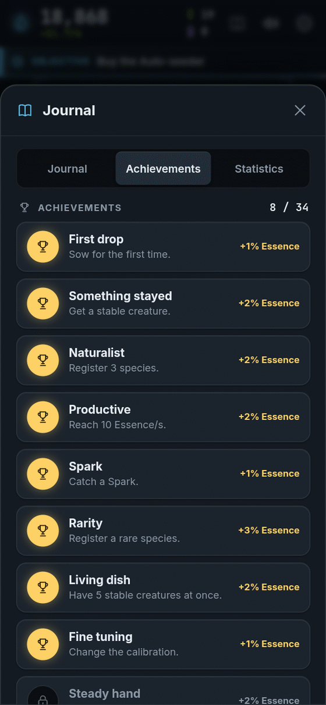

[[Español|Logros]] · **English**

# Achievements: medals to collect

**Achievements** are medals. Each time you earn one a little bell rings and you get a **small, permanent Essence bonus**.

<table>
<tr>
<td valign="top">

- You see them in the **Journal** (the book at the top), in the **Achievements** tab.
- Your achievements **stay forever**, even after an Extinction.
- No achievement is required: they are a gift for playing and exploring.
- If you earn **all 34**, your Essence grows **+91%**.

*(There are also hidden things that are not on this list. See [[Secrets|Secrets-en]].)*

</td>
<td width="254" align="center" valign="top">

</td>
</tr>
</table>

## First steps

| Achievement | How to get it | Bonus |
|---|---|---|
| **First drop** | Seed for the first time. | +1% |
| **Something stayed** | Get a stable creature. | +2% |
| **Steady hand** | Seed 100 times. | +2% |
| **Steady rain** | Seed 1,000 times. | +3% |

## Species collection

| Achievement | How to get it | Bonus |
|---|---|---|
| **Naturalist** | Register 3 species. | +2% |
| **Taxonomist** | Register 10 species. | +3% |
| **A fauna of my own** | Register 20 species. | +5% |
| **Rarity** | Register a rare species. | +3% |
| **Jewel** | Register a very rare species. | +5% |

## Behaviours

| Achievement | How to get it | Bonus |
|---|---|---|
| **Swimmer** | Observe a swimming creature. | +2% |
| **Whirl** | Observe a spinning creature. | +2% |
| **Heartbeat** | Observe a pulsing creature. | +2% |
| **Mitosis** | Observe a dividing creature. | +3% |
| **Colony** | Form a colony. | +3% |
| **Ethologist** | Observe all 6 behaviours. | +5% |

## Production

| Achievement | How to get it | Bonus |
|---|---|---|
| **Productive** | Reach 10 Essence per second. | +2% |
| **Flourishing** | Reach 100 Essence per second. | +3% |
| **Ecosystem** | Reach 1,000 Essence per second. | +5% |
| **Ten thousand** | Earn 10,000 Essence in total. | +2% |
| **Millionaire** | Earn 1,000,000 Essence in total. | +3% |

## Golden sparks

| Achievement | How to get it | Bonus |
|---|---|---|
| **Spark** | Catch a Spark. | +1% |
| **Light catcher** | Catch 10 Sparks. | +3% |
| **Moth** | Catch 50 Sparks. | +5% |

## A dish full of life

| Achievement | How to get it | Bonus |
|---|---|---|
| **Living dish** | Have 5 stable creatures at once. | +2% |
| **Bustle** | Have 10 stable creatures at once. | +3% |

## Scientist skills

| Achievement | How to get it | Bonus |
|---|---|---|
| **Printer** | Print a species. | +1% |
| **Fine tuning** | Change the calibration. | +1% |
| **Archivist** | Save a regime (a named setting). | +1% |
| **Variation** | Register a mutated variant. | +3% |
| **Symbiosis** | Form a symbiotic pair. | +3% |

## A long life

| Achievement | How to get it | Bonus |
|---|---|---|
| **Tabula rasa** | Trigger an Extinction. | +5% |
| **Heritage** | Buy a Genome node. | +2% |
| **Back again** | Return after being away. | +1% |
| **Patience** | Play for an hour. | +2% |

**[▶ Go collect medals!]({{GAME_URL}})**
