**Español** · [[English|How-to-play-en]]

# Cómo jugar

¡Es muy fácil! Solo necesitas **un dedo**.

Bioluma se juega en **sesiones** cortas de laboratorio, con un **reloj**. En cada sesión siembras vida y juntas **Esencia**. Al terminar, tu Esencia se vuelve **Datos**, y con los Datos mejoras el **Árbol**. La sesión siguiente rinde más. ¡Y la otra, más todavía!

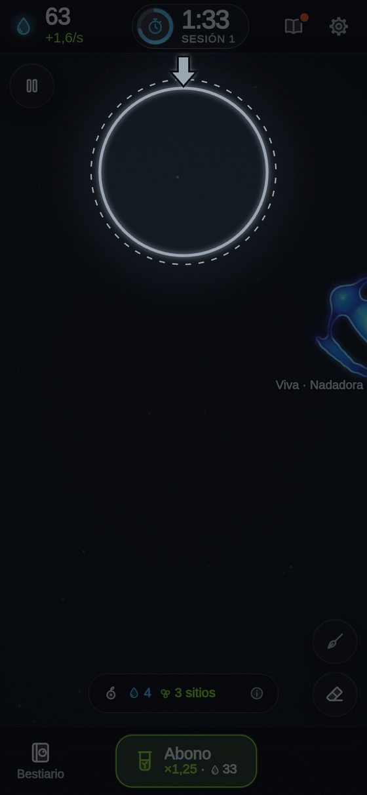

---

## Paso 0 · Abre el juego

<table>
<tr>
<td valign="top">

Verás a Bioluma brillar. **Toca la pantalla** para entrar.

Te saluda **VELA**, la ayudante del laboratorio. **Toca su globo** para leer lo siguiente.

¿Ya sabes jugar? Toca **«Saltar tutorial»**. Puedes repetirlo cuando quieras desde **Ajustes**.

</td>
<td width="254" align="center" valign="top">

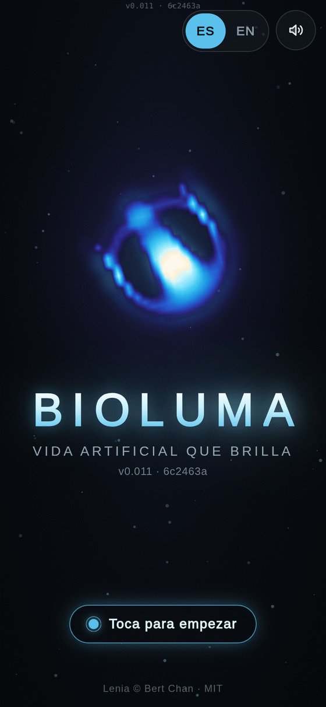

</td>
</tr>
</table>

---

## Paso 1 · Toca la placa 🌱 y el reloj empieza

<table>
<tr>
<td valign="top">

La **placa** es el cuadro oscuro del medio.

**Tócala.** ¡Acabas de poner una **semilla de luz**!

Tu primera semilla es **gratis** y vive seguro.

Arriba, en el centro, está el **reloj** de la sesión: **2:00**. Espera quieto hasta tu primera semilla. Entonces empieza a correr.

</td>
<td width="254" align="center" valign="top">

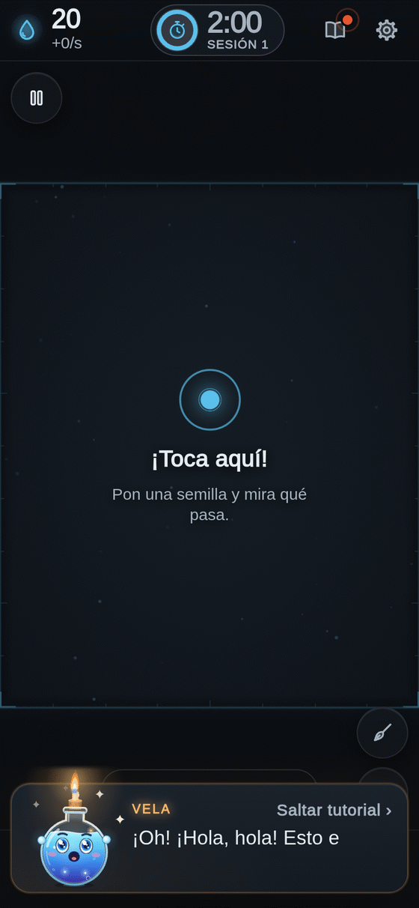

</td>
</tr>
</table>

---

## Paso 2 · Mira cómo nace

<table>
<tr>
<td valign="top">

La primera vez, el juego **se para** y VELA te lo explica con una tarjeta. Toca **«¡Entendido!»** para seguir.

Encima de cada semilla verás **«Naciendo 62 %»**. Si se queda con forma, ¡es una **criatura**! Dirá **«Viva»**.

Algunas semillas se apagan. **Es normal.** Prueba en otro sitio.

Si tocas muy cerca de otra criatura, verás **«Muy cerca: se fundirían»**. ¡Siembra separado!

</td>
<td width="254" align="center" valign="top">

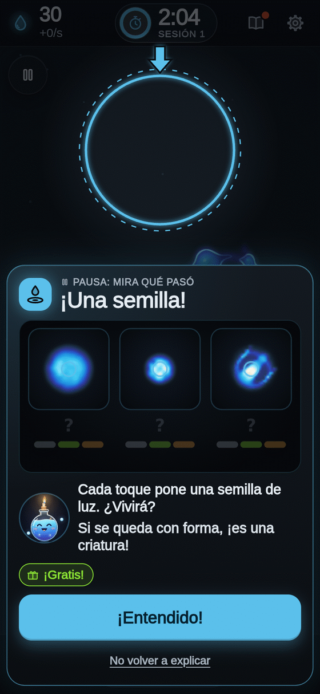

</td>
</tr>
</table>

---

## Paso 3 · Junta Esencia 💧

Cada criatura viva te da **Esencia** cada segundo. Arriba a la izquierda ves cuánta tienes.

**«+1/s»** quiere decir **1 de Esencia cada segundo**.

Con Esencia siembras más. El precio está en la píldora de abajo de la placa: **cada semilla que compras hoy cuesta un poquito más**. En la sesión siguiente vuelve al precio de siempre.

En la placa caben **5 criaturas** al principio. Si está llena, verás **«¡Placa llena!»**. La mejora **Placa más grande** del Árbol da más sitio.

---

## Paso 4 · El reloj ⏱

<table>
<tr>
<td valign="top">

El reloj marca tu **tiempo de laboratorio**.

- Cada **especie nueva** suma **+5 segundos**.
- Cuando queda un minuto, verás **«¡Último minuto!»**.
- Al llegar a **0:00**, la placa se para: **«¡TIEMPO!»**.

**No pierdes nada.** Tu Esencia se cuenta y se vuelve Datos.

</td>
<td width="254" align="center" valign="top">

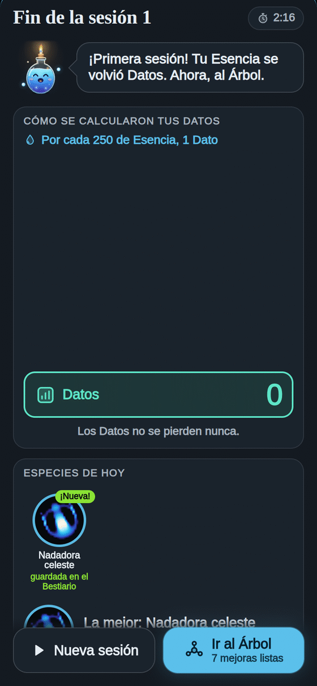

</td>
</tr>
</table>

---

## Paso 5 · Tu Esencia se vuelve Datos 📊

<table>
<tr>
<td valign="top">

Al final de cada sesión, una tarjeta hace la cuenta paso a paso:

- **Por cada 250 de Esencia, 1 Dato.**
- **+5 Datos** por cada especie nueva.
- **+3 Datos** por cada manera de moverse nueva.
- **+2 Datos** por cada encargo cumplido (en la sesión 1 se llaman **primeras metas**: sembrar y tu primera criatura).
- Y más por los **récords**.

**Los Datos no se pierden nunca.** Tus especies nuevas quedan **guardadas en el Bestiario**.

Luego toca **«Ir al Árbol»**.

</td>
<td width="254" align="center" valign="top">

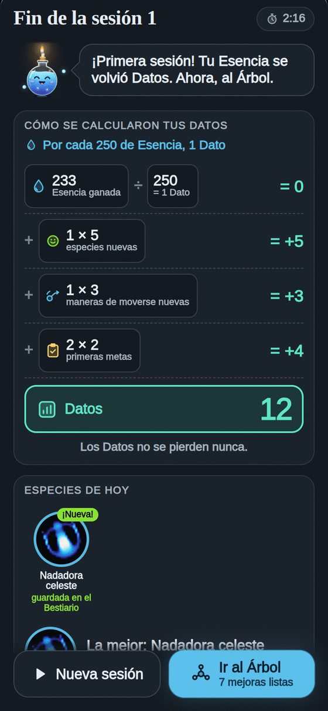

</td>
</tr>
</table>

---

## Paso 6 · Mejora el Árbol 🌳

<table>
<tr>
<td valign="top">

En el **Árbol** gastas tus Datos.

Las mejoras que **laten en verde** las puedes comprar. **Toca una.**

Verás **«AHORA → CON UN NIVEL MÁS»**: gris es lo que tienes, verde es lo que tendrás. Toca **«Comprar»**.

Cada mejora es **tuya para siempre**. La próxima sesión ya lo notas.

Todo sobre las mejoras: [[Árbol]].

</td>
<td width="254" align="center" valign="top">

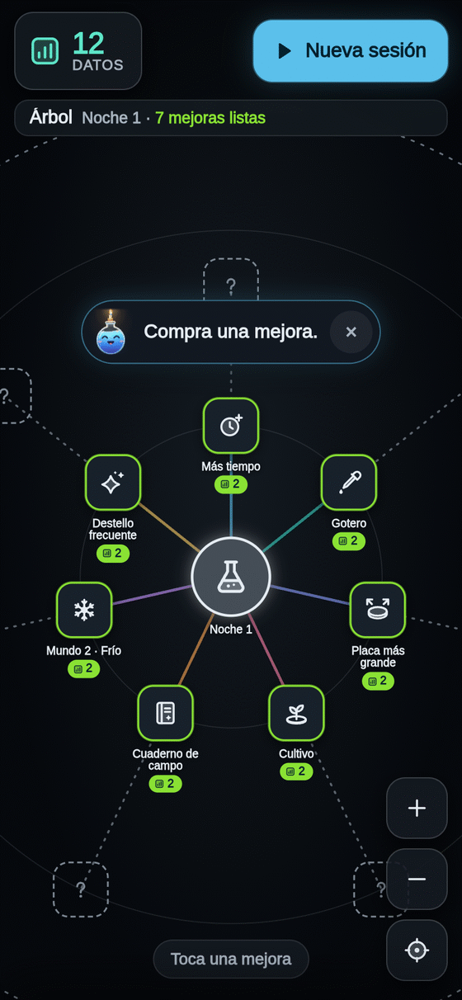

</td>
</tr>
</table>

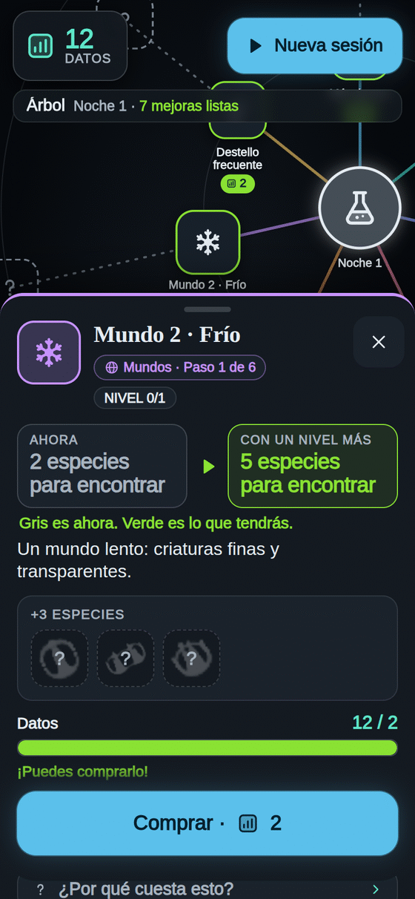

---

## Paso 7 · Una sesión nueva

<table>
<tr>
<td valign="top">

Toca **«Nueva sesión»**. Una tarjeta te dice:

- cuánto tiempo tienes hoy,
- qué te **regala el Árbol** (Esencia de inicio, siembras gratis, criaturas de la Nevera),
- lo **nuevo** desde la última vez,
- y tu **encargo**.

Cuando tengas otro **Mundo**, elige su tarjeta: otras reglas, otras criaturas. Mira [[Mundos]].

Toca **«¡Empezar!»**. Recuerda: **el reloj empieza con tu primera semilla**.

</td>
<td width="254" align="center" valign="top">

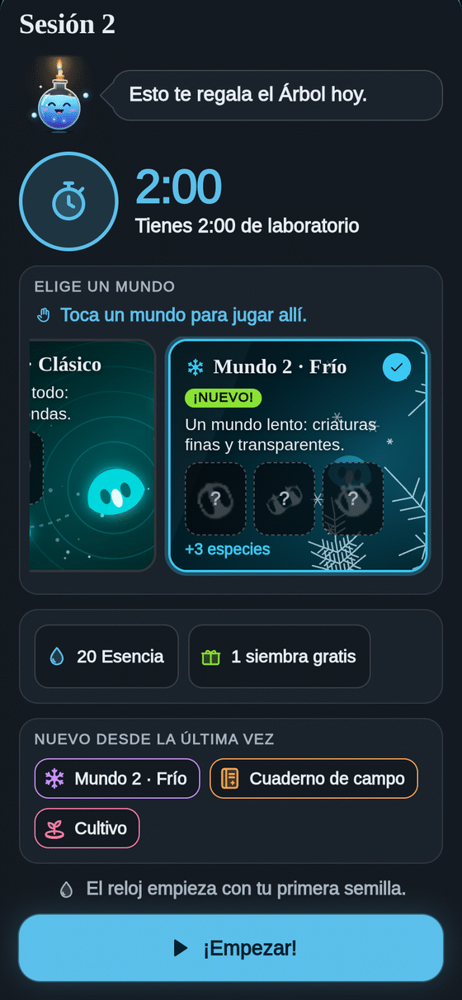

</td>
</tr>
</table>

---

## Paso 8 · Abono, encargos y el Destello

<table>
<tr>
<td valign="top">

**Abono 🌿** (el botón del centro, abajo, desde la primera sesión). Cuando tus criaturas ya dan Esencia y el reloj lleva medio minuto, se enciende en verde: **todo da Esencia ×1,25 hasta el final de la sesión**. Cuesta 20 segundos de tu Esencia. El siguiente de la misma sesión cuesta el doble. Sin criaturas vivas dice **«Falta vida»**.

**Encargos** (desde la sesión 2). VELA te pide favores en la barra de arriba de la placa: «Ten 3 criaturas vivas a la vez». Cumplirlo da Esencia, **+2 Datos** y **+5 segundos** de reloj. Si el favor es del Árbol, empieza con **«Al terminar:»**: el Árbol se abre cuando acaba el reloj.

**El Destello ✨** (desde la sesión 2). A veces una chispa dorada cruza la placa. **¡Tócala rápido!** Te regala **30 segundos de tu Esencia**, y tu próxima semilla vivirá seguro.

</td>
<td width="254" align="center" valign="top">

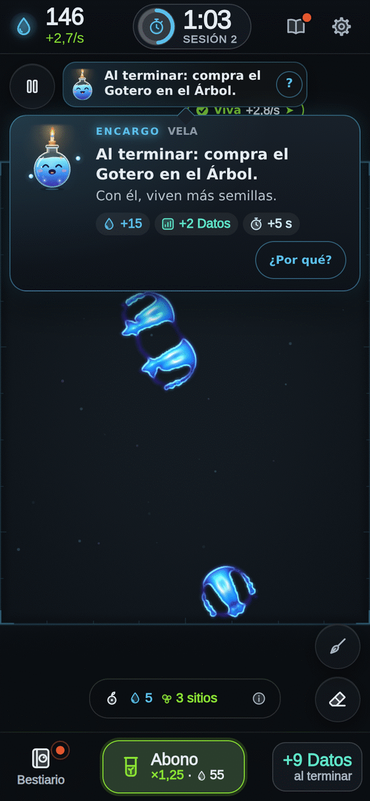

</td>
</tr>
</table>

---

## Paso 9 · El Bestiario 📖

<table>
<tr>
<td valign="top">

El botón **Bestiario** está abajo a la izquierda. Ahí se guarda **cada especie** que descubres, para siempre.

Toca una para ver su ficha: su retrato, su nombre, **cómo se mueve**, **dónde vive** y **cuánta Esencia da**.

Más en [[Especies]].

</td>
<td width="254" align="center" valign="top">

</td>
</tr>
</table>

---

## Paso 10 · La noche avanza 🌙

Después de unas sesiones y unas especies, **el centro del Árbol brilla en dorado**: ¡la noche puede avanzar!

Tócalo. **No se borra nada.** Se abren mejoras nuevas y cada noche da **más Datos**. Todo en [[Noche]].

---

## La pausa ⏸

<table>
<tr>
<td valign="top">

El botón de **pausa** (arriba a la izquierda de la placa) para la placa **y el reloj**.

Toca **«Seguir»** para volver. Si quieres acabar ya, **«Terminar ahora»** te dice cuántos Datos te llevas antes de confirmar.

</td>
<td width="254" align="center" valign="top">

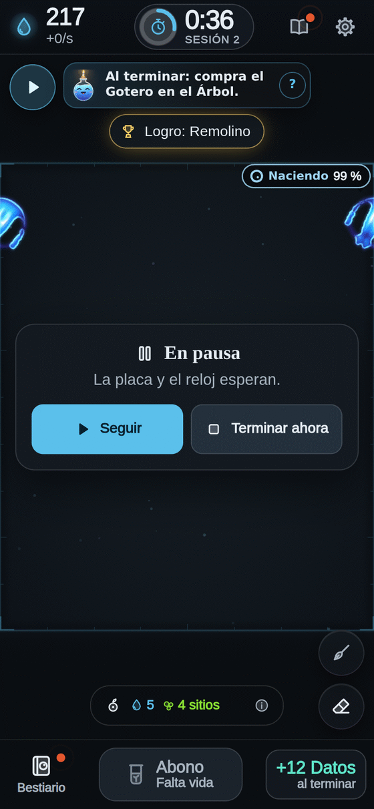

</td>
</tr>
</table>

---

## Trucos 💡

- **Siembra separado.** Dos semillas que se tocan se funden y pierden la forma.
- **¿Se apagaron todas?** Verás **«¡Toca aquí otra vez!»**. Siembra de nuevo: es barato.
- **Compra primero lo que late en verde.** El **Gotero** hace que vivan más semillas; **Más tiempo** alarga cada sesión.
- **Los mundos nuevos traen especies nuevas**: cada especie nueva da Datos y segundos de reloj.
- **Nada se pierde**: ni los Datos, ni el Árbol, ni el Bestiario.

Más preguntas: [[Preguntas frecuentes]].
