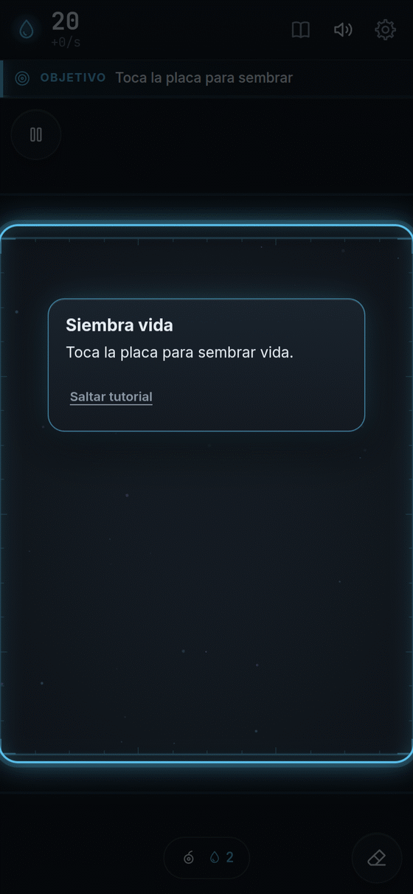
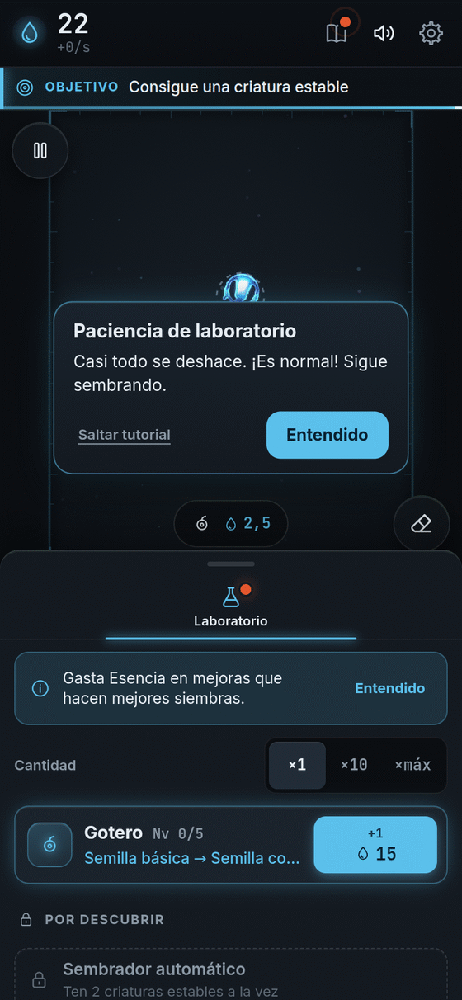
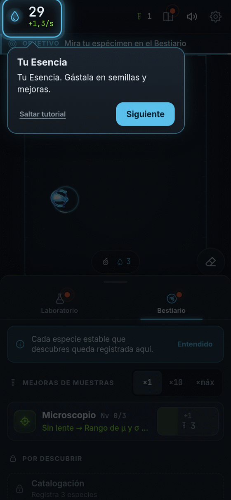
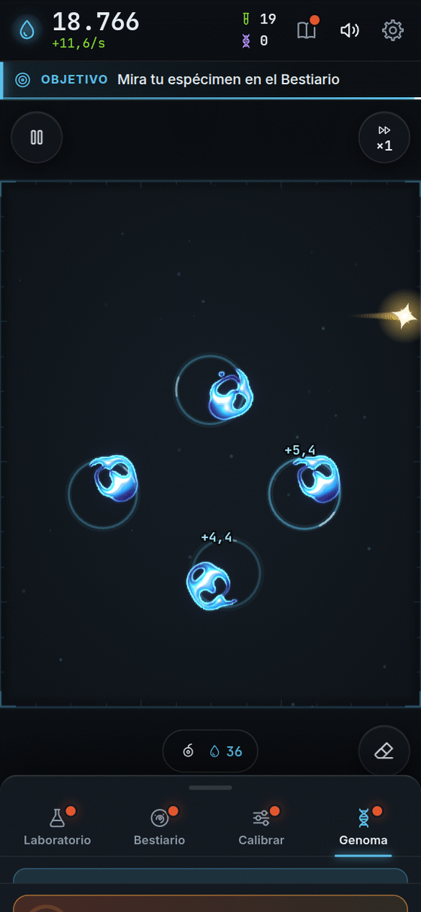
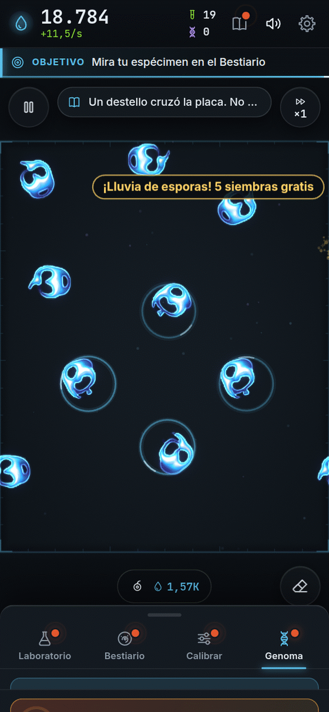
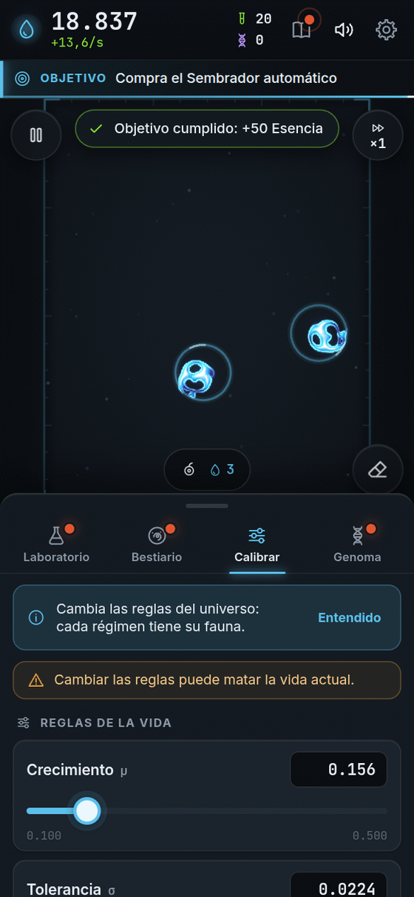
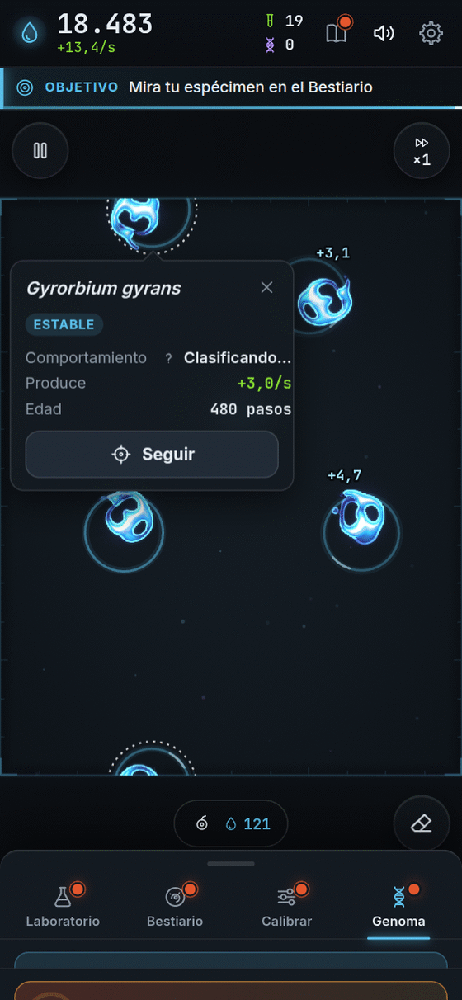

**Español** · [[English|How-to-play-en]]

# Cómo jugar

¡Es muy fácil! Solo necesitas **un dedo**. Aquí tienes todo el juego, paso a paso.

---

## Paso 0 · Abre el juego

<table>
<tr>
<td valign="top">

Verás a Bioluma brillar.

**Toca la pantalla** para empezar.

Un tutorial corto te enseña los primeros pasos. Si ya sabes jugar, lo puedes saltar. Después lo puedes repetir desde **Ajustes**.

</td>
<td width="254" align="center" valign="top">

</td>
</tr>
</table>

---

## Paso 1 · Toca la placa 🌱

<table>
<tr>
<td valign="top">

La **placa** es el cuadro oscuro del medio. Es como una gotita de laboratorio.

**Tócala.** ¡Acabas de sembrar!

Sembrar cuesta un poquito de **Esencia**. Es la moneda de Bioluma. Empiezas con 20, así que puedes sembrar muchas veces.

</td>
<td width="254" align="center" valign="top">

</td>
</tr>
</table>

---

## Paso 2 · Mira qué pasa

<table>
<tr>
<td valign="top">

La luz se mueve. Algunas siembras se **deshacen**. Otras se **inflan** demasiado.

¡Eso es normal! Es ciencia de verdad. **Sigue tocando.**

Si ves un **anillo de puntitos**, quiere decir *"estoy naciendo"*. Espera un momento.

</td>
<td width="254" align="center" valign="top">

</td>
</tr>
</table>

<table>
<tr>
<td valign="top">

**Consejo del tutorial:** casi todo se disuelve o explota. Cuando algo se queda, ¡ahí empieza la diversión!

</td>
<td width="254" align="center" valign="top">

</td>
</tr>
</table>

---

## Paso 3 · ¡Vida!

<table>
<tr>
<td valign="top">

Cuando una criatura **se queda sana**, brilla con un anillo. ¡Está viva!

Ahora te da **Esencia sin parar**.

**Tócala** y verás su ficha: cómo se llama, qué hace y cuánta Esencia te regala. Algunas nadan, otras giran, otras laten.

</td>
<td width="254" align="center" valign="top">

</td>
</tr>
</table>

---

## Paso 4 · Junta Esencia

<table>
<tr>
<td valign="top">

Arriba a la izquierda está tu **Esencia**. Debajo dice cuánta ganas **cada segundo**.

Más criaturas sanas, más Esencia.

La Esencia sirve para dos cosas: **sembrar** y **comprar mejoras**.

¿Te quedaste sin nada y no hay nada vivo? No te preocupes: la **pipeta de emergencia** te regala una siembra de vez en cuando. Nunca te quedas atascado.

</td>
<td width="254" align="center" valign="top">

</td>
</tr>
</table>

---

## Paso 5 · Compra mejoras

<table>
<tr>
<td valign="top">

Abre el **Laboratorio** (el frasco, abajo).

Cada tarjeta es una mejora. Toca el botón azul para comprarla.

- El **Gotero** hace siembras que funcionan más.
- El **Sembrador automático** siembra solito.
- La **Placa** da más espacio.

Las mejoras nuevas aparecen cuando haces cosas nuevas. Mira la lista completa en [[Mejoras]].

</td>
<td width="254" align="center" valign="top">

</td>
</tr>
</table>

---

## Paso 6 · Descubre especies

<table>
<tr>
<td valign="top">

Cada criatura **distinta** entra al **Bestiario**, con su retrato y su nombre científico.

Cada especie nueva te da:

- **Muestras** (una moneda especial);
- un **multiplicador** que te da más Esencia **para siempre**.

¡Colecciónalas todas! Conoce más en [[Especies]].

</td>
<td width="254" align="center" valign="top">

</td>
</tr>
</table>

<table>
<tr>
<td valign="top">

Toca un retrato y verás la **ficha de la especie**: su nombre en latín, qué hace, qué tan rara es y cuánto vale.

</td>
<td width="254" align="center" valign="top">

</td>
</tr>
</table>

---

## Paso 7 · ¡Atrapa la chispa dorada! ✨

<table>
<tr>
<td valign="top">

De vez en cuando cruza una **chispa dorada**. Se llama **Destello**.

**¡Tócala antes de que se vaya!** Te da un premio sorpresa:

- **Floración:** ganas **×7** Esencia durante 30 segundos.
- **Esencia de golpe:** un montón de Esencia de una vez.
- **Lluvia de esporas:** 5 siembras gratis.
- **Mutágeno:** tus próximas 3 siembras salen bien seguro.

Si se escapa, no pasa nada. Vendrá otra.

</td>
<td width="254" align="center" valign="top">

</td>
</tr>
</table>

<table>
<tr>
<td valign="top">

¡Premio! Aquí el Destello acaba de regalar algo.

</td>
<td width="254" align="center" valign="top">

</td>
</tr>
</table>

---

## Paso 8 · Cambia las reglas del universo

<table>
<tr>
<td valign="top">

Cuando descubres tu primera especie, puedes comprar el **Calibrador** en el Laboratorio. Eso abre la pestaña **Calibrar**, con deslizadores. Se llaman **μ** (mu) y **σ** (sigma).

Muévelos y **cambias las reglas**. Cada regla tiene sus propias criaturas. ¡Puedes encontrar bichos que nunca viste!

⚠️ Cuidado: cambiar las reglas puede deshacer la vida que tienes. Es parte de la aventura.

</td>
<td width="254" align="center" valign="top">

</td>
</tr>
</table>

---

## Paso 9 · Empieza de nuevo, pero más fuerte 🧬

<table>
<tr>
<td valign="top">

Cuando ya ganaste mucha Esencia, aparece la pestaña **Genoma** y se activa el botón **Extinguir**.

**Mantenlo apretado 1,5 segundos.** La placa se pone blanca y se vacía.

¡Pero **no pierdes lo importante**! Te quedas con todos tus descubrimientos. Y ganas **Genoma**, que compra reglas nuevas.

Así cada vez llegas más lejos y más rápido. Lo explicamos en [[Prestigio y Genoma]].

</td>
<td width="254" align="center" valign="top">

</td>
</tr>
</table>

<table>
  <tr>
    <td align="center"> La placa se vacía…</td>
    <td align="center"> …y ganas Genoma.</td>
  </tr>
</table>

---

## Trucos

- **Si no sale nada, sigue tocando.** Fallar es parte del juego.
- **La placa es como un donut.** Lo que sale por un lado entra por el otro.
- **Toca una criatura** para ver su ficha. El botón **Seguir** hace que la cámara la acompañe.

<table>
<tr>
<td valign="top">

- **Mantén el dedo apretado** en la placa (desde el Gotero II): siembra grande.
- **Arrastra** (desde el Gotero III): ¡pincel de materia!
- **Pellizca con dos dedos** para acercar y alejar.
- Botones de la placa: **Pausa**, **Borrar** (quita materia) y **Velocidad** (más rápido, cuando compres la Incubadora).
- La primera vez que abres una pestaña, arriba hay una frasecita que explica para qué sirve. Toca **Entendido** y se va.
- El **libro** de arriba es la **Bitácora**: guarda frases del científico y tus **logros**. Mira [[Logros]].

</td>
<td width="254" align="center" valign="top">

</td>
</tr>
</table>

### En el computador

| Haz | Para |
|---|---|
| Clic | Sembrar |
| Clic derecho | Borrar |
| Rueda del ratón | Acercar o alejar |
| Teclas **1 2 3 4** | Cambiar de pestaña |
| **Espacio** | Pausa |
| **E** · **J** · **M** | Borrar · Bitácora · Silencio |
| **+** · **-** · **0** | Acercar · alejar · volver |

## Mientras no estás

Si cierras el juego, la placa **sigue trabajando un ratito**. Al volver te espera un regalo de Esencia. No descubre especies ni compra cosas por ti: eso solo lo haces tú. Más detalles en [[Preguntas frecuentes]].

## ¿Quieres más?

[[Mejoras]] · [[Especies]] · [[Prestigio y Genoma]] · [[Logros]] · [[Secretos]]

## [▶ ¡A jugar!]({{GAME_URL}})
