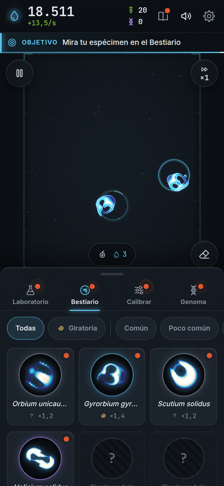
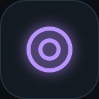
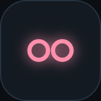
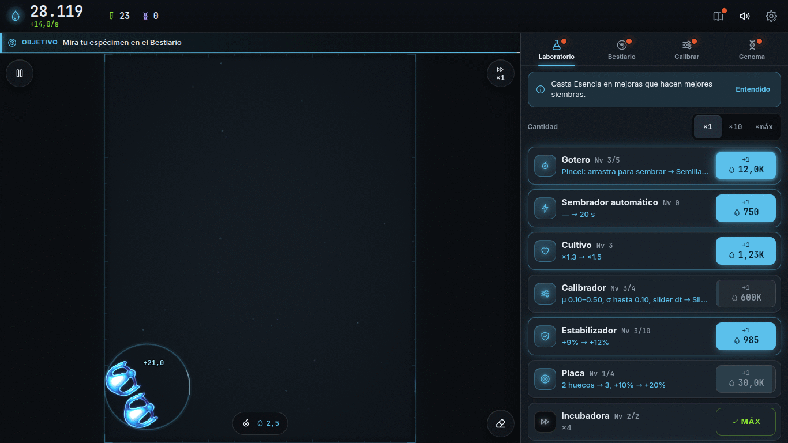
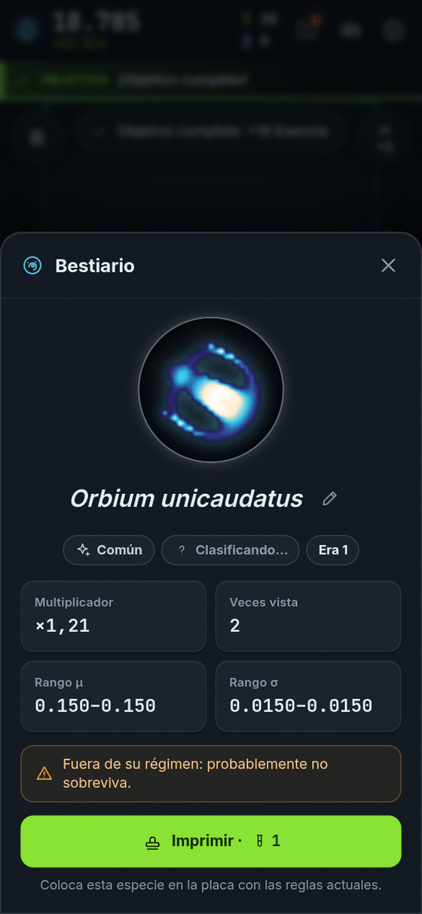

**Español** · [[English|Species-en]]

# Especies: los bichos de luz

En Bioluma viven criaturas hechas de luz. Se llaman **especies**. Cada una tiene su nombre científico en latín, como *Orbium unicaudatus*. Los nombres vienen del catálogo de Bert Chan, el científico que descubrió estas criaturas (lee [[Ciencia detrás]]).

Nadie las dibujó. **Nacen solas** cuando la regla del juego tiene la forma correcta.

## Seis maneras de moverse

El juego mira a cada criatura sana y decide **qué hace**. Cada comportamiento tiene su propio dibujito y su propio color. Y cada uno da más o menos Esencia.

<table>
<tr>
<td align="center" width="16%"> <b>Quieta</b></td>
<td align="center" width="16%"> <b>Pulsante</b></td>
<td align="center" width="16%"> <b>Nadadora</b></td>
<td align="center" width="16%"> <b>Giratoria</b></td>
<td align="center" width="16%"> <b>Divisora</b></td>
<td align="center" width="16%"> <b>Colonia</b></td>
</tr>
</table>

| Comportamiento | Qué hace | Cuánta Esencia da |
|---|---|---|
| **Quieta** (círculo) | Se queda en su lugar, firme como una piedrita brillante. | Normal |
| **Pulsante** (dos círculos) | Late: se hace grande y chica, como un corazón. | Un poco más |
| **Nadadora** (flecha) | Se va nadando en línea recta. Si sale por un lado, aparece por el otro. | Más |
| **Giratoria** (espiral) | Nada dando vueltas, como una bailarina. | Todavía más |
| **Divisora** (dos círculos) | ¡Una se hace dos! Como un globo de agua que se parte. | Mucho más |
| **Colonia** (tres círculos) | Muchas criaturas iguales viviendo juntas y cerquita. | La que más |

 <i>Una criatura divisora justo cuando se parte en dos: ¡una se hace dos!</i>

> **Dato divertido:** la criatura necesita unos segundos para que el juego descubra qué hace. Mientras tanto cuenta como "quieta". Cuando el juego entiende que nada o gira, ¡tu Esencia da un saltito!

## Las fichas

Toca una criatura en la placa, o un retrato en el Bestiario, y verás su **ficha**:

<table>
<tr>
<td valign="top">

- Su **nombre** científico (o "Espécimen" con un número si es nueva y todavía no tiene nombre).
- Su **rareza**.
- Su **comportamiento**.
- Su **multiplicador** de Esencia.
- Cuántas veces la viste y en qué Era la descubriste.
- Un botón **Imprimir** para poner otra igual en la placa.
- Un lápiz para **ponerle tu propio nombre**.

</td>
<td width="254" align="center" valign="top">

</td>
</tr>
</table>

## Rarezas

| Rareza | Qué tan difícil es encontrarla | Multiplicador de Esencia |
|---|---|---|
| Común | Fácil | ×1,1 |
| Poco común | Hay que buscar | ×1,3 |
| Rara | Cuesta encontrarla | ×1,6 |
| Muy rara | ¡Un tesoro! | ×2,0 |

(Con la mejora **Catalogación** todos estos multiplicadores crecen.)

## Cómo encontrar más especies

1. **Siembra mucho.** Cada siembra es un dado: a veces sale algo nuevo.
2. **Cambia las reglas** en **Calibrar**. Cada ajuste de **μ** y **σ** tiene sus propias criaturas. Es la forma más rápida de encontrar bichos distintos.
3. **Usa el Microscopio** (Bestiario): en el nivel 3 te marca pistas de dónde hay especies por descubrir.
4. **Guarda tus ajustes favoritos** (Calibrador II): vuelves con un toque.
5. **Compra reglas nuevas con Genoma** ([[Prestigio y Genoma]]): abren especies más grandes y raras.
6. **Mira el Bestiario**: las siluetas con "?" son especies que te esperan. No te decimos cuántas hay.

¿Cuántas especies hay? **Muchas más de las que encontrarás en una tarde.** Y no, no vamos a contar cuáles son. ¡Descúbrelas tú!

Más sobre secretos, sin spoilers, en [[Secretos]].

**[▶ ¡A buscar bichos!]({{GAME_URL}})**
