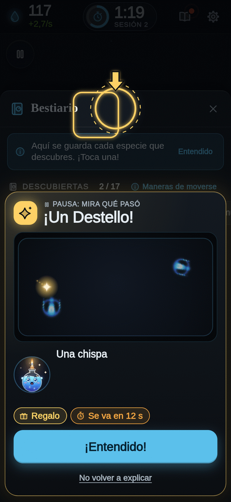
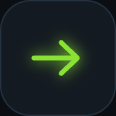
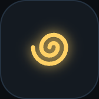
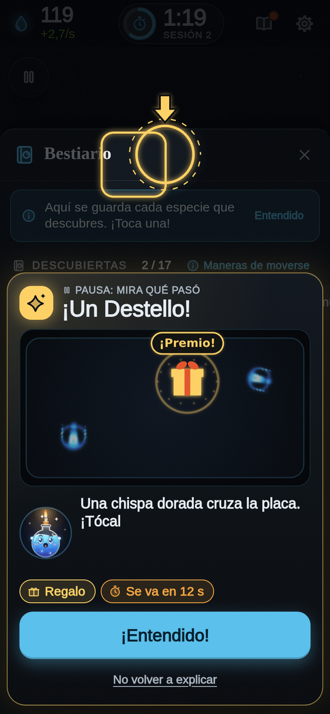

**Español** · [[English|Species-en]]

# Especies: los bichos de luz

En Bioluma viven criaturas hechas de luz. Se llaman **especies**. Cada una tiene un **nombre que dice cómo es**, como *Nadadora celeste* o *Media luna violeta*, y debajo, en pequeño, su nombre científico en latín, como *Orbium unicaudatus*. Los nombres en latín vienen del catálogo de Bert Chan, el científico que descubrió estas criaturas (lee [[Ciencia detrás]]).

Nadie las dibujó. **Nacen solas** cuando las reglas de la placa tienen la forma correcta.

## Maneras de moverse

El juego mira a cada criatura viva y decide **qué hace**. Cada manera tiene su dibujito y su color, y unas dan más Esencia que otras.

<table>
<tr>
<td align="center" width="33%"> <b>Quieta</b></td>
<td align="center" width="33%"> <b>Nadadora</b></td>
<td align="center" width="33%"> <b>Gira</b></td>
</tr>
</table>

| Manera | Qué hace | Esencia | Dónde vive |
|---|---|---|---|
| **Quieta** (círculo) | Se queda en su sitio, firme como una piedrita brillante. | Normal (×1) | Mundo 5 · Discos |
| **Nadadora** (flecha) | Se desliza por la placa sin parar, siempre hacia delante. | Más (×1,6) | En casi todos los mundos |
| **Gira** (espiral) | Da vueltas como un remolino. | Todavía más | Mundo 3 · Remolinos y Mundo 6 · Patas |

Hay otras maneras de moverse en la ciencia de Lenia (latir, dividirse, vivir en colonia), pero **aún no viven en ningún mundo** del juego. El botón **«Maneras de moverse»** del Bestiario las explica todas.

> **Dato divertido:** una criatura necesita unos segundos para que el juego descubra qué hace. Mientras tanto cuenta como «quieta». Cuando el juego entiende que nada o gira, ¡tu Esencia da un saltito!

## Las fichas

Toca un retrato en el Bestiario y verás su **ficha**:

<table>
<tr>
<td valign="top">

- Su **nombre** (y el latín pequeño debajo) y su número: «Criatura 3».
- Su **rareza** y **cómo se mueve** (toca la etiqueta para ver la explicación).
- **Dónde vive**: su mundo.
- **Cuánta Esencia da**, con la cuenta.
- **Hacer una copia**, con la mejora **Copiadora** del Árbol (cuesta Esencia; con **Archivo**, a veces es gratis).
- Un lápiz para **ponerle tu propio nombre**.

</td>
<td width="254" align="center" valign="top">

</td>
</tr>
</table>

## Rarezas

| Rareza | Qué tan difícil es encontrarla | Multiplicador de Esencia |
|---|---|---|
| Común | Fácil | ×1,1 |
| Poco común | Hay que buscar | ×1,3 |
| Rara | Cuesta encontrarla | ×1,6 |
| Muy rara | ¡Un tesoro! | ×2,0 |

(Con la mejora **Coleccionista** del Árbol todas dan más.)

## Cómo encontrar más especies

1. **Siembra mucho.** Cada semilla es un dado: a veces sale algo nuevo.
2. **Abre mundos nuevos** en el [[Árbol]]. Cada mundo tiene sus propias criaturas: mira [[Mundos]].
3. **Mira las tarjetas de los mundos** al empezar una sesión: las siluetas «?» son especies que aún te faltan allí.
4. **Semillas curiosas** (Árbol, camino Descubrir): las semillas prueban más las especies que no tienes.
5. Cada especie nueva da **+5 Datos** y **+5 segundos** de reloj. ¡Buscar vale la pena!

¿Cuántas especies hay? **Muchas más de las que encontrarás en una tarde.** ¡Descúbrelas tú!

Más sobre secretos, sin spoilers, en [[Secretos]].

**[▶ ¡A buscar bichos!]({{GAME_URL}})**
