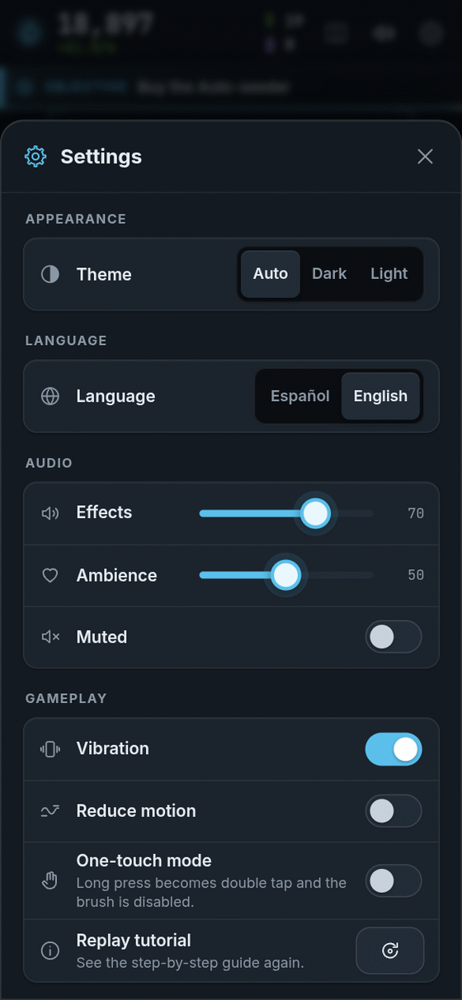
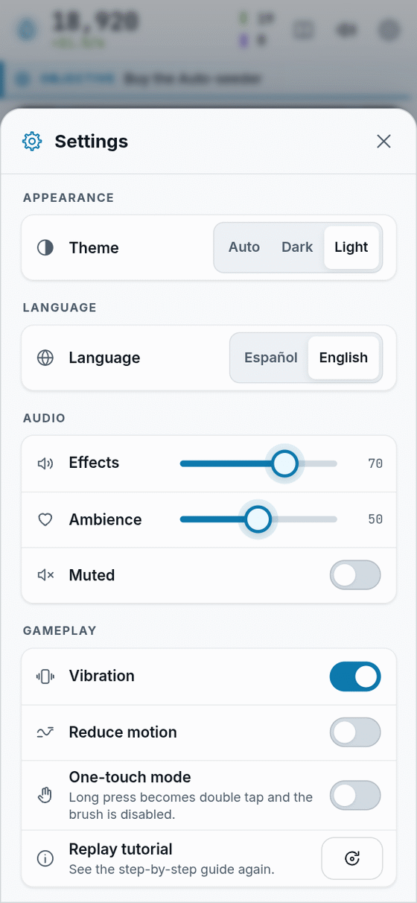
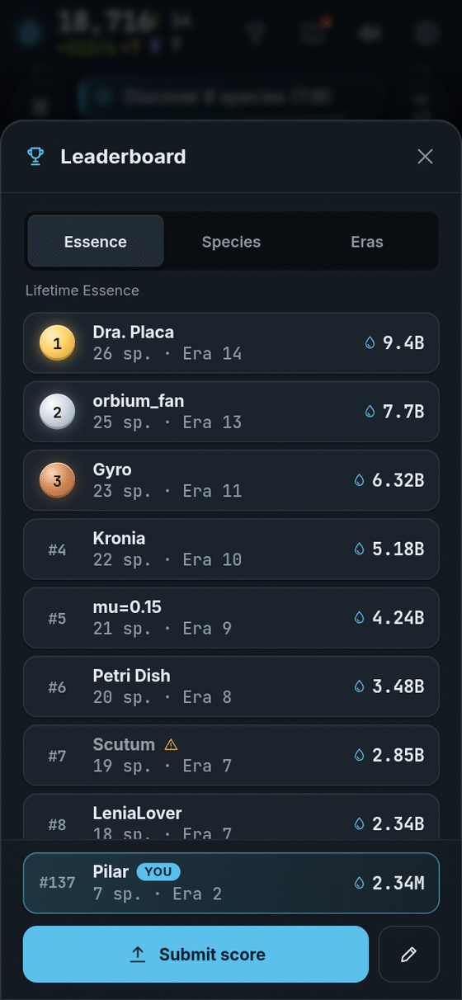

[[Español|Preguntas-frecuentes]] · **English**

# Frequently asked questions

Short answers to the most common questions.

## The basics

### Does it cost money?
**No.** Bioluma is free.

### Does it have ads?
**No.** Never. There are no ads in the game.

### Can I pay to win?
**No.** Nothing that costs money gives you more Essence, more speed or an edge on the leaderboard. If one day there are optional extras (colours, sounds…), they only change how the game **looks** or **sounds**, never how you **win**.

### Do I need an account?
**No.** You open it and play.

### What age is it for?
Everyone. It is played with one finger and the texts are short. The littlest ones can play with a grown-up next to them to help with reading.

## Saving

### Is my game saved?
**Yes, by itself.** Every 30 seconds and whenever something important happens. It is saved **in your browser**, on your device. If something fails, the game tells you.

### Can I play on another device with my game?
Yes. Go to **Settings → Save data → Export**, copy the long code (it starts with `BIOLUMA1.`) and paste it into **Import** on the other device.

### What if I clear my browser data?
If you clear the site's data or play in a **private window**, the game **is lost**. That is why it is a good idea to **export** a copy now and then.

### How do I start from scratch?
**Settings → Save data → Delete save.** It asks you to tap twice so you do not delete by accident.

## Time away

### Does it keep playing when I am away?
**No.** The lab works in **sessions** with a clock, and the clock only runs while you play. If you close the game in the middle of a session, when you come back it **carries on where you left it**, with the same time.

### Do I lose anything if I leave?
**No.** Your Data, the Tree, the Bestiary and your worlds stay with you. Golden Sparks do not show up while you are away either.

### Can I play without internet?
Yes, once the game has loaded. If you **install** it (see [[Platforms|Platforms-en]]), it works even better offline. The pretty fonts are swapped for the system ones, but everything else works the same.

## Settings

<table>
  <tr>
    <td align="center"> Dark theme</td>
    <td align="center"> Light theme</td>
  </tr>
</table>

### How do I change the language?
**Settings → Language → Español / English.** The first time you open it, the game uses your browser's language.

### Are there dark and light modes?
Yes. **Settings → Appearance → Theme:** *Auto*, *Dark* or *Light*. The dish always looks dark, like under a microscope.

### How do I turn the sound off?
In **Settings → Audio**, or press **M** on a computer (on a wide screen the **speaker** is also at the top). In **Settings → Audio** you can lower just the **effects** or just the **ambience**. Every sound is made on the spot: there are no recordings.

### The game makes me dizzy or runs slowly
Try this in **Settings**:
- **Reduce motion:** turns off trails, particles and animations.
- **Graphics → Quality:** *Low* makes the dish smaller and lighter (it may apply the next time you open the game).

### It is hard to press and hold
Turn on **One-touch mode** in Settings. Long press becomes double tap and the brush is turned off.

### Can I repeat the tutorial?
Yes. **Settings → Replay tutorial.**

## Devices

### Which devices does it work on?
Any modern browser with **WebGL2**: recent Chrome, Edge, Firefox and Safari, on a phone, tablet or computer. More in [[Platforms|Platforms-en]].

### It says "This browser cannot grow life"
Your browser has no WebGL2. Update it, try another one, and check that **hardware acceleration** is turned on.

## Leaderboard and fair play

### Is there a leaderboard?
Yes, **optional**. It has three boards: **Lifetime Essence**, **Species** and **Nights**. To appear you choose a **scientist name** (3 to 16 characters). It asks for no email or anything else. Until you choose one, **nothing is sent**.

If you do not see the trophy button at the top, your version does not have it switched on yet.

 <i>Example with sample data: the names are made up.</i>

### How is cheating prevented?
With several layers: your progress is signed, the server checks that the numbers **are possible** (that they do not grow faster than real time, that they add up with your game…) and the browser warns if it sees odd things, like the clock going backwards or an edited game.

If something does not add up, your name turns **grey** ("Under review") and drops out of the top. Blatant tricks do not get through. Best is to play fair: winning for real is more fun!

### Can I lose my place if I restart the game?
No. **Your best result** is kept, so starting over does not erase you.

## Privacy

### What data is sent?
None by default. The **Anonymous analytics** setting is **off**; if you turn it on, aggregated numbers (no personal data) are sent to balance the game. Only the leaderboard sends anything more, and only if you choose a name.

## Playing

### Why does almost everything dissolve at the start?
Because it is **real science**: most blobs of light do not find their shape. Keep seeding. The ones that do, glow!

### Why does the dish start empty every session?
Each session is a fresh stint in the lab. **Your species are not lost**: they are kept in the **Bestiary**. With the Tree's **Fridge**, your best creatures start the next session with you.

### I changed worlds and my favourite creature does not hatch
That is normal: **each world has its own creatures**. Pick its world on the start card. Each species' card says **where it lives**. See [[Worlds|Worlds-en]].

### How do I get more Data?
By collecting Essence (**every 250 makes 1 Data**) and by **discovering**: each new species gives +5 Data, each new way of moving +3 and each request +2. **Fertiliser** and the **Spark** help you collect more Essence.

### What happened to the Lab, Calibrate, Genome and Extinction?
They belonged to an earlier version. Now everything is upgraded in the [[Tree|Tree-en]], the rules are the [[Worlds|Worlds-en]] and the [[Night|Night-en]] replaces Extinction, **without erasing anything**. If you had an old save, it was turned into Data and upgrades.

## Something is not working?

Tell us at [github.com/ronalc90/Lenia/issues](https://github.com/ronalc90/Lenia/issues). It helps a lot if you say which device and browser you use.

**[▶ Play now!]({{GAME_URL}})**
