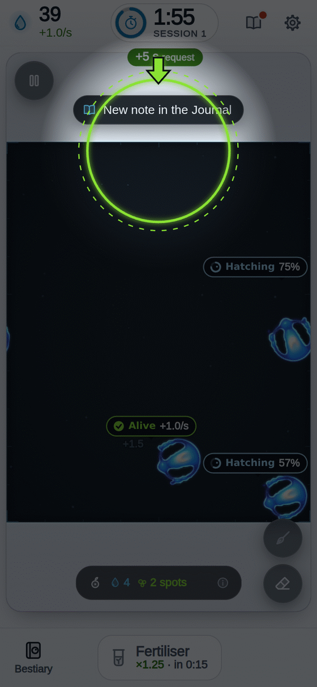
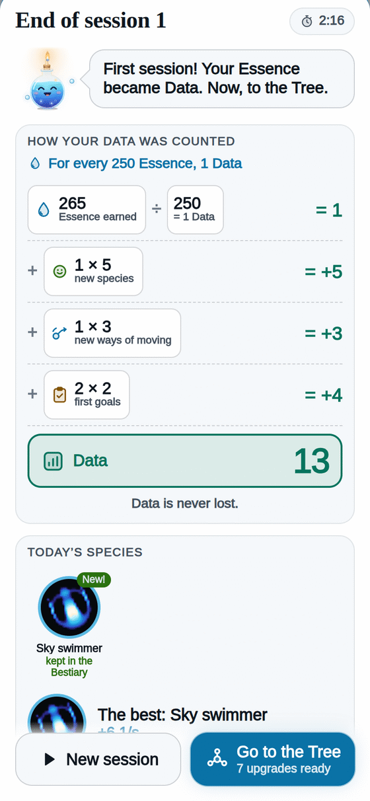
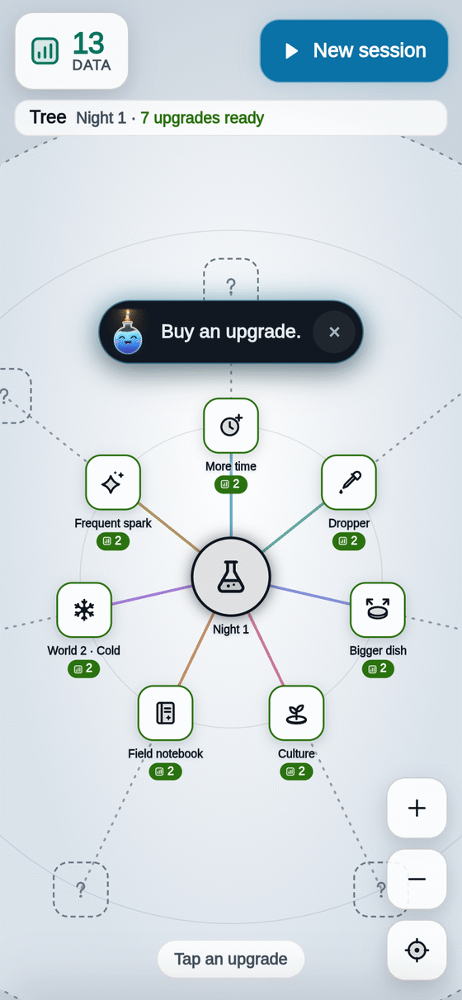

  

[[Español|Home]] · **English**

# Bioluma

**You sow light. Real life is born.**
The creatures swim, spin and glow. Nobody drew them: they are born on their own inside the game!
It is played in short lab sessions, with one finger and no ads.

## [▶ Play now!]({{GAME_URL}})

*(It works in your phone's or computer's browser. Nothing to install.)*

---

## What do I do in Bioluma?

<table>
  <tr>
    <td align="center" width="25%"> <b>1. Sow</b> Tap the dish: the clock starts.</td>
    <td align="center" width="25%"> <b>2. Time!</b> Your Essence becomes Data.</td>
    <td align="center" width="25%"> <b>3. Upgrade</b> Data grows the Tree.</td>
    <td align="center" width="25%"> <b>4. Discover</b> New worlds and species.</td>
  </tr>
</table>

Every session earns more than the one before. And when your lab grows, **the night moves on** and new upgrades open. You never lose anything!

## Start here

- [[How to play|How-to-play-en]]: Learn to play step by step, with pictures
- [[Tree|Tree-en]]: Know what each upgrade does
- [[Worlds|Worlds-en]]: Choose where to play
- [[Species|Species-en]]: Meet the critters of light
- [[Night|Night-en]]: Understand how the night moves on
- [[Achievements|Achievements-en]]: See the medals I can earn
- [[Secrets|Secrets-en]]: Find out there are secrets (no spoilers)
- [[FAQ|FAQ-en]]: Answer a question
- [[Platforms|Platforms-en]]: Play on a phone, tablet or PC
- [[Science behind|Science-behind-en]]: Learn why this is real science
- [[Development|Development-en]]: Help build the game
- [[Credits|Credits-en]]: See who made this possible

## Why it is fun

- **Life is real.** Every creature comes out of a math rule running live. None of them is hand-animated.
- **Everything glows and sounds.** Each tap makes ripples of light and musical notes made on the spot.
- **Something is always happening.** Golden sparks, new creatures, prizes, medals.
- **You decide.** What do you upgrade first? Which world do you play today? Every game turns out different.

---

Bioluma is free software (MIT license). Code and bug reports: <a href="https://github.com/ronalc90/Lenia">github.com/ronalc90/Lenia</a>.
