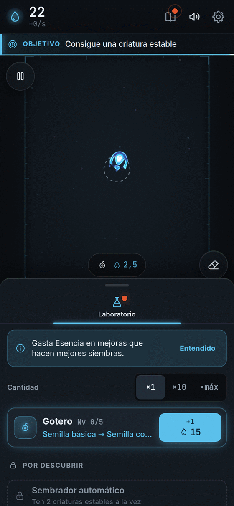
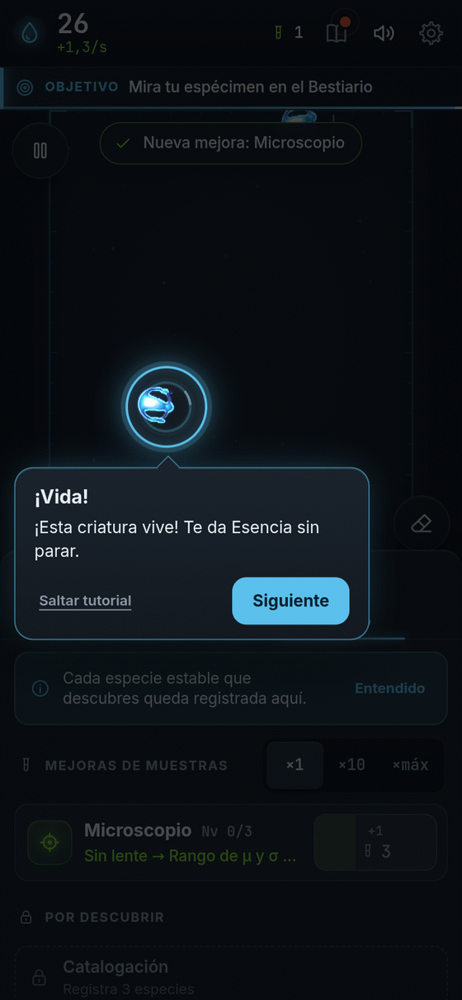

  

**Español** · [[English|Home-en]]

# Bioluma

**Tú siembras luz. Nace vida de verdad.**
Las criaturas nadan, giran, laten y se dividen. Nadie las dibujó: ¡nacen solas dentro del juego!
Es gratis, no tiene anuncios y se juega con un solo dedo.

## [▶ ¡Jugar ahora!]({{GAME_URL}})

*(Funciona en el navegador del teléfono o del computador. No hay que instalar nada.)*

---

## ¿Qué hago en Bioluma?

<table>
  <tr>
    <td align="center" width="25%"> <b>1. Toca</b> Siembra una gotita de luz.</td>
    <td align="center" width="25%"> <b>2. Mira</b> Algunas siembras cobran vida.</td>
    <td align="center" width="25%"> <b>3. Mejora</b> Gasta Esencia en cosas geniales.</td>
    <td align="center" width="25%"> <b>4. Descubre</b> Colecciona especies nuevas.</td>
  </tr>
</table>

Cuando ya tienes muchas criaturas, puedes **empezar de nuevo, pero más fuerte**. ¡Eso es lo más divertido!

## Empieza por aquí

| Quiero… | Página |
|---|---|
| Aprender a jugar paso a paso, con fotos | [[Cómo jugar]] |
| Saber qué compra cada botón | [[Mejoras]] |
| Conocer a los bichos de luz | [[Especies]] |
| Entender cómo se empieza de nuevo | [[Prestigio y Genoma]] |
| Ver las medallas que puedo ganar | [[Logros]] |
| Descubrir que hay secretos (sin spoilers) | [[Secretos]] |
| Resolver una duda | [[Preguntas frecuentes]] |
| Jugar en el teléfono, en la tablet o en el PC | [[Plataformas]] |
| Saber por qué esto es ciencia de verdad | [[Ciencia detrás]] |
| Ayudar a construir el juego | [[Desarrollo]] |
| Ver quién hizo posible esto | [[Créditos]] |

## Por qué es divertido

- **La vida es real.** Cada criatura sale de una regla matemática que corre en vivo. Ninguna está animada a mano.
- **Todo brilla y suena.** Cada toque hace ondas de luz y notas de música que se inventan en el momento.
- **Siempre pasa algo.** Chispas doradas, criaturas nuevas, premios, medallas.
- **Tú decides.** ¿Cambias las reglas del universo? ¿Empiezas de nuevo? Cada partida sale distinta.

---

Bioluma es software libre (licencia MIT). Código y reportes de errores: <a href="https://github.com/ronalc90/Lenia">github.com/ronalc90/Lenia</a>.
