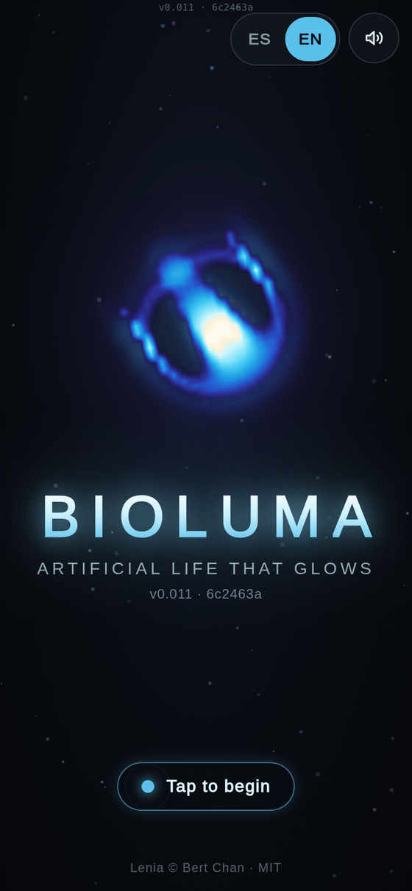
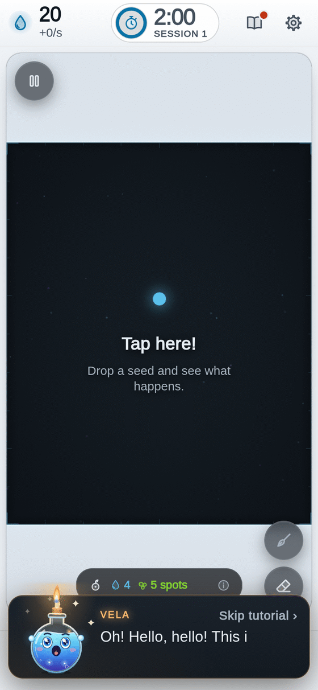
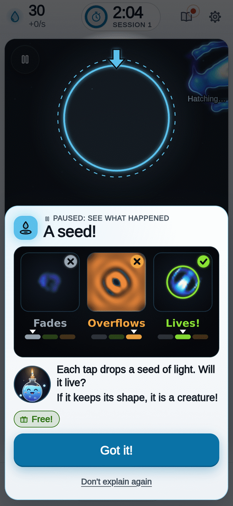
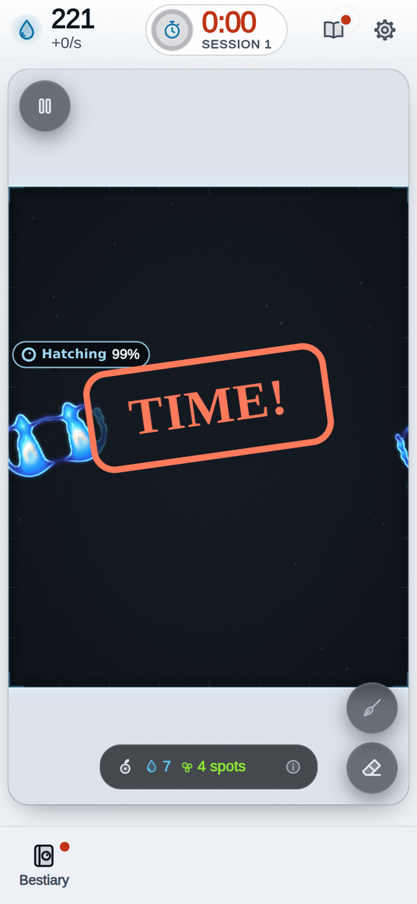
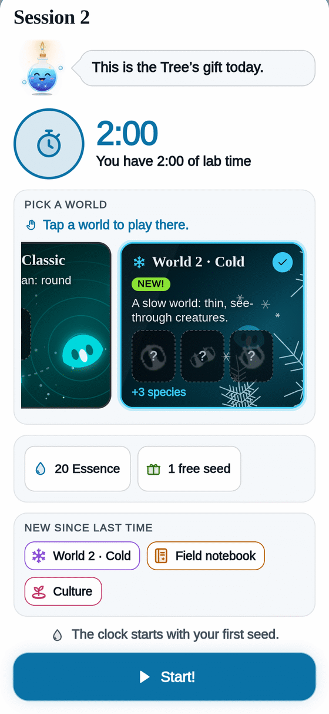
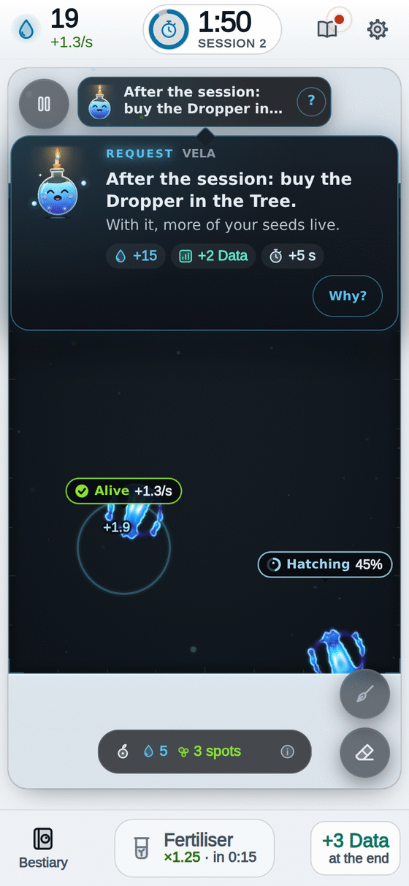
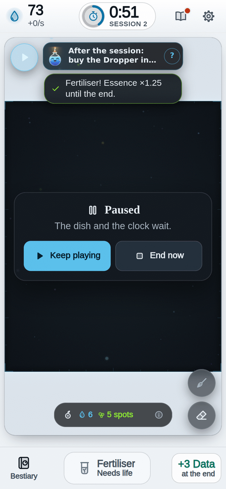

[[Español|Cómo-jugar]] · **English**

# How to play

It is very easy! You only need **one finger**.

Bioluma is played in short lab **sessions**, with a **clock**. In each session you sow life and collect **Essence**. At the end, your Essence becomes **Data**, and Data grows the **Tree**. The next session earns more. And the one after that, even more!

---

## Step 0 · Open the game

<table>
<tr>
<td valign="top">

You will see Bioluma glow. **Tap the screen** to come in.

**VELA**, the lab assistant, says hello. **Tap her bubble** to read on.

Already know how to play? Tap **"Skip tutorial"**. You can replay it any time from **Settings**.

</td>
<td width="254" align="center" valign="top">

</td>
</tr>
</table>

---

## Step 1 · Tap the dish 🌱 and the clock starts

<table>
<tr>
<td valign="top">

The **dish** is the dark box in the middle.

**Tap it.** You just dropped a **seed of light**!

Your first seed is **free** and always lives.

At the top, in the middle, is the session **clock**: **2:00**. It waits until your first seed. Then it starts running.

</td>
<td width="254" align="center" valign="top">

</td>
</tr>
</table>

---

## Step 2 · Watch it hatch

<table>
<tr>
<td valign="top">

The first time, the game **pauses** and VELA explains it with a card. Tap **"Got it!"** to go on.

Above each seed you will see **"Hatching 62%"**. If it keeps its shape, it is a **creature**! It will say **"Alive"**.

Some seeds fade away. **That is normal.** Try another spot.

If you tap too close to another creature, you will see **"Too close: they would melt"**. Sow apart!

</td>
<td width="254" align="center" valign="top">

</td>
</tr>
</table>

---

## Step 3 · Collect Essence 💧

Every living creature gives you **Essence** every second. Top left shows how much you have.

**"+1/s"** means **1 Essence every second**.

Essence buys more seeds. The price is on the pill under the dish: **each seed you buy today costs a tiny bit more**. Next session it goes back to the usual price.

The dish holds **5 creatures** at first. When it is full you will see **"Dish full!"**. The **Bigger dish** upgrade in the Tree gives more room.

---

## Step 4 · The clock ⏱

<table>
<tr>
<td valign="top">

The clock is your **lab time**.

- Each **new species** adds **+5 seconds**.
- With one minute left you will see **"Last minute!"**.
- At **0:00** the dish stops: **"TIME!"**.

**You lose nothing.** Your Essence is counted and becomes Data.

</td>
<td width="254" align="center" valign="top">

</td>
</tr>
</table>

---

## Step 5 · Your Essence becomes Data 📊

<table>
<tr>
<td valign="top">

At the end of each session a card does the maths step by step:

- **For every 250 Essence, 1 Data.**
- **+5 Data** for each new species.
- **+3 Data** for each new way of moving.
- **+2 Data** for each request done (in session 1 they are called **first goals**: sowing and your first creature).
- And more for **records**.

**Data is never lost.** Your new species are **kept in the Bestiary**.

Then tap **"Go to the Tree"**.

</td>
<td width="254" align="center" valign="top">

</td>
</tr>
</table>

---

## Step 6 · Grow the Tree 🌳

<table>
<tr>
<td valign="top">

The **Tree** is where you spend your Data.

Upgrades that **glow green** can be bought. **Tap one.**

You will see **"NOW → WITH ONE MORE LEVEL"**: grey is what you have, green is what you will get. Tap **"Buy"**.

Every upgrade is **yours forever**. You will notice it next session.

All about upgrades: [[Tree|Tree-en]].

</td>
<td width="254" align="center" valign="top">

</td>
</tr>
</table>

---

## Step 7 · A new session

<table>
<tr>
<td valign="top">

Tap **"New session"**. A card tells you:

- how much time you have today,
- what the **Tree gives you** (starting Essence, free seeds, creatures from the Fridge),
- what is **new** since last time,
- and your **request**.

Once you have another **World**, pick its card: other rules, other creatures. See [[Worlds|Worlds-en]].

Tap **"Start!"**. Remember: **the clock starts with your first seed**.

</td>
<td width="254" align="center" valign="top">

</td>
</tr>
</table>

---

## Step 8 · Fertiliser, requests and the Spark

<table>
<tr>
<td valign="top">

**Fertiliser 🌿** (the middle button, at the bottom, from the first session). Once your creatures make Essence and the clock has run half a minute, it lights up green: **everything gives Essence ×1.25 until the session ends**. It costs 20 seconds of your Essence. The next one in the same session costs double. With nothing alive it says **"Needs life"**.

**Requests** (from session 2). VELA asks for favours in the bar at the top of the dish: "Have 3 living creatures at once". Doing one gives Essence, **+2 Data** and **+5 seconds** of clock. A favour for the Tree starts with **"After the session:"**: the Tree opens when the clock ends.

**The Spark ✨** (from session 2). Now and then a golden spark crosses the dish. **Tap it quickly!** It gives you **30 seconds of your Essence**, and your next seed will surely live.

</td>
<td width="254" align="center" valign="top">

</td>
</tr>
</table>

---

## Step 9 · The Bestiary 📖

<table>
<tr>
<td valign="top">

The **Bestiary** button is at the bottom left. Every species you discover is **kept there forever**.

Tap one to see its card: its portrait, its name, **how it moves**, **where it lives** and **how much Essence it gives**.

More in [[Species|Species-en]].

</td>
<td width="254" align="center" valign="top">

</td>
</tr>
</table>

---

## Step 10 · The night moves on 🌙

After some sessions and some species, **the centre of the Tree glows gold**: the night can move on!

Tap it. **Nothing is erased.** New upgrades open and every night gives **more Data**. All in [[Night|Night-en]].

---

## Pause ⏸

<table>
<tr>
<td valign="top">

The **pause** button (top left of the dish) stops the dish **and the clock**.

Tap **"Keep playing"** to go back. If you want to finish now, **"End now"** tells you how much Data you take before you confirm.

</td>
<td width="254" align="center" valign="top">

</td>
</tr>
</table>

---

## Tips 💡

- **Sow apart.** Two seeds that touch melt together and lose their shape.
- **Did they all fade?** You will see **"Tap here again!"**. Sow again: it is cheap.
- **Buy what glows green first.** The **Dropper** makes more seeds live; **More time** makes every session longer.
- **New worlds bring new species**: each new species gives Data and clock seconds.
- **Nothing is lost**: not your Data, not the Tree, not the Bestiary.

More questions: [[FAQ|FAQ-en]].
