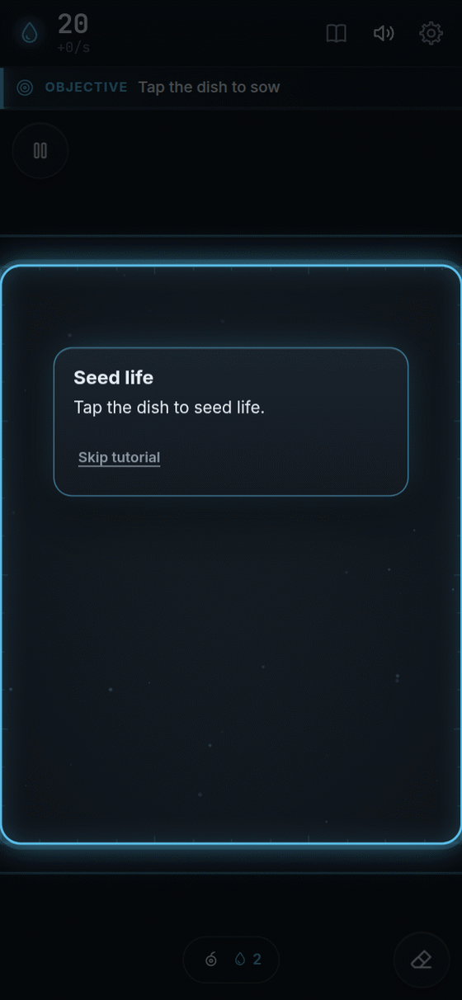
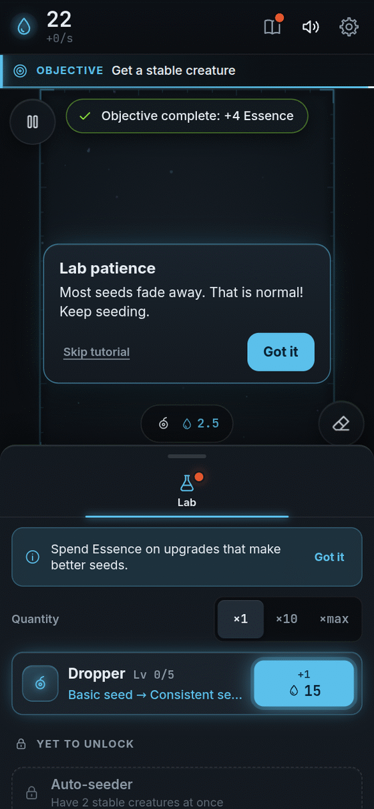
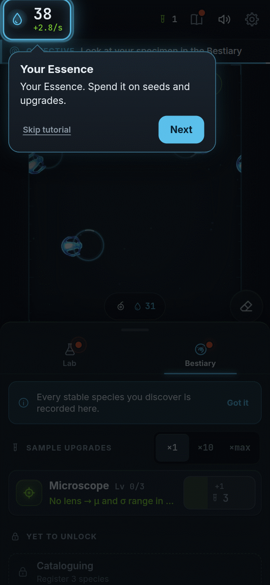
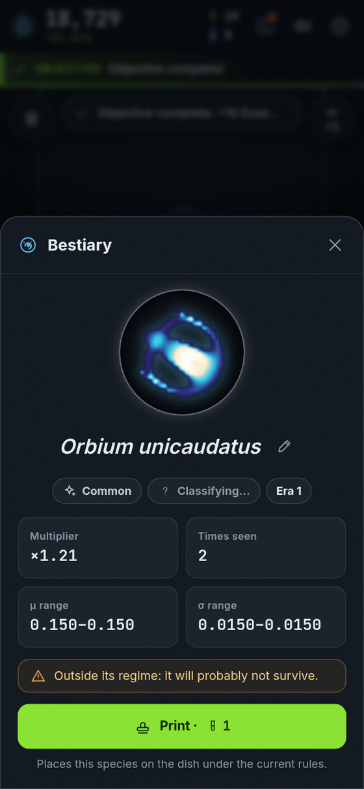
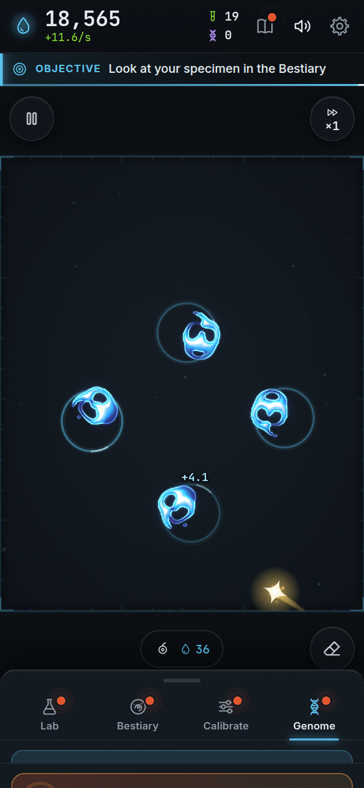
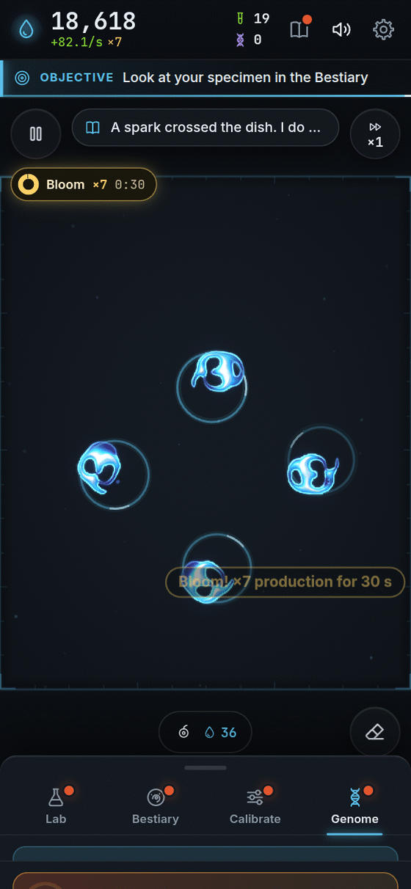
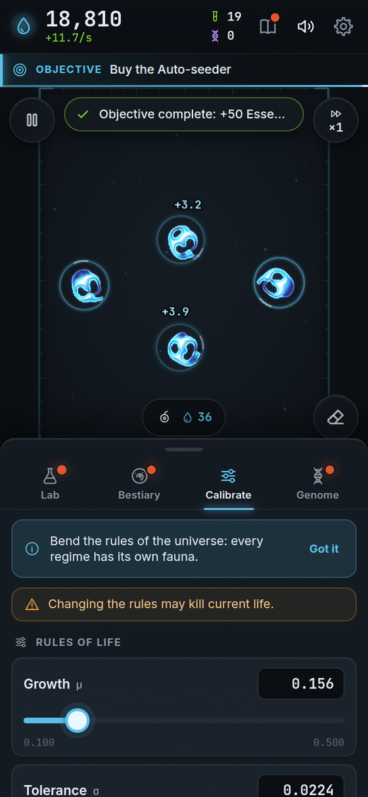
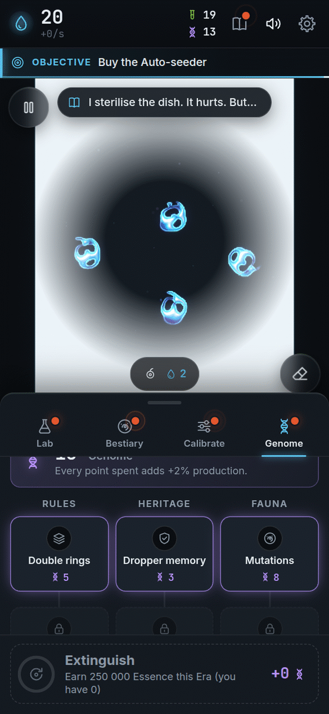
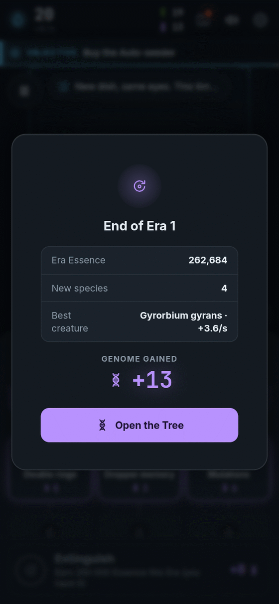
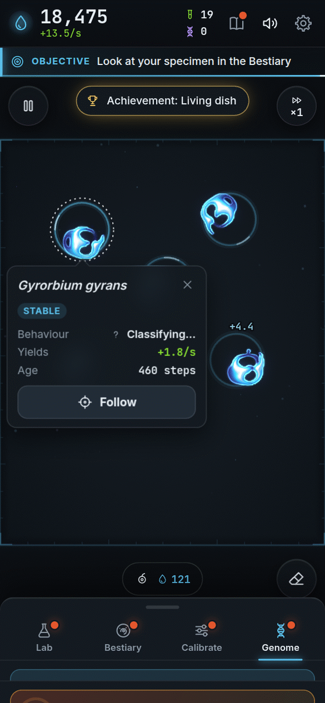

[[Español|Cómo-jugar]] · **English**

# How to play

It is very easy! You only need **one finger**. Here is the whole game, step by step.

---

## Step 0 · Open the game

<table>
<tr>
<td valign="top">

You will see Bioluma glow.

**Tap the screen** to begin.

A short tutorial shows you the first steps. If you already know how to play, you can skip it. You can replay it later from **Settings**.

</td>
<td width="254" align="center" valign="top">

</td>
</tr>
</table>

---

## Step 1 · Tap the dish 🌱

<table>
<tr>
<td valign="top">

The **dish** is the dark square in the middle. It is like a little lab droplet.

**Tap it.** You just seeded it!

Seeding costs a little **Essence**. That is Bioluma's money. You start with 20, so you can seed many times.

</td>
<td width="254" align="center" valign="top">

</td>
</tr>
</table>

---

## Step 2 · Watch what happens

<table>
<tr>
<td valign="top">

The light moves. Some seeds **melt away**. Others **swell** too much.

That is normal! It is real science. **Keep tapping.**

If you see a **ring of dots**, it means *"I am being born"*. Wait a moment.

</td>
<td width="254" align="center" valign="top">

</td>
</tr>
</table>

<table>
<tr>
<td valign="top">

**Tutorial tip:** almost everything dissolves or blows up. When something stays, the fun begins!

</td>
<td width="254" align="center" valign="top">

</td>
</tr>
</table>

---

## Step 3 · Life!

<table>
<tr>
<td valign="top">

When a creature **stays healthy**, it glows with a ring. It is alive!

Now it gives you **Essence non-stop**.

**Tap it** to see its card: its name, what it does and how much Essence it gives you. Some swim, some spin, some pulse.

</td>
<td width="254" align="center" valign="top">

</td>
</tr>
</table>

---

## Step 4 · Collect Essence

<table>
<tr>
<td valign="top">

Your **Essence** is at the top left. Under it you see how much you earn **every second**.

More healthy creatures, more Essence.

Essence is for two things: **seeding** and **buying upgrades**.

Out of Essence and nothing alive? Do not worry: the **emergency pipette** gives you a free seed now and then. You never get stuck.

</td>
<td width="254" align="center" valign="top">

</td>
</tr>
</table>

---

## Step 5 · Buy upgrades

<table>
<tr>
<td valign="top">

Open the **Lab** (the flask, at the bottom).

Each card is an upgrade. Tap the blue button to buy it.

- The **Dropper** makes seeds that work more often.
- The **Auto-seeder** seeds by itself.
- The **Dish** gives you more room.

New upgrades appear when you do new things. See the full list in [[Upgrades|Upgrades-en]].

</td>
<td width="254" align="center" valign="top">

</td>
</tr>
</table>

---

## Step 6 · Discover species

<table>
<tr>
<td valign="top">

Every **different** creature goes into the **Bestiary**, with its portrait and its scientific name.

Every new species gives you:

- **Samples** (a special coin);
- a **multiplier** that gives you more Essence **forever**.

Collect them all! Learn more in [[Species|Species-en]].

</td>
<td width="254" align="center" valign="top">

</td>
</tr>
</table>

<table>
<tr>
<td valign="top">

Tap a portrait to see the **species card**: its Latin name, what it does, how rare it is and how much it is worth.

</td>
<td width="254" align="center" valign="top">

</td>
</tr>
</table>

---

## Step 7 · Catch the golden spark! ✨

<table>
<tr>
<td valign="top">

Now and then a **golden spark** drifts across the dish. It is called the **Spark**.

**Tap it before it goes!** It gives you a surprise prize:

- **Bloom:** you earn **×7** Essence for 30 seconds.
- **Essence lump:** a pile of Essence at once.
- **Spore rain:** 5 free seeds.
- **Mutagen:** your next 3 seeds are sure to take.

If it gets away, no problem. Another one will come.

</td>
<td width="254" align="center" valign="top">

</td>
</tr>
</table>

<table>
<tr>
<td valign="top">

Prize! Here the Spark just handed something over.

</td>
<td width="254" align="center" valign="top">

</td>
</tr>
</table>

---

## Step 8 · Change the rules of the universe

<table>
<tr>
<td valign="top">

When you discover your first species, you can buy the **Calibrator** in the Lab. That opens the **Calibrate** tab, with sliders. They are called **μ** (mu) and **σ** (sigma).

Move them and you **change the rules**. Each rule has its own creatures. You can find critters you have never seen!

⚠️ Careful: changing the rules can melt the life you have. It is part of the adventure.

</td>
<td width="254" align="center" valign="top">

</td>
</tr>
</table>

---

## Step 9 · Start over, but stronger 🧬

<table>
<tr>
<td valign="top">

When you have earned a lot of Essence, the **Genome** tab appears and the **Extinguish** button turns on.

**Hold it for 1.5 seconds.** The dish turns white and empties.

But you **keep what matters**! You keep all your discoveries. And you earn **Genome**, which buys new rules.

So each time you go farther and faster. We explain it in [[Prestige and Genome|Prestige-and-Genome-en]].

</td>
<td width="254" align="center" valign="top">

</td>
</tr>
</table>

<table>
  <tr>
    <td align="center"> The dish empties…</td>
    <td align="center"> …and you earn Genome.</td>
  </tr>
</table>

---

## Tips

- **If nothing shows up, keep tapping.** Failing is part of the game.
- **The dish is like a donut.** What leaves one side comes back on the other.
- **Tap a creature** to see its card. The **Follow** button makes the camera go with it.

<table>
<tr>
<td valign="top">

- **Press and hold** on the dish (from Dropper II): big seed.
- **Drag** (from Dropper III): a matter brush!
- **Pinch with two fingers** to zoom in and out.
- Dish buttons: **Pause**, **Erase** (removes matter) and **Speed** (faster, once you buy the Incubator).
- The first time you open a tab, a little sentence at the top says what it is for. Tap **Got it** and it goes away.
- The **book** at the top is the **Journal**: it keeps the scientist's notes and your **achievements**. See [[Achievements|Achievements-en]].

</td>
<td width="254" align="center" valign="top">

</td>
</tr>
</table>

### On a computer

| Do | To |
|---|---|
| Click | Seed |
| Right-click | Erase |
| Mouse wheel | Zoom in or out |
| Keys **1 2 3 4** | Switch tab |
| **Space** | Pause |
| **E** · **J** · **M** | Erase · Journal · Mute |
| **+** · **-** · **0** | Zoom in · out · reset |

## While you are away

If you close the game, the dish **keeps working for a while**. When you come back, a gift of Essence is waiting. It does not discover species or buy things for you: only you do that. More in the [[FAQ|FAQ-en]].

## Want more?

[[Upgrades|Upgrades-en]] · [[Species|Species-en]] · [[Prestige and Genome|Prestige-and-Genome-en]] · [[Achievements|Achievements-en]] · [[Secrets|Secrets-en]]

## [▶ Play now!]({{GAME_URL}})
