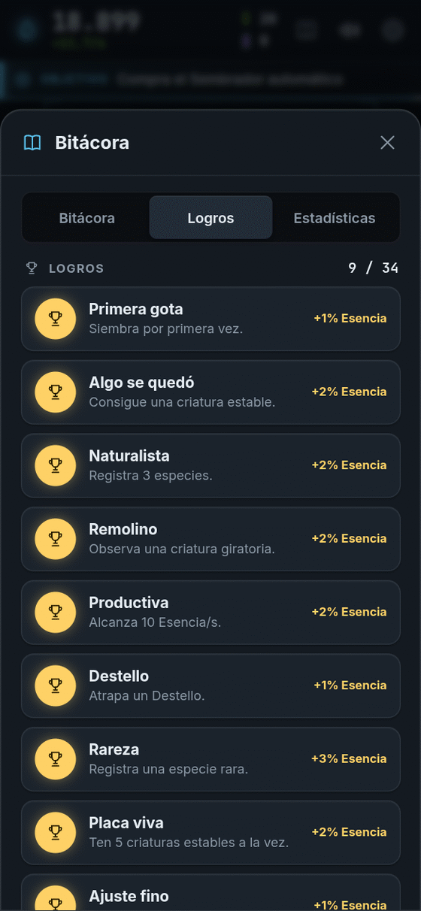
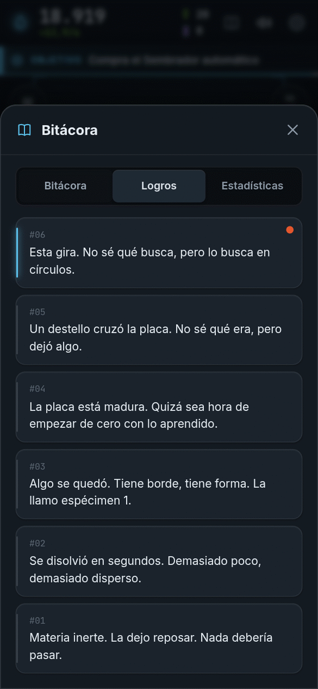

**Español** · [[English|Achievements-en]]

# Logros: medallas para coleccionar

Los **logros** son medallas. Cada vez que consigues uno suena una campanita y te regalan un **bono pequeño y permanente** de Esencia.

<table>
<tr>
<td valign="top">

- Se ven en la **Bitácora** (el libro de arriba), en la pestaña **Logros**.
- Tus logros **se quedan para siempre**, aunque hagas una Extinción.
- Ningún logro es obligatorio: son un regalo por jugar y explorar.
- Si consigues **los 34**, tu Esencia crece **+91 %**.

*(Además hay cosas escondidas que no están en esta lista. Mira [[Secretos]].)*

</td>
<td width="500" align="center" valign="top">

 

</td>
</tr>
</table>

## Primeros pasos

| Logro | Cómo se consigue | Bono |
|---|---|---|
| **Primera gota** | Siembra por primera vez. | +1 % |
| **Algo se quedó** | Consigue una criatura estable. | +2 % |
| **Mano firme** | Siembra 100 veces. | +2 % |
| **Lluvia constante** | Siembra 1 000 veces. | +3 % |

## Colección de especies

| Logro | Cómo se consigue | Bono |
|---|---|---|
| **Naturalista** | Registra 3 especies. | +2 % |
| **Taxónoma** | Registra 10 especies. | +3 % |
| **Fauna propia** | Registra 20 especies. | +5 % |
| **Rareza** | Registra una especie rara. | +3 % |
| **Joya** | Registra una especie muy rara. | +5 % |

## Comportamientos

| Logro | Cómo se consigue | Bono |
|---|---|---|
| **Nadadora** | Observa una criatura nadadora. | +2 % |
| **Remolino** | Observa una criatura giratoria. | +2 % |
| **Latido** | Observa una criatura pulsante. | +2 % |
| **Mitosis** | Observa una criatura divisora. | +3 % |
| **Colonia** | Forma una colonia. | +3 % |
| **Etóloga** | Observa los 6 comportamientos. | +5 % |

## Producción

| Logro | Cómo se consigue | Bono |
|---|---|---|
| **Productiva** | Llega a 10 Esencia por segundo. | +2 % |
| **Floreciente** | Llega a 100 Esencia por segundo. | +3 % |
| **Ecosistema** | Llega a 1 000 Esencia por segundo. | +5 % |
| **Diez mil** | Gana 10 000 Esencia en total. | +2 % |
| **Millonaria** | Gana 1 000 000 de Esencia en total. | +3 % |

## Destellos dorados

| Logro | Cómo se consigue | Bono |
|---|---|---|
| **Destello** | Atrapa un Destello. | +1 % |
| **Cazadora de luz** | Atrapa 10 Destellos. | +3 % |
| **Polilla** | Atrapa 50 Destellos. | +5 % |

## Placa llena de vida

| Logro | Cómo se consigue | Bono |
|---|---|---|
| **Placa viva** | Ten 5 criaturas estables a la vez. | +2 % |
| **Bullicio** | Ten 10 criaturas estables a la vez. | +3 % |

## Maña de científico

| Logro | Cómo se consigue | Bono |
|---|---|---|
| **Impresora** | Imprime una especie. | +1 % |
| **Ajuste fino** | Cambia la calibración. | +1 % |
| **Archivista** | Guarda un régimen (un ajuste con nombre). | +1 % |
| **Variación** | Registra una variante mutada. | +3 % |
| **Simbiosis** | Forma una pareja simbiótica. | +3 % |

## Una vida larga

| Logro | Cómo se consigue | Bono |
|---|---|---|
| **Tabula rasa** | Provoca una Extinción. | +5 % |
| **Herencia** | Compra un nodo del Genoma. | +2 % |
| **De vuelta** | Vuelve después de una ausencia. | +1 % |
| **Paciencia** | Juega una hora. | +2 % |

**[▶ ¡A coleccionar medallas!]({{GAME_URL}})**
