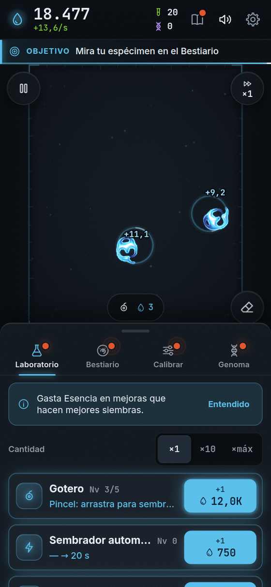

**Español** · [[English|Upgrades-en]]

# Mejoras

Las mejoras son **superpoderes** que compras con **Esencia**, en la pestaña **Laboratorio** (el frasco).
Hay unas pocas que se compran con **Muestras**, en el **Bestiario**.

<table>
<tr>
<td valign="top">

**Cómo comprar**

1. Abre el **Laboratorio**.
2. Elige cuántas quieres: **×1**, **×10** o **×máx** (todas las que puedas pagar).
3. Toca el **botón azul** de la mejora.

Las mejoras que todavía no puedes comprar están **en gris** y te dicen qué hacer para abrirlas.

</td>
<td width="254" align="center" valign="top">

</td>
</tr>
</table>

Cada nivel cuesta un poco más que el anterior. Los números exactos pueden cambiar cuando se afina el juego, por eso aquí te contamos **qué hace** cada una.

## Laboratorio (se compran con Esencia)

| Mejora | Niveles | Qué hace, con palabras fáciles | Aparece cuando… |
|---|---|---|---|
| **Gotero** | 5 | Hace tus siembras mejores. **1:** salen bien más seguido. **2:** mantén el dedo apretado para una siembra grande. **3:** arrastra el dedo y pinta con materia. **4:** semilla en forma de anillo. **5:** semilla de ruido y elegir la forma. | Desde el inicio |
| **Sembrador automático** | sin tope | Siembra solo, en un lugar libre, aunque no toques. Cada nivel va más rápido. | Tienes 2 criaturas sanas a la vez |
| **Cultivo** | sin tope | Un caldo más rico: **todo lo que vive da más Esencia** (+10 % por nivel). | Llegas a 10 Esencia por segundo |
| **Calibrador** | 4 | Abre los deslizadores para **cambiar las reglas**. **1:** movimientos pequeños de μ y σ. **2:** más rango y puedes **guardar ajustes** con nombre. **3:** μ y σ completos y el deslizador dt. **4:** el deslizador R, que cambia el tamaño de las criaturas. | Registras tu primera especie |
| **Estabilizador** | 10 | Ajusta las semillas hacia lo que **mejor vive** con las reglas de ahora. | Compras el Calibrador I |
| **Placa** | 4 | **Más espacio:** caben más criaturas antes de que sembrar se ponga caro. Además da un poquito más de Esencia. | Tienes 4 criaturas sanas a la vez |
| **Incubadora** | 2 | **Acelera el tiempo.** Primero ×2 y luego ×4. Las criaturas maduran y se descubren antes. | Compras la Placa I |
| **Afinidad nadadora** | 10 | Más Esencia de las criaturas que **nadan** y las que **giran**. | Ves una nadadora |
| **Afinidad sésil** | 10 | Más Esencia de las que **se quedan quietas** y las que **laten**. | Ves una criatura quieta |
| **Afinidad colonial** | 10 | Más Esencia de las que **se dividen** y las **colonias**. | Ves una división |
| **Reserva** | 3 | La placa trabaja **más horas mientras no estás**: de 2 horas a 8, 12 y 24. | Vuelves después de cerrar el juego |
| **Pipeta rápida** | 3 | La **siembra gratis de emergencia** se recarga más rápido. | Usas la pipeta de emergencia |
| **Nutriente** | 5 | Las criaturas sanas cuentan como un poco más complejas, y dan un poco más. | Tienes el Cultivo en nivel 10 |

## Bestiario (se compran con Muestras)

| Mejora | Niveles | Qué hace | Aparece cuando… |
|---|---|---|---|
| **Microscopio** | 3 | Mira mejor. **1:** la ficha muestra en qué reglas vive la especie. **2:** muestra velocidad, periodo y firma. **3:** en **Calibrar** te marca pistas de dónde hay especies por descubrir. | Registras 1 especie |
| **Catalogación** | 5 | **Todas** tus especies valen más (+10 % por nivel). | Registras 3 especies |
| **Archivo** | 3 | Te regala una **Impresión** gratis cada cierto tiempo (10, 5 o 2 minutos). | Registras 5 especies |
| **Marcador** | 1 | Cada criatura muestra un **puntito de color** según lo que hace. | Ves 2 comportamientos distintos |

### ¿Qué es una Impresión?

Es como una **fotocopiadora de criaturas**. En el Bestiario tocas una especie que ya registraste y eliges **Imprimir**. El siguiente toque en la placa pone esa criatura ahí. Cuesta **Muestras**. Si las reglas de ahora no le gustan, ¡quizá no sobreviva!

## ¿De dónde sale la Esencia?

- Cada criatura **sana** da Esencia.
- Si **nada** o **gira**, da más. Si se **divide**, todavía más.
- Si es de una especie que **ya registraste**, da más.
- Si pones muchas criaturas **iguales**, cada una nueva vale un poquito menos. ¡Mezcla especies!
- Una placa llena de manchas sin forma no da **nada**. Lo que cuenta es la **forma**.

Para ver qué comportamiento da más, mira [[Especies]]. Para empezar de nuevo con mejoras nuevas, mira [[Prestigio y Genoma]].

**[▶ ¡A jugar!]({{GAME_URL}})**
