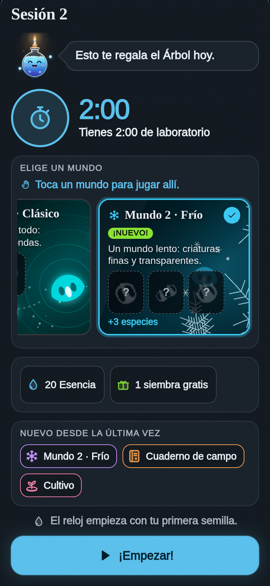

**Español** · [[English|Worlds-en]]

# Mundos 🌍

Cada **mundo** es una placa con **otras reglas**. Y con otras reglas nacen **otras criaturas**.

Empiezas en el **Mundo 1 · Clásico**. Los demás se abren en el camino **Mundos** del [[Árbol]], uno detrás de otro.

## Cómo se elige

Al empezar una sesión, la tarjeta de inicio muestra **tus mundos** como tarjetas, con sus especies:

- un **retrato** para las que ya encontraste,
- una **silueta «?»** para las que faltan.

**Toca un mundo** para jugar allí. El mundo que acabas de abrir viene **ya elegido** y dice **«¡Nuevo!»**.

## Los siete mundos

| Mundo | Cómo es | Se abre |
|---|---|---|
| **1 · Clásico** | Donde empezó todo: nadadoras redondas. | Desde el principio |
| **2 · Frío** | Un mundo lento: criaturas finas y transparentes. | Noche 1 |
| **3 · Remolinos** | Nace una criatura que gira como un remolino. | Noche 1 |
| **4 · Escudos** | Criaturas fuertes con forma de escudo. | Noche 2 |
| **5 · Discos** | Discos, anillos y triángulos que brillan. | Noche 2 |
| **6 · Patas** | Criaturas con patitas que caminan por la placa. | Noche 3 |
| **7 · Gigantes** | Criaturas enormes: caben menos, pero cada una vale el doble. | Noche 4 |

## Consejos

- **Un mundo nuevo = especies nuevas.** Cada especie nueva da **+5 Datos** y **+5 segundos** de reloj.
- Los mundos van **en orden**: cada uno nuevo da un poco más de Esencia que el anterior.
- ¿Quieres ver una criatura que **gira**? Búscala en **Remolinos** o en **Patas**. Las **quietas** viven en **Discos**.
- Tu **Bestiario** dice en qué mundo vive cada especie.

Más: [[Árbol]] · [[Especies]] · [[Cómo jugar]]
