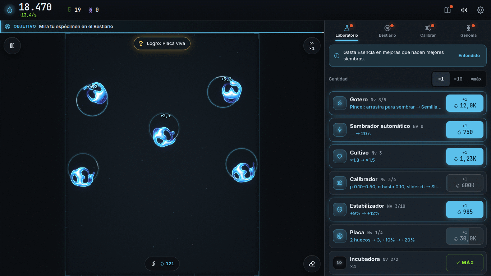
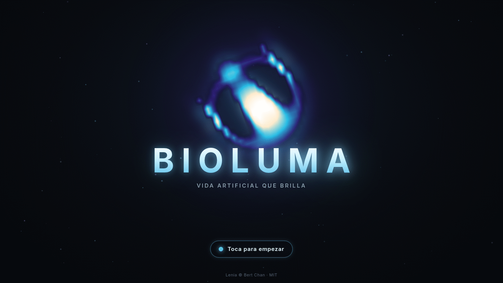
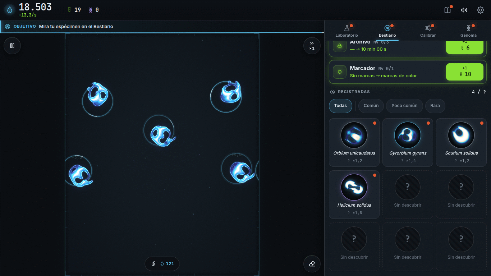
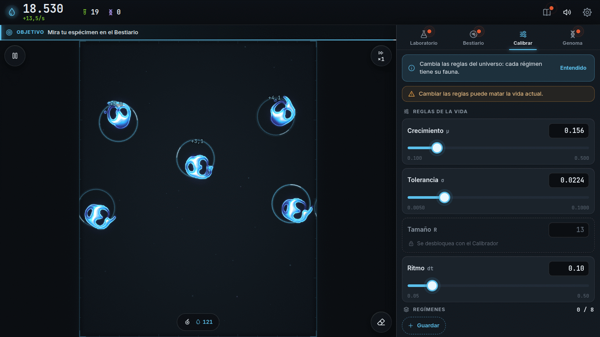
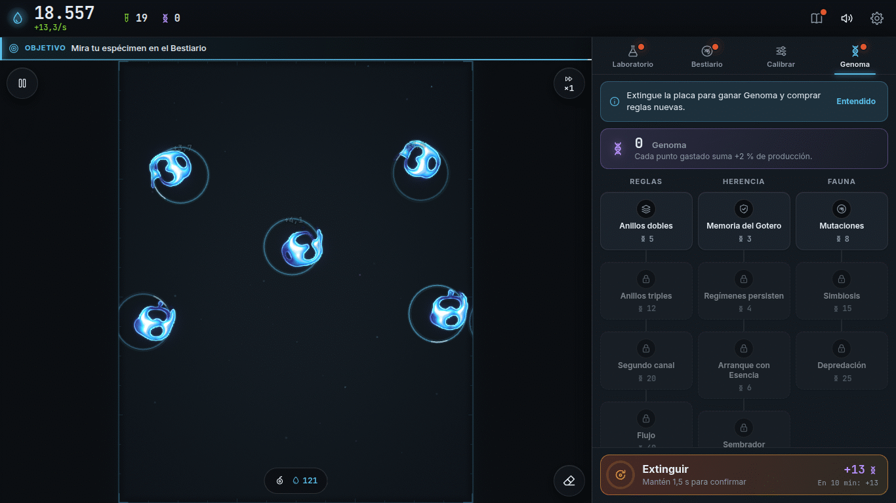
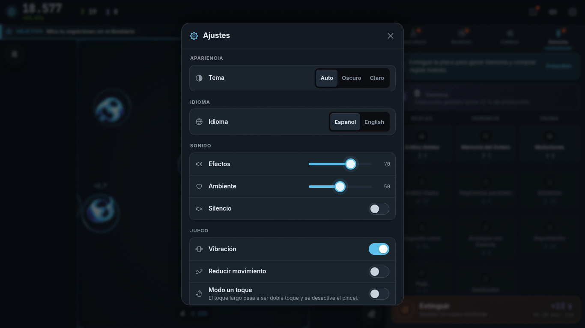

[[Español|Plataformas]] · **English**

# Platforms: where to play

**Bioluma is played in the browser.** Nothing to download, nothing to pay. And if you want, you can **install** it like an app.

## Where can I play?

| Device | Status | How |
|---|---|---|
| **Android phone or tablet** | Ready | Open the game in Chrome. It can be installed. |
| **iPhone and iPad** | Ready | Open the game in Safari. It can be added to the home screen. |
| **Computer** (Windows, Mac, Linux) | Ready | A recent Chrome, Edge, Firefox or Safari. |
| **Google Play** (Android) | Coming soon | In the works. |
| **Microsoft Store** (Windows) | Coming soon | In the works. |
| **Steam** (PC) | Coming soon | In the works. |
| **App Store** (iPhone) | Coming soon | In the works. |
| **itch.io** and **galaxy.click** | Coming soon | For browser games. |

 <i>Bioluma in a computer's browser.</i>

<table>
  <tr>
    <td align="center" width="50%"> The title screen</td>
    <td align="center" width="50%"> The Bestiary</td>
  </tr>
  <tr>
    <td align="center"> Calibrate</td>
    <td align="center"> Genome</td>
  </tr>
  <tr>
    <td align="center" colspan="2"> Settings</td>
  </tr>
</table>

> All you need is a modern browser with **WebGL2** (almost all of them from the last few years). See the [[FAQ|FAQ-en]] if something does not work.

## How to install it (PWA)

A **PWA** is a web page that installs like an app: it has its own icon, opens full screen and works better offline.

### On Android (Chrome)

1. Open the game in **Chrome**.
2. Tap the **⋮** menu (top right).
3. Choose **Install app** (or **Add to Home screen**).
4. Confirm. The Bioluma icon appears!

### On iPhone or iPad (Safari)

1. Open the game in **Safari** (not another browser).
2. Tap the **Share** button (the square with an arrow pointing up).
3. Scroll down and choose **Add to Home Screen**.
4. Tap **Add**.

### On a computer (Chrome or Edge)

1. Open the game.
2. Look for the **install** icon at the end of the address bar (a little screen with an arrow).
3. Click **Install**.

In **Safari on Mac** (version 17 or newer): menu **File → Add to Dock**. **Desktop Firefox** cannot install it, but you can play just the same.

> **Mind your save.** The installed app and the browser may keep the game **separately** (on iPhone almost always). To move it from one to the other use **Settings → Save data → Export** and then **Import**.

## Stores: coming soon

We are preparing store versions. When they are ready they will show up here with their link. All will be **free and ad-free**, just like the web version, and will play the same way.

Are you a developer? The technical details for every platform are in [`docs/PLATAFORMAS.md`](https://github.com/ronalc90/Lenia/blob/main/docs/PLATAFORMAS.md) in the repository (Spanish) and in [[Development|Development-en]].

**[▶ Play now!]({{GAME_URL}})**
