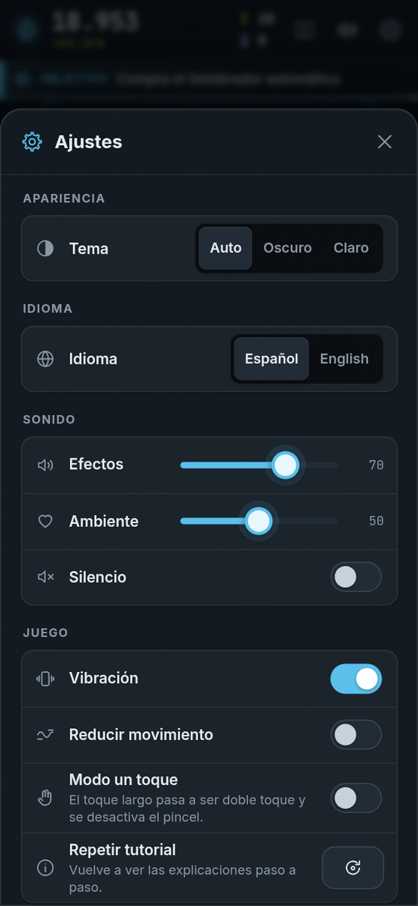
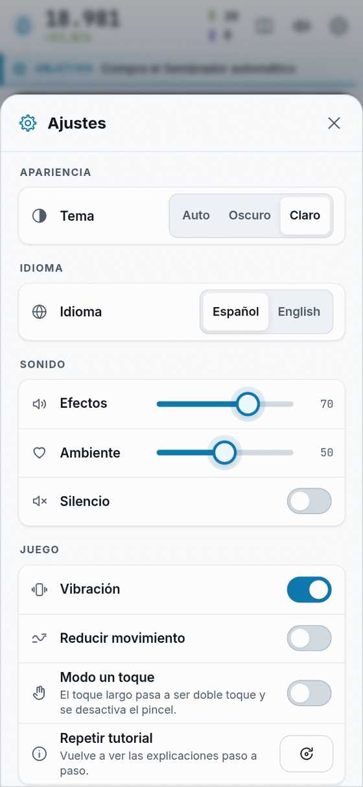
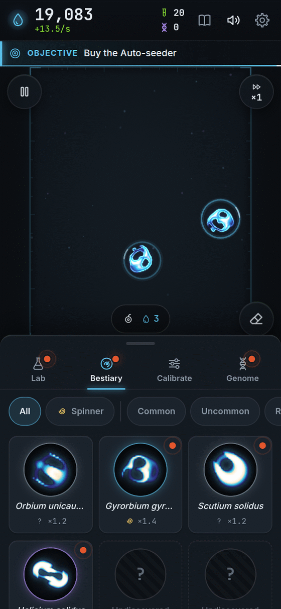
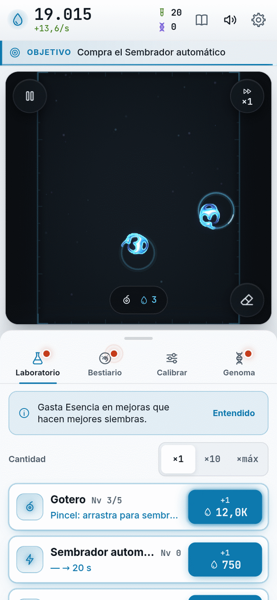
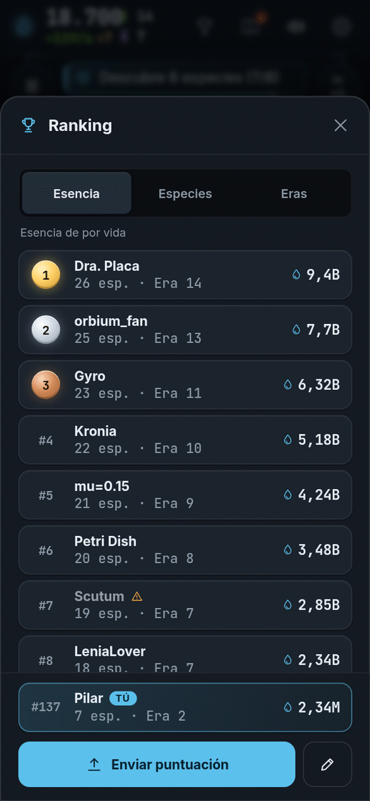

**Español** · [[English|FAQ-en]]

# Preguntas frecuentes

Respuestas cortitas a las dudas más comunes.

## Lo básico

### ¿Cuesta dinero?
**No.** Bioluma es gratis.

### ¿Tiene anuncios?
**No.** Nunca. No hay anuncios en el juego.

### ¿Se puede pagar para ganar?
**No.** Nada que cueste dinero te da más Esencia, más velocidad o ventaja en el ranking. Si algún día hay adornos opcionales (colores, sonidos…), solo cambian cómo **se ve** o **suena** el juego, nunca cómo se **gana**.

### ¿Necesito una cuenta?
**No.** Abres y juegas.

### ¿Para qué edad es?
Para todos. Se juega con un dedo y los textos son cortos. Los más chiquitos pueden jugar con un adulto al lado para leer.

## Guardado

### ¿Se guarda mi partida?
**Sí, sola.** Cada 30 segundos y cuando pasa algo importante. Se guarda **en tu navegador**, en tu aparato. Si algo falla, el juego te avisa.

### ¿Puedo jugar en otro aparato con mi partida?
Sí. Entra a **Ajustes → Partida → Exportar**, copia el código largo (empieza con `BIOLUMA1.`) y pégalo en **Importar** en el otro aparato.

### ¿Qué pasa si borro los datos del navegador?
Si borras los datos del sitio o juegas en una **ventana privada**, la partida **se pierde**. Por eso conviene **exportar** una copia de vez en cuando.

### ¿Cómo empiezo de cero?
**Ajustes → Partida → Borrar partida.** Te pide tocar dos veces para no borrar por accidente.

## Tiempo sin jugar (offline)

### ¿Sigue ganando Esencia cuando no juego?
**Un ratito.** Al volver recibes una parte de lo que habrías ganado: la mitad de tu producción reciente, hasta un máximo de **2 horas**. La mejora **Reserva** sube el máximo hasta **24 horas**.

### ¿Descubre especies o compra mejoras sola?
**No.** Eso solo lo haces tú. Tampoco aparecen Destellos dorados mientras no estás.

### ¿Se puede jugar sin internet?
Sí, una vez que el juego cargó. Si lo **instalas** (mira [[Plataformas]]), funciona aún mejor sin conexión. Las letras bonitas se cambian por las del sistema, pero todo lo demás funciona igual.

## Ajustes

<table>
  <tr>
    <td align="center"> Tema oscuro</td>
    <td align="center"> Tema claro</td>
  </tr>
</table>

### ¿Cómo cambio el idioma?
**Ajustes → Idioma → Español / English.** Al abrir por primera vez, el juego usa el idioma de tu navegador.

 <i>El mismo Bestiario, en inglés.</i>

### ¿Hay modo oscuro y modo claro?
Sí. **Ajustes → Apariencia → Tema:** *Auto*, *Oscuro* o *Claro*. La placa siempre se ve oscura, como bajo un microscopio.

 <i>Tema claro: la placa sigue oscura.</i>

### ¿Cómo apago el sonido?
Toca el **altavoz** de arriba, o la tecla **M** en el computador. En **Ajustes → Sonido** puedes bajar solo los **efectos** o solo la **música ambiente**. Todos los sonidos se inventan en el momento: no hay grabaciones.

### El juego me marea o va lento
Prueba en **Ajustes**:
- **Reducir movimiento:** apaga estelas, partículas y animaciones.
- **Gráficos → Calidad:** *Baja* hace la placa más chica y más ligera (puede aplicarse la próxima vez que abras el juego).

### Es difícil tocar y mantener apretado
Activa el **Modo un toque** en Ajustes. El toque largo pasa a ser doble toque y se apaga el pincel.

### ¿Puedo repetir el tutorial?
Sí. **Ajustes → Repetir tutorial.**

## Aparatos

### ¿En qué aparatos funciona?
En cualquier navegador moderno con **WebGL2**: Chrome, Edge, Firefox y Safari recientes, en teléfono, tablet o computador. Más detalles en [[Plataformas]].

### Dice "Este navegador no puede cultivar vida"
Tu navegador no tiene WebGL2. Actualízalo, prueba con otro, y revisa que esté activada la **aceleración por hardware**.

## Ranking y juego limpio

### ¿Hay ranking?
Sí, **opcional**. Tiene tres tablas: **Esencia de toda la vida**, **Especies** y **Eras**. Para aparecer eliges un **nombre de científico** (3 a 16 caracteres). No pide correo ni nada más. Hasta que lo eliges, **no se envía nada**.

Si no ves el botón del trofeo arriba, tu versión todavía no lo tiene activado.

 <i>Ejemplo con datos de muestra: los nombres son inventados.</i>

### ¿Cómo se evita hacer trampa?
Con varias capas: tu progreso va firmado, el servidor revisa que los números **sean posibles** (que no crezcan más rápido que el tiempo real, que cuadren con tu partida…) y el navegador avisa si detecta cosas raras, como el reloj hacia atrás o una partida editada.

Si algo no cuadra, tu nombre queda **en gris** ("En revisión") y sale del top. Los trucos descarados no pasan. Lo ideal es jugar limpio: ¡es más divertido ganar de verdad!

### ¿Puedo perder mi lugar si reinicio la partida?
No. Se guarda **lo mejor que hayas logrado**, así que empezar de nuevo no te borra.

## Privacidad

### ¿Qué datos se envían?
Ninguno por defecto. El ajuste **Analítica anónima** viene **apagado**; si lo enciendes, se envían números agregados (sin datos personales) para equilibrar el juego. Solo el ranking envía algo más, y solo si tú eliges un nombre.

## Jugando

### ¿Por qué casi todo se deshace al principio?
Porque es **ciencia de verdad**: la mayoría de las manchas de luz no encuentra su forma. Sigue sembrando. Las que sí, ¡brillan!

### Cambié μ y σ y mi criatura desapareció
Es normal. Cada regla tiene sus propias criaturas. Vuelve a sembrar, o guarda ajustes con nombre (Calibrador II) para regresar a los que te gustan.

### ¿Cómo consigo más Muestras?
**Descubriendo.** Cada especie nueva da Muestras, y también ver un comportamiento nuevo en una especie.

### ¿Perderé todo si hago una Extinción?
**No.** Te quedas con tu Bestiario, tus logros y tu Genoma. Mira [[Prestigio y Genoma]].

## ¿Algo no funciona?

Cuéntanoslo en [github.com/ronalc90/Lenia/issues](https://github.com/ronalc90/Lenia/issues). Ayuda mucho si dices qué aparato y qué navegador usas.

**[▶ ¡A jugar!]({{GAME_URL}})**
