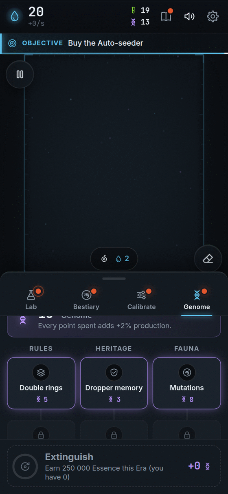

[[Español|Prestigio-y-Genoma]] · **English**

# Prestige and Genome: start over, stronger

Imagine you build a sandcastle. When it is huge, you knock it down and build it again! But this time **you know how**, so you build it better and faster.

In Bioluma that is called **Extinction**.

## When can I do it?

When, in one life of the dish, you have earned a lot of Essence (**250,000**), the **Extinguish** button lights up, in the **Genome** tab. Before that, the tab peeks out to tell you you are getting close.

The button always tells you how much **Genome** you would earn now. And how much you would earn if you wait 10 more minutes. You decide when.

## How do I do it?

<table>
<tr>
<td valign="top">

1. Open the **Genome** tab.
2. **Hold** the **Extinguish** button for **1.5 seconds**.
3. The dish turns white and empties.
4. The **Era summary** appears: how much Essence you earned, how many new species, your best creature… and the Genome you earned!
5. Tap **Open the Tree** and spend your Genome.

(Holding is so you cannot do it by accident.)

</td>
<td width="254" align="center" valign="top">

</td>
</tr>
</table>

## What stays and what goes?

| ✅ You keep… | 🔄 Starts over… |
|---|---|
| Your whole **Bestiary**: species, names and portraits | The **dish** (empty) |
| Your **Samples** and Bestiary upgrades | Your **Essence** (back to 20) |
| Your **achievements** and their bonuses | The **Lab** upgrades |
| Your **Genome** and what you bought with it | The rules (μ and σ go back to the start) |
| The **Journal** and your statistics | Your saved settings (unless you buy *Lasting regimes*) |

Each new life of the dish is called an **Era**: Era 1, Era 2, Era 3…

## Genome: what you buy

**Genome** does not give giant numbers. It **buys new rules**. There is a tree with three branches. Each node needs the previous one in its branch.

| Branch | Node | Cost | What it does |
|---|---|---|---|
| **Rules** | Double rings | 5 | Creatures can have **2 rings**. New species appear and the Calibrator gains a profile picker. |
| | Triple rings | 12 | **3 rings**. Big creatures appear. |
| | Second channel | 20 | Two substances at once. *Coming soon.* |
| | Flow | 40 | Matter is conserved and creatures compete. *Coming soon.* |
| **Heritage** | Dropper memory | 3 | Each Era starts with the Dropper almost at your best level. |
| | Lasting regimes | 4 | Your saved settings survive Extinction. |
| | Essence head start | 6 | You start every Era with a pile of Essence. |
| | Lasting auto-seeder | 10 | Each Era starts with the Auto-seeder ready. |
| **Fauna** | Mutations | 8 | Some Prints come out **mutant**: if they live, they are new species! |
| | Symbiosis | 15 | Two different species, close together, **help each other** and give more Essence. |
| | Predation | 25 | One channel eats the other. Needs *Second channel*. *Coming soon.* |

**Bonus:** every Genome point you spend gives you **+2%** Essence. So spending is always worth it.

## How do I earn more Genome?

- Earn **more Essence** in the Era.
- **Discover new species** (each one gives **2** Genome).
- **See new behaviours** for the first time (each one gives **1**).

Species and behaviours only give Genome **the first time in your whole game**. So exploring pays, but repeating the same Extinction again and again does not.

## Tips

- Do not be afraid to extinguish. **You keep your discoveries.**
- The first Eras are the longest. After that they fly!
- If you feel stuck, look at the button: it says how much you would earn **now**.

Next: [[Achievements|Achievements-en]] · [[Secrets|Secrets-en]] · [[FAQ|FAQ-en]]

**[▶ Play now!]({{GAME_URL}})**
