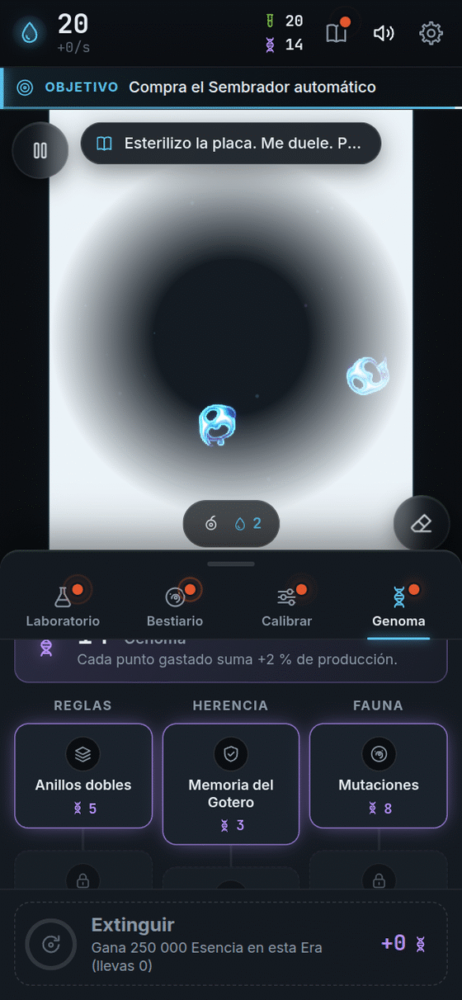
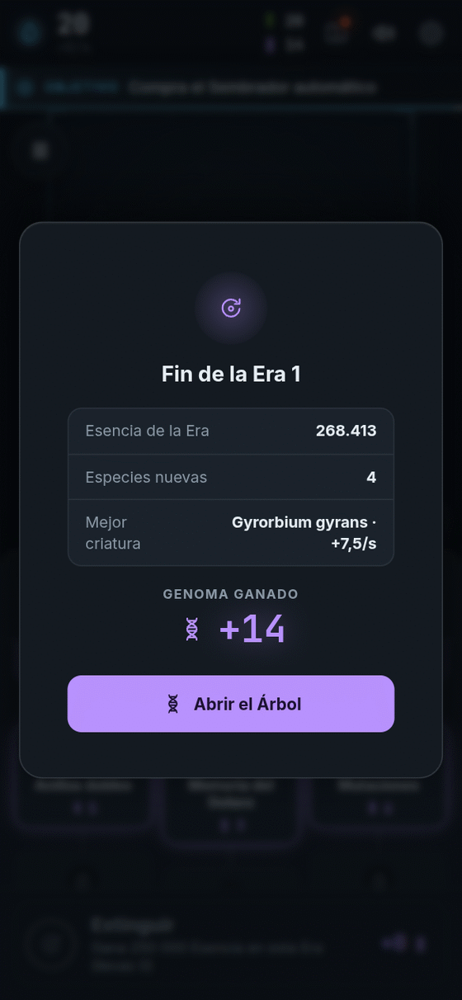
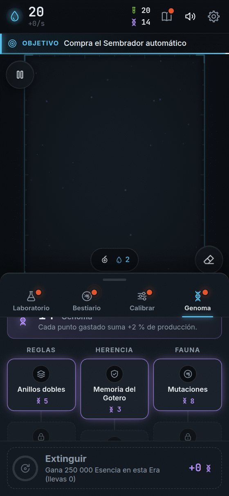

**Español** · [[English|Prestige-and-Genome-en]]

# Prestigio y Genoma: empezar de nuevo, más fuerte

Imagina que construyes un castillo de arena. Cuando está enorme, ¡lo tiras y lo vuelves a hacer! Pero esta vez **ya sabes cómo**, y lo haces mejor y más rápido.

En Bioluma eso se llama **Extinción**.

## ¿Cuándo puedo hacerlo?

Cuando en una misma vida de la placa ganaste mucha Esencia (**250 000**), el botón **Extinguir** se enciende, en la pestaña **Genoma**. Antes de eso, la pestaña se asoma para avisarte que ya falta poco.

El botón siempre te dice cuánto **Genoma** ganarías ahora. Y también cuánto ganarías si esperas 10 minutos más. Tú decides cuándo.

## ¿Cómo se hace?

<table>
<tr>
<td valign="top">

1. Abre la pestaña **Genoma**.
2. **Mantén apretado** el botón **Extinguir** durante **1,5 segundos**.
3. La placa se pone blanca y se vacía.
4. Aparece el **resumen de la Era**: cuánta Esencia ganaste, cuántas especies nuevas, cuál fue tu mejor criatura… ¡y el Genoma que ganaste!
5. Toca **Abrir el Árbol** y gasta tu Genoma.

(Mantener apretado es para que no lo hagas sin querer.)

</td>
<td width="254" align="center" valign="top">

</td>
</tr>
</table>

## ¿Qué se queda y qué se va?

| ✅ Te quedas con… | 🔄 Empieza de nuevo… |
|---|---|
| Todo tu **Bestiario**: especies, nombres y retratos | La **placa** (vacía) |
| Tus **Muestras** y las mejoras del Bestiario | Tu **Esencia** (vuelves a 20) |
| Tus **logros** y sus bonos | Las mejoras del **Laboratorio** |
| Tu **Genoma** y lo que compraste con él | Las reglas (μ y σ vuelven al inicio) |
| La **Bitácora** y tus estadísticas | Tus ajustes guardados (a menos que compres *Regímenes persisten*) |

Cada nueva vida de la placa se llama **Era**: Era 1, Era 2, Era 3…

## Genoma: lo que compras

El **Genoma** no da números gigantes. **Compra reglas nuevas**. Hay un árbol con tres ramas. Cada nodo necesita el anterior de su rama.

| Rama | Nodo | Cuesta | Qué hace |
|---|---|---|---|
| **Reglas** | Anillos dobles | 5 | Las criaturas pueden tener **2 anillos**. Aparecen especies nuevas y el Calibrador gana un selector de perfil. |
| | Anillos triples | 12 | **3 anillos**. Aparecen criaturas grandes. |
| | Segundo canal | 20 | Dos sustancias a la vez. *Próximamente.* |
| | Flujo | 40 | La materia se conserva y las criaturas compiten. *Próximamente.* |
| **Herencia** | Memoria del Gotero | 3 | Cada Era empieza con el Gotero casi al nivel más alto que tuviste. |
| | Regímenes persisten | 4 | Tus ajustes guardados sobreviven a la Extinción. |
| | Arranque con Esencia | 6 | Empiezas cada Era con un montón de Esencia. |
| | Sembrador persistente | 10 | Cada Era empieza con el Sembrador automático listo. |
| **Fauna** | Mutaciones | 8 | Algunas Impresiones salen **mutantes**: si viven, ¡son especies nuevas! |
| | Simbiosis | 15 | Dos especies distintas, juntitas, **se ayudan** y dan más Esencia. |
| | Depredación | 25 | Un canal se come al otro. Requiere *Segundo canal*. *Próximamente.* |

**Extra:** cada punto de Genoma que gastas te da **+2 %** de Esencia. Así que gastar siempre conviene.

## ¿Cómo se gana más Genoma?

- Ganando **más Esencia** en la Era.
- **Descubriendo especies nuevas** (cada una da **2** de Genoma).
- **Viendo comportamientos nuevos** por primera vez (cada uno da **1**).

Las especies y los comportamientos solo dan Genoma **la primera vez en toda tu partida**. Así que explorar paga, pero repetir la misma Extinción una y otra vez no.

## Consejos

- No tengas miedo de extinguir. **No pierdes tus descubrimientos.**
- Las primeras Eras son las más largas. Después ¡vuelan!
- Si te sientes atascado, mira el botón: dice cuánto ganarías **ahora**.

Siguiente: [[Logros]] · [[Secretos]] · [[Preguntas frecuentes]]

**[▶ ¡A jugar!]({{GAME_URL}})**
