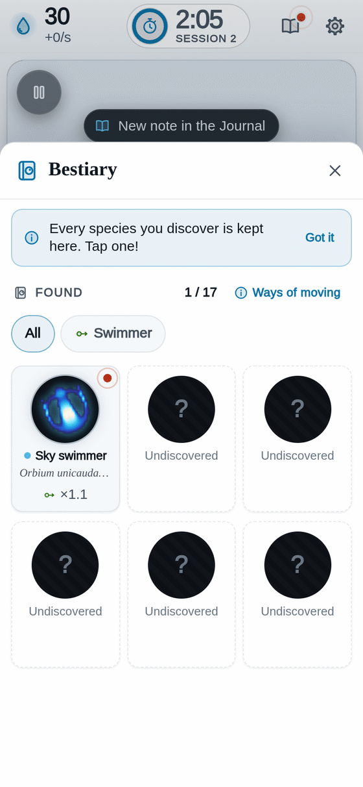
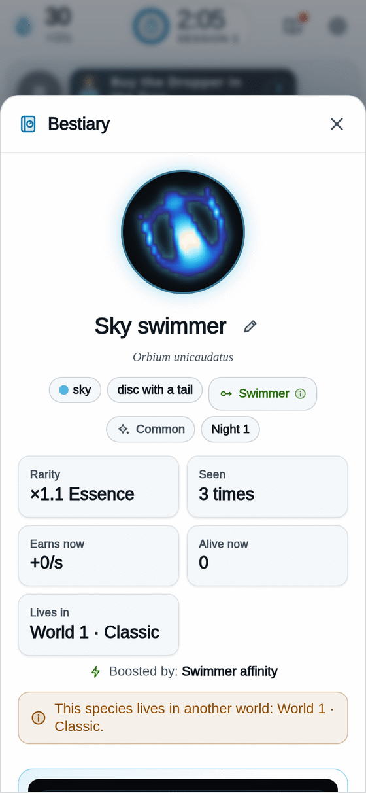

[[Español|Especies]] · **English**

# Species: the critters of light

In Bioluma live creatures made of light. They are called **species**. Each one has a **name that says what it looks like**, such as *Sky swimmer* or *Violet crescent*, and under it, in small letters, its scientific name in Latin, such as *Orbium unicaudatus*. The Latin names come from the catalogue of Bert Chan, the scientist who discovered these creatures (read [[Science behind|Science-behind-en]]).

Nobody drew them. **They are born on their own** when the dish's rules have the right shape.

## Ways of moving

The game watches every living creature and decides **what it does**. Each way has its little drawing and its colour, and some give more Essence than others.

<table>
<tr>
<td align="center" width="33%"> <b>Still</b></td>
<td align="center" width="33%"> <b>Swimmer</b></td>
<td align="center" width="33%"> <b>Spins</b></td>
</tr>
</table>

| Way | What it does | Essence | Where it lives |
|---|---|---|---|
| **Still** (circle) | Stays put, steady as a shiny pebble. | Normal (×1) | World 5 · Discs |
| **Swimmer** (arrow) | Glides across the dish without stopping, always forward. | More (×1.6) | Almost every world |
| **Spins** (spiral) | Turns round and round like a whirl. | Even more | World 3 · Whirls and World 6 · Legs |

Lenia science has other ways of moving (pulsing, splitting, living in colonies), but **no world in the game grows them yet**. The Bestiary's **"Ways of moving"** button explains them all.

> **Fun fact:** a creature needs a few seconds before the game knows what it does. Meanwhile it counts as "still". When the game sees it swim or spin, your Essence makes a little jump!

## The cards

Tap a portrait in the Bestiary to see its **card**:

<table>
<tr>
<td valign="top">

- Its **name** (with the Latin small under it) and its number: "Creature 3".
- Its **rarity** and **how it moves** (tap the tag for the explanation).
- **Where it lives**: its world.
- **How much Essence it gives**, with the maths.
- **Make a copy**, with the **Copier** upgrade from the Tree (it costs Essence; with **Archive**, sometimes it is free).
- A pencil to **give it your own name**.

</td>
<td width="254" align="center" valign="top">

</td>
</tr>
</table>

## Rarities

| Rarity | How hard to find | Essence multiplier |
|---|---|---|
| Common | Easy | ×1.1 |
| Uncommon | You have to look | ×1.3 |
| Rare | Hard to find | ×1.6 |
| Very rare | A treasure! | ×2.0 |

(The Tree's **Collector** upgrade makes them all give more.)

## How to find more species

1. **Seed a lot.** Every seed is a die roll: sometimes something new comes out.
2. **Open new worlds** in the [[Tree|Tree-en]]. Each world has its own creatures: see [[Worlds|Worlds-en]].
3. **Look at the world cards** when a session starts: the "?" silhouettes are species you are still missing there.
4. **Curious seeds** (Tree, Discover path): seeds try the species you do not have more often.
5. Every new species gives **+5 Data** and **+5 seconds** of clock. Looking pays off!

How many species are there? **Many more than you will find in one afternoon.** Discover them yourself!

More about secrets, with no spoilers, in [[Secrets|Secrets-en]].

**[▶ Go find critters!]({{GAME_URL}})**
