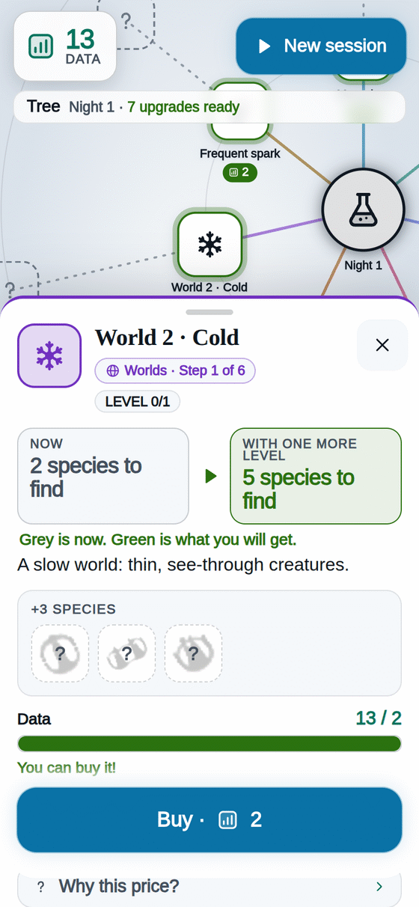

[[Español|Árbol]] · **English**

# The Tree 🌳

The **Tree** is where you spend your **Data**. Every upgrade is **yours forever**: it is never lost.

## How to use it

1. When a session ends, tap **"Go to the Tree"**. Between sessions there is also the **Tree** button at the bottom.
2. Upgrades that **glow green** can be bought now.
3. **Tap one.** Its sheet says what it does with two boxes: **NOW** (grey) and **WITH ONE MORE LEVEL** (green).
4. Tap **"Buy"**. Done! You will notice it next session.

- **Why does it cost that?** Tap **"Why does it cost this?"** on the sheet: you will see the maths.
- Each level costs a bit more than the one before.
- The **"?"** are upgrades you do not know yet: they appear when you buy the one before.
- Some upgrades wait for a new **night**: their sheet says so. See [[Night|Night-en]].

## The seven paths

**Seven straight paths** leave the centre. Each step only needs the one before it.

| Path | What it improves | Examples |
|---|---|---|
| ⏱ **Clock** | More time in every session | More time, Big clock, Fridge, Final stretch |
| 💧 **Dropper** | More seeds live and you sow more | Dropper, Pocket Essence, Gift seeds, Auto-seeder |
| 🧫 **Dish** | More room for creatures | Bigger dish, More room, Nursery, Incubator |
| 🌱 **Life** | Every creature gives more Essence | Culture, Extra food, Swimmers, Friendship |
| 🔬 **Discover** | More Data for each discovery | Field notebook, Copier, Collector, Archive |
| 🌍 **Worlds** | New rules with new creatures | World 2 · Cold, World 3 · Whirls… See [[Worlds|Worlds-en]] |
| ✨ **Spark** | The golden spark comes more often and gives more | Frequent spark, Slow spark, Better gifts |

## Tips

- **Start with what you notice most:** the **Dropper** (more seeds live) and **More time** (longer sessions).
- **Bigger dish** makes room for more creatures: more Essence at once.
- **A new world** brings new species, and every new species gives **+5 Data** and **+5 seconds** of clock.
- Short of Data? The sheet tells you **how many** and **in about how many sessions** you will have them.

More: [[How to play|How-to-play-en]] · [[Night|Night-en]] · [[Worlds|Worlds-en]]
