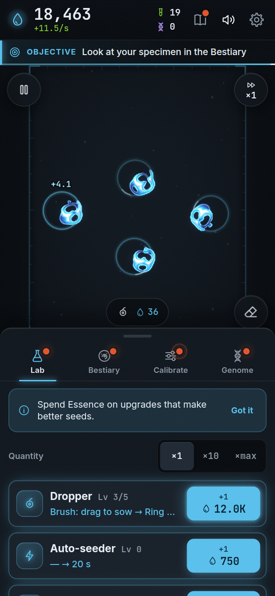

[[Español|Mejoras]] · **English**

# Upgrades

Upgrades are **superpowers** you buy with **Essence**, in the **Lab** tab (the flask).
A few are bought with **Samples**, in the **Bestiary**.

<table>
<tr>
<td valign="top">

**How to buy**

1. Open the **Lab**.
2. Pick how many you want: **×1**, **×10** or **×max** (as many as you can pay for).
3. Tap the upgrade's **blue button**.

Upgrades you cannot buy yet are **greyed out** and tell you what to do to open them.

</td>
<td width="254" align="center" valign="top">

</td>
</tr>
</table>

Each level costs a bit more than the last. Exact numbers can change as the game gets tuned, so here we tell you **what each one does**.

## Lab (bought with Essence)

| Upgrade | Levels | What it does, in plain words | Appears when… |
|---|---|---|---|
| **Dropper** | 5 | Makes your seeds better. **1:** they work more often. **2:** press and hold for a big seed. **3:** drag your finger and paint with matter. **4:** ring-shaped seed. **5:** noise seed and a shape picker. | From the start |
| **Auto-seeder** | no cap | Seeds by itself, on a free spot, even when you are not tapping. Each level is faster. | You have 2 healthy creatures at once |
| **Culture** | no cap | A richer broth: **everything alive gives more Essence** (+10% per level). | You reach 10 Essence per second |
| **Calibrator** | 4 | Opens the sliders to **change the rules**. **1:** small moves of μ and σ. **2:** wider range and you can **save settings** by name. **3:** full μ and σ and the dt slider. **4:** the R slider, which changes creature size. | You register your first species |
| **Stabilizer** | 10 | Tunes seeds towards what **lives best** under the current rules. | You buy Calibrator I |
| **Dish** | 4 | **More room:** more creatures fit before seeding gets pricey. It also gives a little more Essence. | You have 4 healthy creatures at once |
| **Incubator** | 2 | **Speeds up time.** First ×2 and then ×4. Creatures mature and get discovered sooner. | You buy Dish I |
| **Swimmer affinity** | 10 | More Essence from creatures that **swim** and ones that **spin**. | You see a swimmer |
| **Sessile affinity** | 10 | More Essence from ones that **stay still** and ones that **pulse**. | You see a still creature |
| **Colony affinity** | 10 | More Essence from ones that **divide** and **colonies**. | You see a division |
| **Reserve** | 3 | The dish works **more hours while you are away**: from 2 hours to 8, 12 and 24. | You come back after closing the game |
| **Quick pipette** | 3 | The **free emergency seed** recharges faster. | You use the emergency pipette |
| **Nutrient** | 5 | Healthy creatures count as slightly more complex, and give a bit more. | Culture reaches level 10 |

## Bestiary (bought with Samples)

| Upgrade | Levels | What it does | Appears when… |
|---|---|---|---|
| **Microscope** | 3 | See better. **1:** the card shows which rules the species lives in. **2:** shows speed, period and signature. **3:** in **Calibrate** it marks hints of where undiscovered species are. | You register 1 species |
| **Cataloguing** | 5 | **All** your species are worth more (+10% per level). | You register 3 species |
| **Archive** | 3 | Gives you a free **Print** every so often (10, 5 or 2 minutes). | You register 5 species |
| **Marker** | 1 | Each creature shows a **coloured dot** for what it does. | You see 2 different behaviours |

### What is a Print?

It is like a **creature photocopier**. In the Bestiary you tap a species you already registered and choose **Print**. Your next tap on the dish puts that creature there. It costs **Samples**. If the current rules do not suit it, it might not survive!

## Where does Essence come from?

- Every **healthy** creature gives Essence.
- If it **swims** or **spins**, it gives more. If it **divides**, even more.
- If it is a species you **already registered**, it gives more.
- If you place many **identical** creatures, each new one is worth a little less. Mix species!
- A dish full of shapeless blobs gives **nothing**. What counts is **shape**.

To see which behaviour pays most, read [[Species|Species-en]]. To start over with new upgrades, read [[Prestige and Genome|Prestige-and-Genome-en]].

**[▶ Play now!]({{GAME_URL}})**
