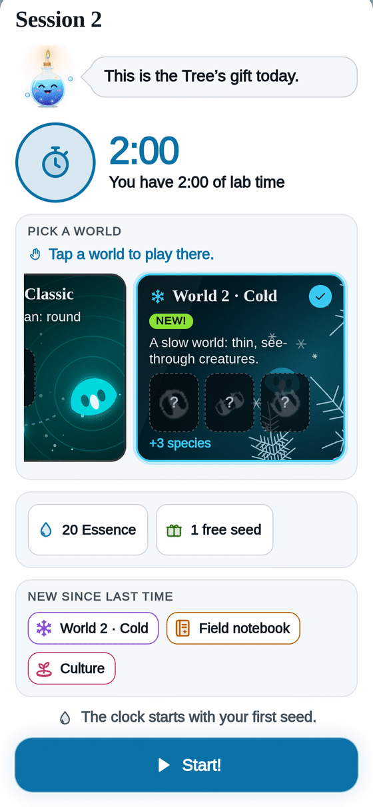

[[Español|Mundos]] · **English**

# Worlds 🌍

Each **world** is a dish with **other rules**. And other rules grow **other creatures**.

You start in **World 1 · Classic**. The others open on the **Worlds** path of the [[Tree|Tree-en]], one after another.

## How to pick one

When a session starts, the start card shows **your worlds** as cards, with their species:

- a **portrait** for the ones you found,
- a **"?" silhouette** for the ones still missing.

**Tap a world** to play there. The world you just opened comes **already picked** and says **"New!"**.

## The seven worlds

| World | What it is like | Opens |
|---|---|---|
| **1 · Classic** | Where it all began: round swimmers. | From the start |
| **2 · Cold** | A slow world: thin, see-through creatures. | Night 1 |
| **3 · Whirls** | A creature that spins like a whirl is born. | Night 1 |
| **4 · Shields** | Strong creatures shaped like shields. | Night 2 |
| **5 · Discs** | Glowing discs, rings and triangles. | Night 2 |
| **6 · Legs** | Creatures with little legs that walk the dish. | Night 3 |
| **7 · Giants** | Huge creatures: fewer fit, but each is worth double. | Night 4 |

## Tips

- **A new world = new species.** Every new species gives **+5 Data** and **+5 seconds** of clock.
- Worlds come **in order**: each new one gives a bit more Essence than the one before.
- Want to see a creature that **spins**? Look in **Whirls** or **Legs**. The **still** ones live in **Discs**.
- Your **Bestiary** says which world each species lives in.

More: [[Tree|Tree-en]] · [[Species|Species-en]] · [[How to play|How-to-play-en]]
